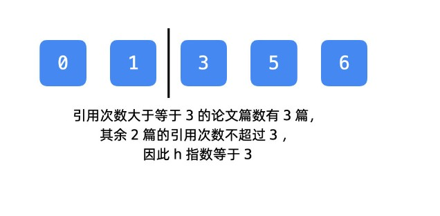
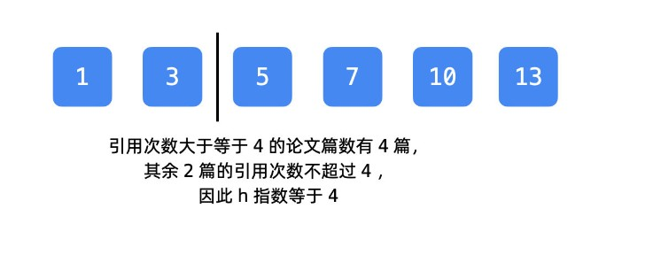
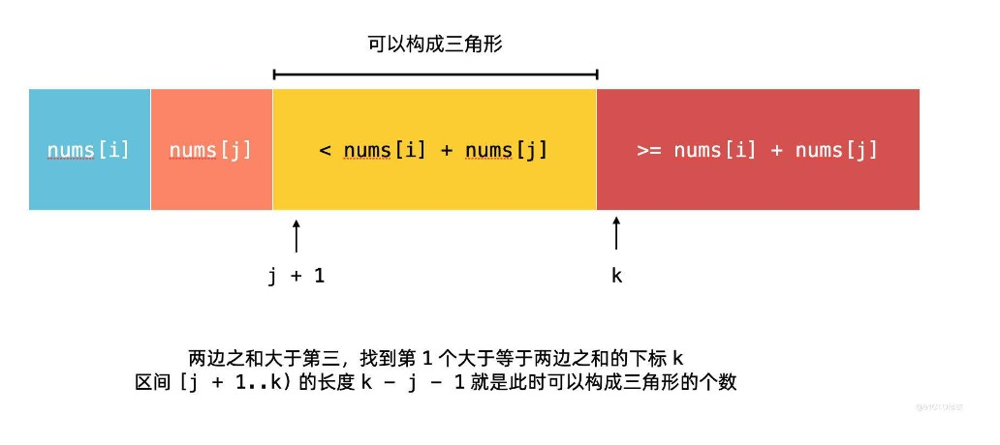

# 【力扣】二分基本问题

[TOC]


## 写在前面

这里是小飞侠Pan🥳，立志成为一名优秀的前端程序媛！！！

本篇文章同时收录于我的[github](https://github.com/mengqiuleo)前端笔记仓库中，持续更新中，欢迎star~

👉[https://github.com/mengqiuleo/myNote](https://github.com/mengqiuleo/myNote)

<hr>

对于力扣上常见的二分查找的题目在这里进行分类总结。这里是第一种类型的题目汇总。主要是使用基本的二分模板。

对于二分的基本知识，点击这里👉 [【LeetCode】二分基础模板，查找左右边界](https://blog.csdn.net/weixin_52834435/article/details/125881904?spm=1001.2014.3001.5501)


## [34. 在排序数组中查找元素的第一个和最后一个位置](https://leetcode.cn/problems/find-first-and-last-position-of-element-in-sorted-array/)

给你一个按照非递减顺序排列的整数数组 nums，和一个目标值 target。请你找出给定目标值在数组中的开始位置和结束位置。

如果数组中不存在目标值 target，返回 [-1, -1]。

示例 1：

```
输入：nums = [5,7,7,8,8,10], target = 8
输出：[3,4]
```


示例 2：

```
输入：nums = [5,7,7,8,8,10], target = 6
输出：[-1,-1]
```


示例 3：

```
输入：nums = [], target = 0
输出：[-1,-1]
```


**思路：**

这里我们还是采用把区间分成两个部分的思想，

如果二分查找的基础知识不太清楚，可以移步这里：👉 [【LeetCode】二分基础模板，查找左右边界](https://blog.csdn.net/weixin_52834435/article/details/125881904?spm=1001.2014.3001.5501)

- 既然是查找元素的左右边界，所以我们进行两次查找，findFirstPosition 和 findLastPosition

对于查找 **左边界**：

```js
 const findFirstPosition = function(nums,target){
    let left = 0,right = nums.length - 1;
    while(left < right){
      let mid = left + Math.floor((right - left)/2);
      if(nums[mid] < target){ //如果中间值小于目标值，那么左边一定不是解
        left = mid + 1;
      }else { //与上面的if相反，mid >= target,答案整体位于左边,并且mid可能等于target
        //nums[mid] === target 可能是
        right = mid;
      }
    }

    //退出循环后，left=right，但其实此时mid并没有判断，需要再判断一次
    if(nums[right] === target){
      return left;
    }
    return -1;
 }
```

- while循环采用 left < right
- 当 `nums[mid] < target` 时，表示目标元素位于mid 的右边，那么左边一定不是解。所以 `left = mid + 1`

- 那么else与上面的相反，如果直接套用模板，else中就是 `right = mid`。并且根据模板可知，mid计算时不用加一
- 当退出循环时，left=right。但是还是在基础用法中说的，我们只是自己求出了一个值，并没有对这个值进行判断，所以最后在进行一次判断 `if(nums[right] === target)`

上面的解释是直接套用模板的，在这里我们重新分成三类进行讨论，最后再合并成两类。

注意，合并成两类，是为了保证最后返回的left=right

**分成三类进行讨论**

**情况 1** ：当 `nums[mid] < target` 时

- `mid` 一定不是 `target` 第一次出现的位置；
- 由于数组有序，`mid` 的左边一定比 `nums[mid]` 还小，因此 `mid` 的左边一定不是 `target` 第一次出现的位置；
- `mid` 的右边比 `nums[mid]` 还大，因此 `mid` 的右边 **有可能** 存在 `target` 第一次出现的位置。

因此下一轮搜索区间是 `[mid + 1..right]`，此时设置 `left = mid + 1`；

**情况 2** ：当 `nums[mid] == target` 时

- `mid` 有可能是 `target` 第一次出现的位置；
- `mid` 的左边也有可能是 `target` 第一次出现的位置；
- `mid` 的右边一定不是 `target` 第一次出现的位置。

因此下一轮搜索区间在 `[left..mid]`，此时设置 `right = mid`。

**情况 3** ：当 `nums[mid] > target` 时

- `mid` 一定不是 `target` 第一次出现的位置；
- `mid` 的右边也一定不是 `target` 第一次出现的位置；
- `mid` 的左边有可能是 `target` 第一次出现的位置，因此下一轮搜索区间在 `[left..mid - 1]`，此时设置 `right = mid - 1`。

> 把情况 ② 和情况 ③ 合并，即当 `nums[mid] >= target` 的时候，下一轮搜索区间是 `[left..mid]`，此时设置 `right = mid`。

`findLastPosition()` 也可以类似分析，这里省略。


**完整代码**

```js
var searchRange = function(nums, target) {
  //查找左边界
  const findFirstPosition = function(nums,target){
    let left = 0,right = nums.length - 1;
    while(left < right){
      let mid = left + Math.floor((right - left)/2);
      if(nums[mid] < target){ //如果中间值小于目标值，那么左边一定不是解
        left = mid + 1;
      }else {
        right = mid;
      }
    }

    //退出循环后，left=right，但其实此时mid并没有判断，需要再判断一次
    if(nums[right] === target){
      return left;
    }
    return -1;
  }

  //查找右边界
  const findLastPosition = function(nums,target){
    let left = 0,right = nums.length - 1;
    while(left < right){
      let mid = left + Math.floor((right - left + 1)/2);//这里需要+1，防止死循环
      if(nums[mid] > target){
        right = mid - 1;
      }else{
        left = mid;
      }
    }
    //因为我们是先查找的左边界，所以一定会有右边界，所以在这里不用再次判断
    /*
    if(nums[right] === target){
      return left;
    }
    */
    return left;
  }

  let len = nums.length;
  if(len === 0){ //特殊判断
    return [-1,-1];
  }
  let firstPosition = findFirstPosition(nums,target)
  if(firstPosition === -1){//如果不存在左边界
    return [-1,-1]
  }
  let lastPosition = findLastPosition(nums,target)
  return [firstPosition,lastPosition]
};
```


## [35. 搜索插入位置](https://leetcode.cn/problems/search-insert-position/)

给定一个排序数组和一个目标值，在数组中找到目标值，并返回其索引。如果目标值不存在于数组中，返回它将会被按顺序插入的位置。

示例 1:

```
输入: nums = [1,3,5,6], target = 5
输出: 2
```


示例 2:

```
输入: nums = [1,3,5,6], target = 2
输出: 1
```


示例 3:

```
输入: nums = [1,3,5,6], target = 7
输出: 4
```

**完整代码**

```js
var searchInsert = function(nums, target) {
  let len = nums.length;
  //特殊判断: 如果插入的元素的值是最大的，插入的位置是在末尾
  if(nums[len - 1] < target){
    return len;
  }

  let left = 0,right = len - 1;
  while(left < right){
    let mid = left + Math.floor((right - left)/2);
    if(nums[mid] >= target){
      right = mid;
    }else {
      left = mid + 1;
    }
  }
  return left;
};
```

**思路**

当我们找不到目标元素时，要找到指定元素的插入位置，那么**其实就是找第一个大于等于指定元素的位置**，然后将这个元素向右挤，整体向右挪一个位置，给我们的指定元素留出位置，然后将指定元素放上去。

```text
输入: [1, 3, 5, 6], 2
输出: 1
```

**题目要我们返回第 1 个 大于等于 目标元素 `2` 的下标**

那么这里第一个大于2的元素是3，它的下标是1，所以答案为 1

- 当 `nums[mid] >= target` 时，此时虽然找到了大于target的元素的下标，但是我们希望找到的应该是尽可能小的数，所以我们需要向左无限逼近。并且，此时找到的 mid 也可能就是 第一个大于等于指定元素的位置，但是 mid 右边一定不是正确答案，所以 `right = mid`

- 在else中，即 `nums[mid] < target` 时，mid 以及 mid的左边一定不是正确答案，所以下一轮搜索时，应该向右走，并且搜索的左起点是 mid+1 ，所以`left = mid + 1`


## [275. H 指数 II](https://leetcode.cn/problems/h-index-ii/)

给你一个整数数组 citations ，其中 citations[i] 表示研究者的第 i 篇论文被引用的次数，citations 已经按照 升序排列 。计算并返回该研究者的 h 指数。

h 指数的定义：h 代表“高引用次数”（high citations），一名科研人员的 h 指数是指他（她）的 （n 篇论文中）总共有 h 篇论文分别被引用了至少 h 次。且其余的 n - h 篇论文每篇被引用次数 不超过 h 次。

提示：如果 h 有多种可能的值，h 指数 是其中最大的那个。

示例 1：

```
输入：citations = [0,1,3,5,6]
输出：3 
解释：给定数组表示研究者总共有 5 篇论文，每篇论文相应的被引用了 0, 1, 3, 5, 6 次。
     由于研究者有 3 篇论文每篇 至少 被引用了 3 次，其余两篇论文每篇被引用 不多于 3 次，所以她的 h 指数是 3 。
```


示例 2：

```
输入：citations = [1,2,100]
输出：2
```

**思路**

> 1. **`N` 篇论文中总共有 `h` 篇论文分别被引用了至少 `h` 次**；
> 2. **其余的 `N - h` 篇论文每篇被引用次数不超过 `h` 次**。

h 指数是 **论文数量**，不是引用次数。





分割线满足的条件是：**分割线右边的最少引用次数 >= 分割线右边的论文篇数**。

**结论**：这条分割线越靠左边，说明被引用的次数很多，文章还很多，h 指数越高。

所以我们需要找到分割线右边的最靠左的一个论文，并且保证这篇论文背引用的次数大于分割线右边的论文数量

**情况 1**：如果 「分割线右边的最少引用次数 < 分割线右边的论文篇数」，这一点可以看示例 `[0,| 1, 3, 5, 6]`，猜测有 4 篇论文最少引用次数为 4 ，但是分割线右边的最小引用次数才为 1，说明分割线太靠左了。下一轮应该往右边找，因此下一轮搜索区间为 `[mid + 1..right]` ，此时设置 `left = mid + 1`。

**情况 2**：剩下的部分就是「分割线右边的最少引用次数 >= 分割线右边的论文篇数」，它肯定在区间 `[left..mid]` 里，此时设置 `right = mid`。

```js
var hIndex = function(citations) {
    let len = citations.length;
    if(len === 0 || citations[len-1] === 0){ //特判
        return 0;
    }
    let left = 0,right = len - 1;
    while(left < right){
        let mid = left + ((right - left)>>1);
        if(citations[mid] < len - mid){
            left = mid + 1;
        }else {
            right = mid;
        }
    }
    return len - left;
};
```

- `citations[mid]` 表示分割线右边的最少的被引用文章的引用次数；

- `len - mid` 表示分割线右边的文章数量；

- 退出循环以后，`mid` 就来到了合适的位置，题目要返回的是论文篇数，所以需要返回 `len - left`；


## [611. 有效三角形的个数](https://leetcode.cn/problems/valid-triangle-number/)

给定一个包含非负整数的数组 nums ，返回其中可以组成三角形三条边的三元组个数。

示例 1:

```
输入: nums = [2,2,3,4]
输出: 3
解释:有效的组合是: 
2,3,4 (使用第一个 2)
2,3,4 (使用第二个 2)
2,2,3
```


示例 2:

```
输入: nums = [4,2,3,4]
输出: 4
```

**解题思路**

能组成三角形三条边的条件：两边之和大于第三边。

依次枚举第 1 条边 `num[i]` 和第 2 条边 `nums[j]`，找第 3 条边的范围。

两边之和大于第三边。我们需要在 `[j + 1..len - 1]` 找到 **严格小于两边之和的区间里元素的个数**，



区间 `[j + 1..len - 1]` 可以划分成两个部分：

- 第 1 部分（图中黄色部分）：可以与 `nums[i]`、`nums[j]` 构成三角形；
- 第 2 部分（图中红色部分）：不可以与 `nums[i]`、`nums[j]` 构成三角形。


**代码分析**

- 首先使用两个for循环，遍历前两条边。对于第三条边，我们需要**寻找到第三条边的最大值**。使用二分查找，那么left=j+1，right=len-1

- 对于每次求第三条边之前，需要特判，如果数组中的最大元素仍然可以组成三角形，那就应该加上 right - j

- `if` 语句就写成「如果 `nums[mid]` 小于两边之和」，此时 `mid` 以及 `mid` 的左边都不是我们要找的，接下来应该在 `[mid + 1..right]` 里继续查找，此时设置 `left = mid + 1`。它的反面区间就是 `[left..mid]` 此时设置 `right = mid`。 

- 最后我们求出了第三条边的最大值，此时还需要进行判断，如果现在的left比两边之和小，那么就是：

  left-(j+1)+1 = left-j

  如果此时的left不符合条件，那么真正的第三条边的最大值应该是：left-1

```js
var triangleNumber = function(nums) {
  let count = 0;
  nums.sort((a,b) => a-b);
  let len = nums.length;
  for(let i = 0;i < len-2;i++)
  {
      for(let j = i+1;j < len-1;j++)
      {
          let target = nums[i] + nums[j];//前两条边的和
          let left = j + 1, right = len - 1;
          if(nums[right] < target){ //特判，如果数组的最大元素仍然能组成三角形
            count += right - j;
            continue;
          }
          while(left < right){
            let mid = Math.floor((right + left)/2);
            if(nums[mid] < target){
              left = mid + 1;
            } else {
              right = mid;
            }
          }
          if(nums[left] < target){
            count += left - j;
          }else {
            count += left - 1 - j;
          }
      }
  }
  return count;
};
```


## [744. 寻找比目标字母大的最小字母](https://leetcode.cn/problems/find-smallest-letter-greater-than-target/)

给你一个排序后的字符列表 letters ，列表中只包含小写英文字母。另给出一个目标字母 target，请你寻找在这一有序列表里比目标字母大的最小字母。

在比较时，字母是依序循环出现的。举个例子：

如果目标字母 target = 'z' 并且字符列表为 letters = ['a', 'b']，则答案返回 'a'


示例 1：

```
输入: letters = ["c", "f", "j"]，target = "a"
输出: "c"
```


示例 2:

```
输入: letters = ["c","f","j"], target = "c"
输出: "f"
```


示例 3:

```
输入: letters = ["c","f","j"], target = "d"
输出: "f"
```

**解题思路**

这个题也是要找到大于目标元素的第一个元素

- 首先进行特判，如果插入位置在最后，直接返回第一个元素

  如果`letters[mid] > target`，那么应该向左搜索，并且此时的mid也可能是答案，所以是`right = mid`

```js
var nextGreatestLetter = function(letters, target) {
    if(target >= letters[letters.length - 1]){ //特判
        return letters[0];
    }
    let left = 0, right = letters.length - 1;
    while(left < right){
        let mid = left + ((right - left)>>1);
        if(letters[mid] > target){
            right = mid;
        }else{
            left = mid + 1;
        }
    }
    return letters[left];
};
```


## [74. 搜索二维矩阵](https://leetcode.cn/problems/search-a-2d-matrix/)

编写一个高效的算法来判断 m x n 矩阵中，是否存在一个目标值。该矩阵具有如下特性：

- 每行中的整数从左到右按升序排列。
- 每行的第一个整数大于前一行的最后一个整数。

示例1：


```
输入：matrix = [[1,3,5,7],[10,11,16,20],[23,30,34,60]], target = 3
输出：true
```

示例2：


```
输入：matrix = [[1,3,5,7],[10,11,16,20],[23,30,34,60]], target = 13
输出：false
```

**解题思路**

由于二维矩阵固定列的「从上到下」或者固定行的「从左到右」都是升序的。

因此我们可以使用两次二分来定位到目标位置：

第一次二分：从第 0 列中的「所有行」开始找，找到合适的行 row

第二次二分：从 row 中「所有列」开始找，找到合适的列 col

```js
var searchMatrix = function(matrix, target) {
  let m = matrix.length, n = matrix[0].length;

  //第一次二分
  let left = 0, right = m - 1;
  while(left < right){
    let mid = left + ((right - left + 1)>>1);
    if(matrix[mid][0] <= target){ //应该在下一行，或者mid当前的行也是答案
      left = mid;
    }else{
      right = mid - 1;
    }
  }
  let row = left; //我们只是自己求出了一个行数
  if(matrix[row][0] > target) return false; //还要判断目标值在不在这个行上
  left = 0, right = n - 1;
  while(left < right){
    let mid = left + ((right - left + 1)>>1);
    if(matrix[row][mid] <= target){
      left = mid;
    }else{
      right = mid - 1;
    }
  }
  let col = left;
  return matrix[row][col] === target;//最后判断有没有找到
};
```

