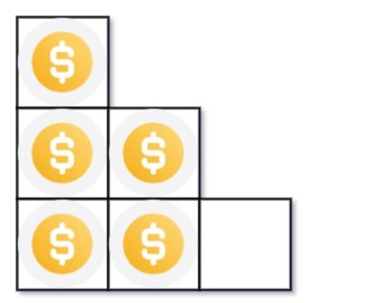

# 【力扣】在范围内二分查找一个整数

[TOC]


## 写在前面

这里是小飞侠Pan🥳，立志成为一名优秀的前端程序媛！！！

本篇文章同时收录于我的[github](https://github.com/mengqiuleo)前端笔记仓库中，持续更新中，欢迎star~

👉[https://github.com/mengqiuleo/myNote](https://github.com/mengqiuleo/myNote)

<hr>

## [69. x 的平方根 ](https://leetcode.cn/problems/sqrtx/)

给你一个非负整数 x ，计算并返回 x 的 算术平方根 。

由于返回类型是整数，结果只保留 整数部分 ，小数部分将被 舍去 。

注意：不允许使用任何内置指数函数和算符，例如 pow(x, 0.5) 或者 x ** 0.5 。

示例 1：

```
输入：x = 4
输出：2
```


示例 2：

```
输入：x = 8
输出：2
解释：8 的算术平方根是 2.82842..., 由于返回类型是整数，小数部分将被舍去。
```

**题解思路**

既然是使用二分查找，首先我们需要确定一个查找的范围，`left=1,right=x`。x就是题目给的数字

并且在查找之前对特殊值0和1进行特殊判断

每次我们都会有一个mid值，并且判断`mid*mid==x`是否成立，所以

- 如果`mid > x/mid`，这里是为了防止溢出，改用除法，实质上是一样的。此时说明`mid*mid>x`，所以应该往左找，那么`right = mid - 1`。根据模板，这里需要将`(right - left + 1)>>1`，防止死循环

```js
var mySqrt = function(x) {
  if(x === 0){
    return 0;
  }
  if(x === 1){
    return 1;
  }
  let left = 1;
  let right = x;
  while(left < right){
    let mid = left +  ((right - left + 1)>>1);
    if(mid > x/mid){
      right = mid - 1;
    }else {
      left = mid;
    }
  }
  return left;
};
```


## [367. 有效的完全平方数](https://leetcode.cn/problems/valid-perfect-square/)

给定一个 正整数 num ，编写一个函数，如果 num 是一个完全平方数，则返回 true ，否则返回 false 。

进阶：不要 使用任何内置的库函数，如  sqrt 。

示例 1：

```
输入：num = 16
输出：true
```


示例 2：

```
输入：num = 14
输出：false
```

**题解思路**

这个题和上面的区别就是：

在这里当我们求出来了之后，需要进行判断我们求出来的值是否是正确答案。而上面的题只要求我们找到一个值即可，并没有判断

```js
var isPerfectSquare = function(num) {
  if(num === 1){
    return true;
  }
  let left = 1;
  let right = num;
  while(left < right){
    let mid = left + ((right - left + 1)>>1);
    if(mid > num/mid){
      right = mid - 1;
    }else{
      left = mid;
    }
  }
  if(left * left === num){
    return true;
  }else{
    return false;
  }
};
```


## [374. 猜数字大小](https://leetcode.cn/problems/guess-number-higher-or-lower/)

猜数字游戏的规则如下：

每轮游戏，我都会从 1 到 n 随机选择一个数字。 请你猜选出的是哪个数字。
如果你猜错了，我会告诉你，你猜测的数字比我选出的数字是大了还是小了。
你可以通过调用一个预先定义好的接口 int guess(int num) 来获取猜测结果，返回值一共有 3 种可能的情况（-1，1 或 0）：

- -1：我选出的数字比你猜的数字小 pick < num
- 1：我选出的数字比你猜的数字大 pick > num
- 0：我选出的数字和你猜的数字一样。恭喜！你猜对了！pick == num,返回我选出的数字。

示例 1：

```
输入：n = 10, pick = 6
输出：6
```


示例 2：

```
输入：n = 1, pick = 1
输出：1
```


示例 3：

```
输入：n = 2, pick = 1
输出：1
```


示例 4：

```
输入：n = 2, pick = 2
输出：2
```

**题解思路**

这个题其实也是给了你一个区间范围，你需要在这个范围内找到一个符合题意的数。

所以: `let left = 1, right = n`，1到n就是题目给定的范围。

- 如果`guess(mid) > 0`，说明自己猜的数字偏小，往大了猜

```js
var guessNumber = function(n) {
    let left = 1, right = n;
    while(left < right){
        let mid = left + ((right - left)>>1);
        if(guess(mid) > 0){ //往大了猜
            left = mid + 1;
        }else{
            right = mid;
        }
    }
    return left;
};
```


## [278. 第一个错误的版本](https://leetcode.cn/problems/first-bad-version/)

你是产品经理，目前正在带领一个团队开发新的产品。不幸的是，你的产品的最新版本没有通过质量检测。由于每个版本都是基于之前的版本开发的，所以错误的版本之后的所有版本都是错的。

假设你有 n 个版本 [1, 2, ..., n]，你想找出导致之后所有版本出错的第一个错误的版本。

你可以通过调用 bool isBadVersion(version) 接口来判断版本号 version 是否在单元测试中出错。实现一个函数来查找第一个错误的版本。你应该尽量减少对调用 API 的次数。


示例 1：

```
输入：n = 5, bad = 4
输出：4
解释：
调用 isBadVersion(3) -> false 
调用 isBadVersion(5) -> true 
调用 isBadVersion(4) -> true
所以，4 是第一个错误的版本。
```


示例 2：

```
输入：n = 1, bad = 1
输出：1
```

**题解思路**

这个题也是给定了二分查找的范围，需要我们在这个范围内找到答案

- 题目给定的范围是[1,n]
- 通过调用接口，如果 isBadVersion(mid) 为真，表示从[left,mid]中存在错误，所以下一轮的搜索范围应该是`right = mid`
- 相反，在else中，因为当前的mid没有出错，那么mid以及mid左边的值都没有出错，所以下一轮搜索范围为`left = mid + 1`

```js
var solution = function(isBadVersion) {
    /**
     * @param {integer} n Total versions
     * @return {integer} The first bad version
     */
    return function(n) {
        let left = 1, right = n;
        while(left < right){
            let mid = left + ((right - left)>>1);
            if(isBadVersion(mid)){
                right = mid;
            }else{
                left = mid + 1;
            }
        }
        return left;
    };
};
```


## [287. 寻找重复数](https://leetcode.cn/problems/find-the-duplicate-number/)

给定一个包含 n + 1 个整数的数组 nums ，其数字都在 [1, n] 范围内（包括 1 和 n），可知至少存在一个重复的整数。

假设 nums 只有 一个重复的整数 ，返回 这个重复的数 。 

示例 1：

```
输入：nums = [1,3,4,2,2]
输出：2
```


示例 2：

```
输入：nums = [3,1,3,4,2]
输出：3
```

**题解思路**

首先了解下抽屉原理：

> [抽屉原理](https://baike.baidu.com/item/抽屉原理/233776)：把 10 个苹果放进 9 个抽屉，一定存在某个抽屉放至少 2 个苹果。

题目已经给定了所有数的范围，我们需要再这个范围内找到那个重复的数

二分查找的思路是先猜一个数（有效范围 `[left..right]` 里位于中间的数 `mid`），然后统计原始数组中 **小于等于** `mid` 的元素的个数 `cnt`：

- 如果 `cnt` **严格大于** `mid`。根据抽屉原理，重复元素就在区间 `[left..mid]` 里；
- 否则，重复元素就在区间 `[mid + 1..right]` 里。

```js
var findDuplicate = function(nums) {
    let left = 1, right = nums.length - 1;
    while(left < right){
        let mid = left + ((right - left)>>1);
        let count = 0;
        nums.forEach(item => { //统计mid左边的数的个数
            if(item <= mid){
                count++;
            }
        })
        if(count > mid){//如果左边的数的数量大于mid，说明左边一定存在重复数，并且mid也可能是那个重复数
            right = mid;
        }else{
            left = mid + 1;
        }
    }
    return left;
};
```

**举例：**

如果我们此时的 mid=4 ,那么统计 1,2,3,4 的个数，如果mid以及mid左边不存在重复数，那么统计出来的 1,2,3,4 的个数应该严格等于4，如果 大于4，就说明1~4中一定存在重复数，应该向左搜索


## [441. 排列硬币](https://leetcode.cn/problems/arranging-coins/)

你总共有 n 枚硬币，并计划将它们按阶梯状排列。对于一个由 k 行组成的阶梯，其第 i 行必须正好有 i 枚硬币。阶梯的最后一行 可能 是不完整的。

给你一个数字 n ，计算并返回可形成 完整阶梯行 的总行数。

示例1：



```
输入：n = 5
输出：2
解释：因为第三行不完整，所以返回 2 。
```

示例2：


```
输入：n = 8
输出：3
解释：因为第四行不完整，所以返回 3 。
```

**题解思路**

题目要求求出可以形成完整阶梯行的总行数

并且题目已经给定了一共有多少硬币，那么往大了猜，n枚硬币最多可以形成n行阶梯。

所以二分查找的范围就有了：[1,n]

那么这个题也是给定了查找的范围，我们从中找到正确答案

- 对于每次我们找到的mid,如果可以完整构成mid行阶梯，那么求出的硬币总数为`mid * (mid + 1)/2`

- 我们需要使用的硬币数小于总共的硬币数n，但是又要求使用尽可能多的硬币数
- 所以在if中，`mid * (mid + 1)/2 <= n`，此时可以构成mid行阶梯，但是需要使用的硬币尽可能多，所以继续向右搜索：`left = mid + 1`

- 最后退出后，还要判断形成left行阶梯时，硬币是否够用`left * (left + 1)/2 === n`

```js
var arrangeCoins = function(n) {
    let left = 1, right = n;
    while(left < right){
        let mid = left + ((right - left)>>1);
        if(mid * (mid + 1)/2 <= n){
            left = mid + 1;
        }else{
            right = mid;
        }
    }
    if(left * (left + 1)/2 === n){
        return left;
    }else{
        return left - 1;
    }
};
```

