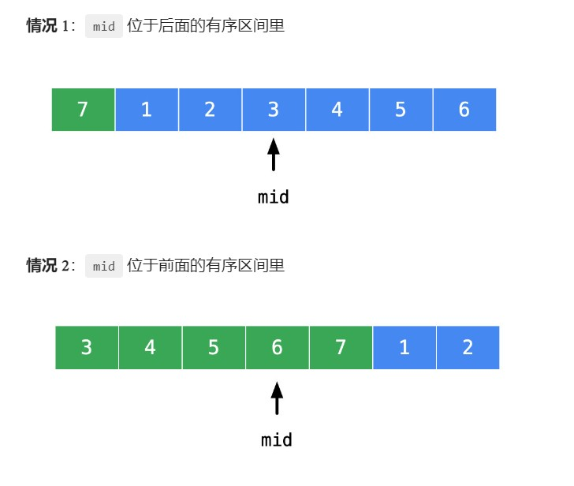

# 【力扣】在非有序数组中使用二分

[TOC]


## 写在前面

这里是小飞侠Pan🥳，立志成为一名优秀的前端程序媛！！！

本篇文章同时收录于我的[github](https://github.com/mengqiuleo)前端笔记仓库中，持续更新中，欢迎star~

👉[https://github.com/mengqiuleo/myNote](https://github.com/mengqiuleo/myNote)

<hr>

## [33. 搜索旋转排序数组](https://leetcode.cn/problems/search-in-rotated-sorted-array/)

整数数组 nums 按升序排列，数组中的值 互不相同 。

在传递给函数之前，nums 在预先未知的某个下标 k（0 <= k < nums.length）上进行了 旋转，使数组变为 [nums[k], nums[k+1], ..., nums[n-1], nums[0], nums[1], ..., nums[k-1]]（下标 从 0 开始 计数）。例如， [0,1,2,4,5,6,7] 在下标 3 处经旋转后可能变为 [4,5,6,7,0,1,2] 。

给你 旋转后 的数组 nums 和一个整数 target ，如果 nums 中存在这个目标值 target ，则返回它的下标，否则返回 -1 。

示例 1：

```
输入：nums = [4,5,6,7,0,1,2], target = 0
输出：4
```


示例 2：

```
输入：nums = [4,5,6,7,0,1,2], target = 3
输出：-1
```


示例 3：

```
输入：nums = [1], target = 0
输出：-1
```

**题解思路**

将待搜索区间从中间一分为二，**位于中间的元素 `nums[mid]` 一定会落在其中一个有序区间里**。需要分类讨论。



我们以讨论 **中间元素和右边界的关系** 为例，其它情况类似。由于不存在重复元素，**所以它们的关系不是大于就是小于**。

**情况 1**：当中间元素的数值严格小于右边界的数值时，即 `nums[mid] < nums[right]` 时

- 此时区间 `[mid..right]` （表示左闭右闭区间，下同）一定是有序的；
- 如果 target 在区间 [left..right] 里，它或者在有序区间 [mid..right] 里，或者在另一个区间 [left..mid - 1]里。
- **在有序区间 `[mid..right]` 里的条件好写**，即：`nums[mid] <= target <= nums[right]`。因为 `target` 落在其中，所以能且只能等于其中的一个元素，当然包括头尾，此时设置 `left = mid`；
- 落在另一个区间 `[left..mid - 1]` 里的时候，就是上一个情况的反面，这种情况用 `else` 表示即可，此时设置 `right = mid - 1`。

**关键**：把比较好些的判断（`target` 落在有序的那部分）放在 `if` 的开头考虑，把剩下的情况放在 `else` 里面。

同理，讨论 `nums[mid] < nums[right]` 的反面

**情况 2**：当中间元素的数值严格大于右边界的数值时，由于没有重复元素，所以是严格大于，即 `nums[mid] > nums[right]`

- 此时区间 `[left..mid]` 内的元素一定是有序的；

- 如果 target 在区间 [left..right] 里，它或者在有序区间 [left..mid] 里，或者在另一个区间 [mid + 1..right]里。

  - **在有序区间 `[left..mid]` 里的条件好写**，即：`nums[left] <= target <= nums[mid]`。因为 `target` 落在其中，所以能且只能等于其中的一个元素，当然包括头尾，此时设置 `right = mid`；

  - 但是，为了与上一个分支的边界设置行为一致，我们这里认为 `[left..mid - 1]` 内的元素一定是有序的，把 `if` 条件改成 `nums[left] <= target <= nums[mid - 1]`，此时设置 `right = mid - 1`；
  - 落在另一个区间 `[mid..right]` 里的时候，就是上一个情况的反面，这种情况用 `else` 表示即可，此时设置 `left = mid`。

```js
var search = function(nums, target) {
  let len = nums.length;
  if(len === 0){
    return -1;
  }
  let left = 0,right = len - 1;
  while(left < right){
    let mid = left + ((right - left + 1)>>1);
    if(nums[mid] < nums[right]){ //位于右边的有序空间
      if(nums[mid] <= target && target <= nums[right]){
        left = mid;
      } else{
        right = mid - 1;
      }
    }else{ //位于左边的有序空间
      if(nums[left] <= target && target <= nums[mid - 1]){
        right = mid - 1;
      }else{
        left = mid;
      }
    }
  }
  if(nums[left] === target){// 退出循环后，还要判断，我们只是求出了自己的答案
    return left;
  }
  return -1;
};
```


## [81. 搜索旋转排序数组 II](https://leetcode.cn/problems/search-in-rotated-sorted-array-ii/)

已知存在一个按非降序排列的整数数组 nums ，数组中的值不必互不相同。

在传递给函数之前，nums 在预先未知的某个下标 k（0 <= k < nums.length）上进行了 旋转 ，使数组变为 [nums[k], nums[k+1], ..., nums[n-1], nums[0], nums[1], ..., nums[k-1]]（下标 从 0 开始 计数）。例如， [0,1,2,4,4,4,5,6,6,7] 在下标 5 处经旋转后可能变为 [4,5,6,6,7,0,1,2,4,4] 。

给你 旋转后 的数组 nums 和一个整数 target ，请你编写一个函数来判断给定的目标值是否存在于数组中。如果 nums 中存在这个目标值 target ，则返回 true ，否则返回 false 。

示例 1：

```
输入：nums = [2,5,6,0,0,1,2], target = 0
输出：true
```


示例 2：

```
输入：nums = [2,5,6,0,0,1,2], target = 3
输出：false
```

**题解思路**

这个题和力扣33题的区别就是，这个题会出现重复元素

那么我们就需要：当遇到重复元素的之后。收缩左右边界(left++或right--)，剔除掉相同的元素

```js
var search = function(nums, target) {
  let left = 0,right = nums.length - 1;
  while(left < right){
      let mid = left + ((right - left + 1)>>1);
      if(nums[mid] < nums[right]){
          if(nums[mid] <= target && target <= nums[right]){
              left = mid;
          }else {
              right = mid - 1;
          }
      }else if(nums[mid] > nums[right]){
          if(nums[left] <= target && target <= nums[mid - 1]){
              right = mid - 1;
          }else {
              left = mid;
          }
      }else if(nums[mid] === nums[right]){//表示从mid到right的值全部相同，那么需要去除这些值
        if (nums[mid] == target) { //如果找到了，直接返回
            return true;
        }
        right--;//逐步向左缩小，去除相同的值
      }
  }
  //这里是需要判断的：我们自己求出了一个目标值，但其实并没有判断它是否正确
  return nums[left] === target;
};
```


## [153. 寻找旋转排序数组中的最小值](https://leetcode.cn/problems/find-minimum-in-rotated-sorted-array/)

已知一个长度为 n 的数组，预先按照升序排列，经由 1 到 n 次 旋转 后，得到输入数组。例如，原数组 nums = [0,1,2,4,5,6,7] 在变化后可能得到：
若旋转 4 次，则可以得到 [4,5,6,7,0,1,2]
若旋转 7 次，则可以得到 [0,1,2,4,5,6,7]
注意，数组 [a[0], a[1], a[2], ..., a[n-1]] 旋转一次 的结果为数组 [a[n-1], a[0], a[1], a[2], ..., a[n-2]] 。

给你一个元素值 互不相同 的数组 nums ，它原来是一个升序排列的数组，并按上述情形进行了多次旋转。请你找出并返回数组中的 最小元素 。

示例 1：

```
输入：nums = [3,4,5,1,2]
输出：1
解释：原数组为 [1,2,3,4,5] ，旋转 3 次得到输入数组。
```


示例 2：

```
输入：nums = [4,5,6,7,0,1,2]
输出：0
解释：原数组为 [0,1,2,4,5,6,7] ，旋转 4 次得到输入数组。
```


示例 3：

```
输入：nums = [11,13,15,17]
输出：11
解释：原数组为 [11,13,15,17] ，旋转 4 次得到输入数组。
```

**解题思路**

虽然整个数组不是有序的，但是它一定是部分有序

- 如果`nums[mid] > nums[right]`，说明mid左边有序，并且最小值位于mid的右边，所以`left = mid + 1`

```js
var findMin = function(nums) {
    let left = 0,right = nums.length - 1;
    while(left < right){
        let mid = left + ((right - left)>>1);
        if(nums[mid] > nums[right]){ 
            left = mid + 1;
        }else{
            right = mid;
        }
    }
  //这里为什么不需要判断呢？是因为题目要求我们找到一个最小值，并且我们也找到了最小值，所以直接返回
    return nums[left];
};
```


## [162. 寻找峰值](https://leetcode.cn/problems/find-peak-element/)

峰值元素是指其值严格大于左右相邻值的元素。

给你一个整数数组 nums，找到峰值元素并返回其索引。数组可能包含多个峰值，在这种情况下，返回 任何一个峰值 所在位置即可。

你可以假设 nums[-1] = nums[n] = -∞ 。

示例 1：

```
输入：nums = [1,2,3,1]
输出：2
解释：3 是峰值元素，你的函数应该返回其索引 2。
```


示例 2：

```
输入：nums = [1,2,1,3,5,6,4]
输出：1 或 5 
解释：你的函数可以返回索引 1，其峰值元素为 2；
     或者返回索引 5， 其峰值元素为 6。
```

**题解思路**

> 因为「两端」是负无穷，画个图，**有凸起的的地方到「两端」一定会有转折**，题目只要求返回任何一个峰值所在位置即可。

并且题目中说明：

对于所有有效的 `i` 都有 `nums[i] != nums[i + 1]`

- 如果`nums[mid] > nums[mid + 1]`，那么说明峰值一定在左边，所以`right = mid`

```js
var findPeakElement = function(nums) {
    let left = 0,right = nums.length - 1;
    while(left < right){
        let mid = left + ((right - left)>>1);
        if(nums[mid] > nums[mid + 1]){
            right = mid;
        }else{
            left = mid + 1;
        }
    }
    return left;
};
```


## [852. 山脉数组的峰顶索引](https://leetcode.cn/problems/peak-index-in-a-mountain-array/)

符合下列属性的数组 arr 称为 山脉数组 ：
arr.length >= 3
存在 i（0 < i < arr.length - 1）使得：

- arr[0] < arr[1] < ... arr[i-1] < arr[i]
- arr[i] > arr[i+1] > ... > arr[arr.length - 1]

给你由整数组成的山脉数组 arr ，返回任何满足 arr[0] < arr[1] < ... arr[i - 1] < arr[i] > arr[i + 1] > ... > arr[arr.length - 1] 的下标 i 。

示例 1：

```
输入：arr = [0,1,0]
输出：1
```


示例 2：

```
输入：arr = [0,2,1,0]
输出：1
```


示例 3：

```
输入：arr = [0,10,5,2]
输出：1
```


示例 4：

```
输入：arr = [3,4,5,1]
输出：2
```


示例 5：

```
输入：arr = [24,69,100,99,79,78,67,36,26,19]
输出：2
```

**题解思路**

这个题和力扣162.寻找峰值的不同是：峰值只有一个

思路其实和那个题是一样的

并且最左边和最右边不存在峰值

- 如果`nums[mid] > nums[mid + 1]`，那么说明峰值一定在左边，所以`right = mid`

```js
var peakIndexInMountainArray = function(nums) {
    let left = 1,right = nums.length - 2;
    while(left < right){
        let mid = left + ((right - left)>>1);
        if(nums[mid] > nums[mid + 1]){
            right = mid;
        }else{
            left = mid + 1;
        }
    }
    return left;
};
```

