# 【LeetCode】二叉树相关题解汇总

[TOC]


## 写在前面

这里是小飞侠Pan🥳，立志成为一名优秀的前端程序媛！！！

本篇文章同时收录于我的[github](https://github.com/mengqiuleo)前端笔记仓库中，持续更新中，欢迎star~

👉[https://github.com/mengqiuleo/myNote](https://github.com/mengqiuleo/myNote)


## 226. 翻转二叉树

[226. 翻转二叉树](https://leetcode.cn/problems/invert-binary-tree/)

给你一棵二叉树的根节点 `root` ，翻转这棵二叉树，并返回其根节点。

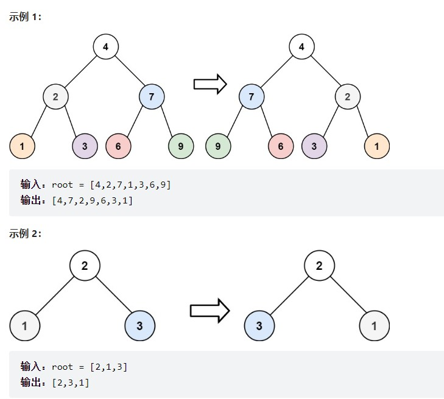

**示例 3：**

```
输入：root = []
输出：[]
```

**题解思路**

**只要把每一个节点的左右孩子翻转一下，就可以达到整体翻转的效果**

这里使用**前序遍历**


```js
var invertTree = function(root) {
    if(!root){
        return null;
    }
    //交换左右节点
    const rightNode = root.right;
    root.right = invertTree(root.left);
    root.left = invertTree(rightNode);
    return root;
};
```


## 100. 相同的树

[100. 相同的树](https://leetcode.cn/problems/same-tree/)

给你两棵二叉树的根节点 `p` 和 `q` ，编写一个函数来检验这两棵树是否相同。

如果两个树在结构上相同，并且节点具有相同的值，则认为它们是相同的。

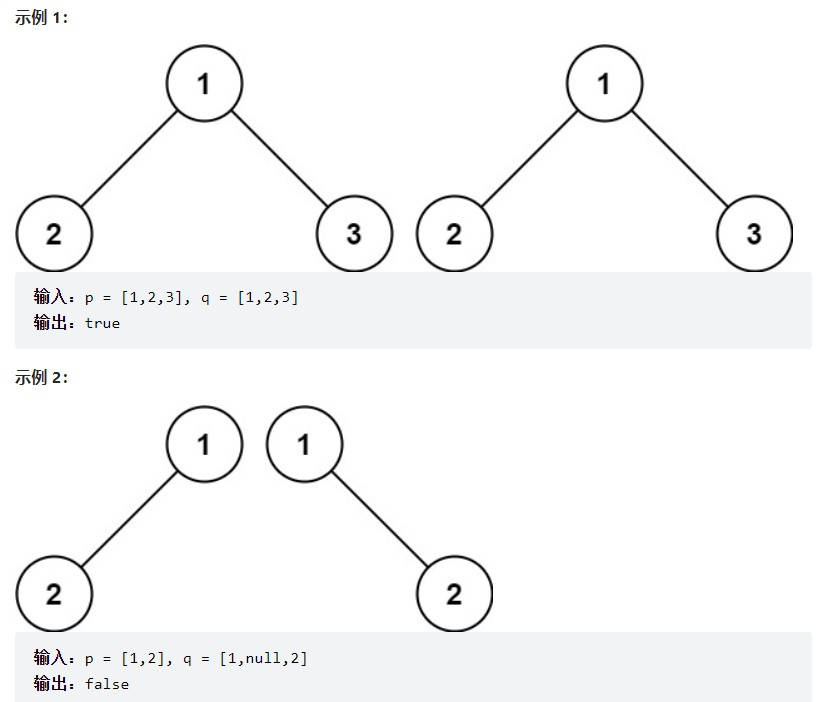

**题解思路**

```js
var isSameTree = function(p, q) {
    if(p == null&&q!= null || q == null&&p!== null){
        return false;
    }
    if(p == null && q == null){
        return true;
    }
    if(p.val != q.val){
        return false;
    }
    return isSameTree(p.left, q.left) && isSameTree(p.right, q.right);
};
```


## 101. 对称二叉树

[101. 对称二叉树](https://leetcode.cn/problems/symmetric-tree/)

给你一个二叉树的根节点 `root` ， 检查它是否轴对称。

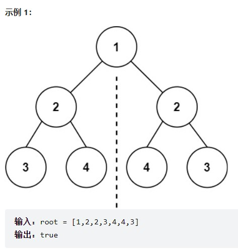

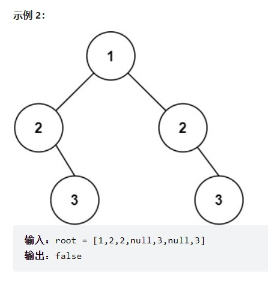

**题解思路**

节点为空的情况有：（**注意我们比较的其实不是左孩子和右孩子，所以如下我称之为左节点右节点**）

- 左节点为空，右节点不为空，不对称，return false
- 左不为空，右为空，不对称 return false
- 左右都为空，对称，返回true

此时已经排除掉了节点为空的情况，那么剩下的就是左右节点不为空：

- 左右都不为空，比较节点数值，不相同就return false

此时左右节点不为空，且数值也不相同的情况我们也处理了。

代码如下：

```cpp
if (left == NULL && right != NULL) return false;
else if (left != NULL && right == NULL) return false;
else if (left == NULL && right == NULL) return true;
else if (left->val != right->val) return false; // 注意这里我没有使用else
```

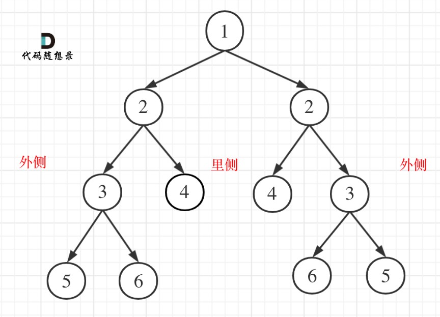

```js
var isSymmetric = function(root) {
    if(root===null){
        return true;
    }
    
    const compareNode = function(left, right){
        //确定终止条件
        if(left===null&&right!==null || left!==null&&right===null){
            return false;
        }else if(left===null&&right===null){
            return true;
        }else if(left.val!==right.val){
            return false;
        }

        //递归循环
        let outSide = compareNode(left.left, right.right);
        let inSide = compareNode(left.right, right.left);
        return outSide&&inSide;
    }

    return compareNode(root.left, root.right);
};
```


## 103. 二叉树的锯齿形层序遍历

[103. 二叉树的锯齿形层序遍历](https://leetcode.cn/problems/binary-tree-zigzag-level-order-traversal/)

给你二叉树的根节点 `root` ，返回其节点值的 **锯齿形层序遍历** 。（即先从左往右，再从右往左进行下一层遍历，以此类推，层与层之间交替进行）。

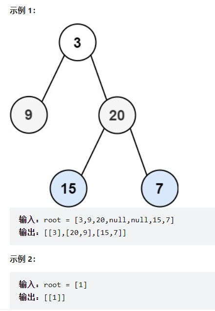

**题解思路**

使用层序遍历，用标志变量控制正序倒序输出

```js
var zigzagLevelOrder = function(root) {
    if(!root) return [];
    let flag = 1; //1:顺序，-1:逆序
    let result = [], queue = [root];
    while(queue.length){
        let len = queue.length;
        let now = [];
        for(let i=0; i<len; i++){
            let node = queue.shift();
            if(flag > 0){
                now.push(node.val);//顺序
            } else {
                now.unshift(node.val);//逆序
            }
            if(node.left) queue.push(node.left);
            if(node.right) queue.push(node.right);
        }
        result.push(now);
        flag = -flag;
    }
    return result;
};
```


## 104. 二叉树的最大深度

[104. 二叉树的最大深度](https://leetcode.cn/problems/maximum-depth-of-binary-tree/)

给定一个二叉树，找出其最大深度。

二叉树的深度为根节点到最远叶子节点的最长路径上的节点数。

说明: 叶子节点是指没有子节点的节点。

示例：
给定二叉树 [3,9,20,null,null,15,7]，

        3
       / \
      9  20
        /  \
       15   7

返回它的最大深度 3 。

**题解思路**

我们这里使用层序遍历

```js
var maxDepth = function(root) {
    if(root === null) return 0;
    let queue = [root];
    let height = 0;
    while(queue.length){
        let length = queue.length;
        height++;
        for(let i=0; i<length; i++){
            let node = queue.shift();
            node.left && queue.push(node.left);
            node.right && queue.push(node.right);
        }
    }
    return height;
};
```


## 559. N 叉树的最大深度

[559. N 叉树的最大深度](https://leetcode.cn/problems/maximum-depth-of-n-ary-tree/)

给定一个 N 叉树，找到其最大深度。

最大深度是指从根节点到最远叶子节点的最长路径上的节点总数。

N 叉树输入按层序遍历序列化表示，每组子节点由空值分隔（请参见示例）。

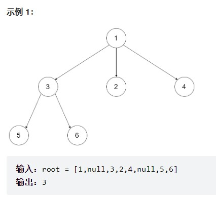

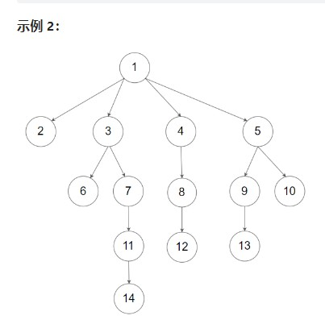

```
输入：root = [1,null,2,3,4,5,null,null,6,7,null,8,null,9,10,null,null,11,null,12,null,13,null,null,14]
输出：5
```

**题解思路**

这道题和上面的相似，也是使用**层序遍历**，不过不是放入左右子节点，而是需要遍历当前节点的孩子`node.children`

```js
var maxDepth = function(root) {
    if(!root) return 0;
    let height = 0;
    let queue = [];
    queue.push(root);
    while(queue.length){
        let length = queue.length;
        height++;
        while(length--){
            let node = queue.shift();
            for(let item of node.children){
                item && queue.push(item);
            }
        }
    }
    return height;
};
```


## 111. 二叉树的最小深度

[111. 二叉树的最小深度](https://leetcode.cn/problems/minimum-depth-of-binary-tree/)

给定一个二叉树，找出其最小深度。

最小深度是从根节点到最近叶子节点的最短路径上的节点数量。

**说明：**叶子节点是指没有子节点的节点。

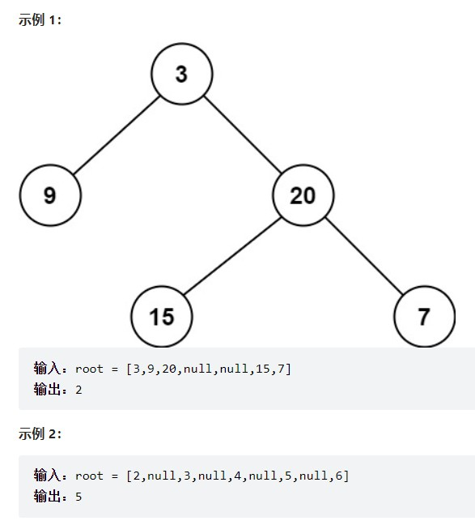

**题解思路**

题目中说的是：**最小深度是从根节点到最近叶子节点的最短路径上的节点数量。**，注意是**叶子节点**。

什么是叶子节点，左右孩子都为空的节点才是叶子节点！

依然采用层序遍历

```js
var minDepth = function(root) { 
    if(root === null) return 0;
    let queue = [root];
    let depth = 0;
    while(queue.length){
        let length = queue.length;
        depth++;
        for(let i=0; i<length; i++){
            let node = queue.shift();
            if(node.left === null && node.right === null){
                return depth;
            }
            node.left && queue.push(node.left);
            node.right && queue.push(node.right);
        }
    }
    return depth;
};
```


## 222. 完全二叉树的节点个数

[222. 完全二叉树的节点个数](https://leetcode.cn/problems/count-complete-tree-nodes/)

给你一棵 完全二叉树 的根节点 root ，求出该树的节点个数。

完全二叉树 的定义如下：在完全二叉树中，除了最底层节点可能没填满外，其余每层节点数都达到最大值，并且最下面一层的节点都集中在该层最左边的若干位置。若最底层为第 h 层，则该层包含 1~ 2h 个节点。

示例 1：


输入：root = [1,2,3,4,5,6]
输出：6
示例 2：

输入：root = []
输出：0
示例 3：

输入：root = [1]
输出：1

**题解思路**

采用**层序遍历**

```js
var countNodes = function(root) {
    let queue = [];
    if(root === null){
        return 0;
    }
    queue.push(root);
    let nodeNum = 0;
    while(queue.length){
        let length = queue.length;
        while(length--){
            let node = queue.shift();
            nodeNum++;
            node.left && queue.push(node.left);
            node.right && queue.push(node.right);
        }
    }
    return nodeNum;
};
```


## 110. 平衡二叉树

[110. 平衡二叉树](https://leetcode.cn/problems/balanced-binary-tree/)

给定一个二叉树，判断它是否是高度平衡的二叉树。

本题中，一棵高度平衡二叉树定义为：

> 一个二叉树*每个节点* 的左右两个子树的高度差的绝对值不超过 1 。

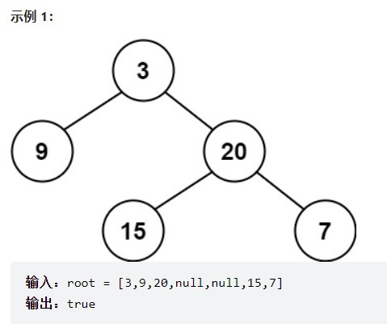

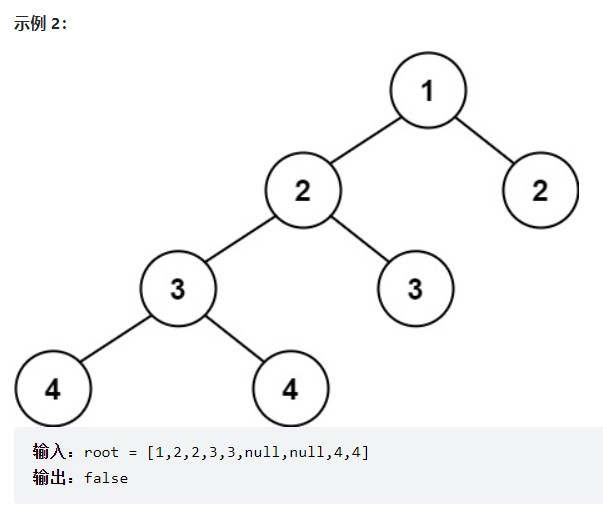

**题解思路**

```js
var isBalanced = function(root) {
    const getDepth = function(node){
        if(node === null) return 0;
        let leftDepth = getDepth(node.left);
        if(leftDepth === -1) return -1;
        let rightDepth = getDepth(node.right);
        if(rightDepth === -1) return -1;
        if(Math.abs(leftDepth - rightDepth) > 1){
            return -1;
        } else {
            return 1 + Math.max(leftDepth, rightDepth);
        }
    }
    return !(getDepth(root) === -1);
};
```


## 257. 二叉树的所有路径

[257. 二叉树的所有路径](https://leetcode.cn/problems/binary-tree-paths/)

给你一个二叉树的根节点 `root` ，按 **任意顺序** ，返回所有从根节点到叶子节点的路径。

**叶子节点** 是指没有子节点的节点。

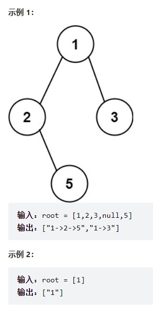

**题解思路**

这道题直接可以看出来使用**回溯**

```js
const binaryTreePaths = (root) => {
  const res = [];

  const buildPath = (root, pathStr) => {
    if (root == null) { // 遍历到null
      return;           // 结束当前递归分支
    }
    if (root.left == null && root.right == null) { // 遍历到叶子节点
      pathStr += root.val; // 路径末尾了，不用加箭头
      res.push(pathStr);   // 加入解集
      return;
    }
    pathStr += root.val + '->'; // 处理非叶子节点，要加箭头
    buildPath(root.left, pathStr); // 基于当前的pathStr，递归左子树
    buildPath(root.right, pathStr); // 基于当前的pathStr，递归右子树
  };

  buildPath(root, '');
  return res;
};
```

**暗含回溯**
结合上图，这里其实暗含回溯，遍历完左子树，构建出合格的路径，加入解集，遍历右子树之前，路径要撤销最末尾的选择，如果path用的是数组，就会弹出最后一项。
我这里用的字符串，pathStr保存了当前节点的路径，递归右子树时，传入它即可，它不包含在递归左子树所拼接的东西。

**闲扯一些别的**
如果有人问你，前中后序遍历的区别是什么？他可能不希望你回答根左右之类的，他希望你抓住实质，他会继续问你为什么。

而且如果你回答：中序遍历是先访问左子树，再访问根节点。可能会觉得你人云亦云，or没想明白，or表述模糊。

中序遍历也是先访问根节点，再左子树，再右子树，只是将 do something with root（对节点进行处理）放在访问完左子树之后。

因为 DFS 遍历，每个节点有 3 次不同的驻留阶段，在其中一个时间点拿当前节点做事，就分别对应前中后遍历。如下图。

> Preorder, Postorder and Inorder are all based on DFS.
> The only difference is:
> During the traversal, what time they will access the content of a node.
> Because a node is actually visited 3 times for binary tree. They include: the time before the first DFS call, and the times after each DFS call.

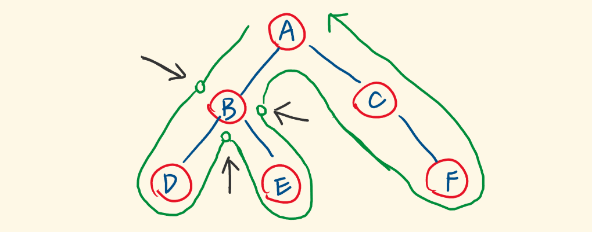

引用参考文章：[谈谈别的，前、中、后序遍历的区别只有一点](https://leetcode.cn/problems/binary-tree-paths/solution/tu-jie-er-cha-shu-de-suo-you-lu-jing-by-xiao_ben_z/)

**问题：**

 为什么用字符串保存的就是当前节点的路径，字符串不能变，指向变了啊？

系统在每一次递归调用的时候都会开辟一段新的栈空间，用于保存当前的状态（比如这里就需要保存当前路径的字符串），当调用返回时就可以恢复到原来的状态。比如说处理完节点1，然后递归处理完1的左子树之后（处理完意思是处理了左子树包含的所有节点），再返回时，当时处理节点1时保存了字符串“1->”，所以下一步递归处理1的右子树时，字符串又是从“1->”开始的，1的左子树的结果并不会影响这里的递归调用，这就是回溯，所以递归天然伴随着回溯。

**我的理解是，pathStr += root.val包含了变更string指针的操作，所以每一层递归指向的都是不同的string。 而用list的话，并没有New一个新的list对象，所有的递归层都在对同一个list操作，因此需要手动回溯。是这样吗？**

字符串是拷贝过去的，相当于新建了一个变量。


## 404. 左叶子之和

[404. 左叶子之和](https://leetcode.cn/problems/sum-of-left-leaves/)

给定二叉树的根节点 `root` ，返回所有左叶子之和。


**示例 2:**

```
输入: root = [1]
输出: 0
```


**题解思路**

**判断当前节点是不是左叶子是无法判断的，必须要通过节点的父节点来判断其左孩子是不是左叶子。**

如果该节点的左节点不为空，该节点的左节点的左节点为空，该节点的左节点的右节点为空，则找到了一个左叶子，判断代码如下：

```text
if (node->left != NULL && node->left->left == NULL && node->left->right == NULL) {
    左叶子节点处理逻辑
}
```

采用层序遍历

```js
var sumOfLeftLeaves = function(root) {
    if(root === null){
        return null;
    }
    let queue = [];
    let sum = 0;
    queue.push(root);
    while(queue.length){
        let node = queue.shift();
        if(node.left!==null && node.left.left===null && node.left.right===null){
            sum += node.left.val;
        }
        node.left && queue.push(node.left);
        node.right && queue.push(node.right);
    }
    return sum;
};
```


## 513. 找树左下角的值

[513. 找树左下角的值](https://leetcode.cn/problems/find-bottom-left-tree-value/)

给定一个二叉树的 **根节点** `root`，请找出该二叉树的 **最底层 最左边** 节点的值。

假设二叉树中至少有一个节点。

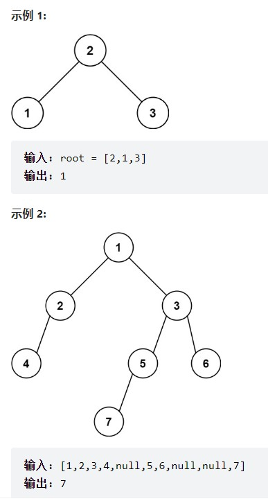

**题解思路**

采用层序遍历，

我们每层都记录第一个值，并且因为层序遍历是从根往下，那么最后一次我们记录的就是最底层的第一个值。

```js
var findBottomLeftValue = function(root) {
    let queue = [];
    if(root === null){
        return null;
    }
    queue.push(root);
    let resNode;
    while(queue.length){
        let length = queue.length;
        for(let i=0; i<length; i++){
            let node = queue.shift();
            if(i===0){
                resNode = node.val;
            }
            node.left && queue.push(node.left);
            node.right && queue.push(node.right);
        }
    }
    return resNode;
};
```


## 112. 路径总和

[112. 路径总和](https://leetcode.cn/problems/path-sum/)

给你二叉树的根节点 root 和一个表示目标和的整数 targetSum 。判断该树中是否存在 根节点到叶子节点 的路径，这条路径上所有节点值相加等于目标和 targetSum 。如果存在，返回 true ；否则，返回 false 

叶子节点 是指没有子节点的节点。

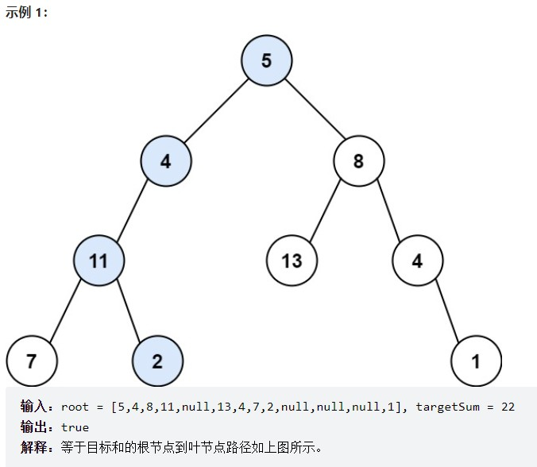

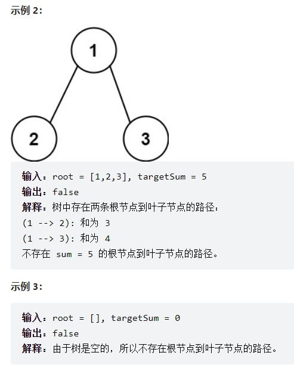

**题解思路**

下面的代码中暗含回溯：回溯隐藏在`traversal(cur->left, count - cur->left->val)`这里， 因为把`count - cur->left->val` 直接作为参数传进去，函数结束，count的数值没有改变。

```js
var hasPathSum = function(root, targetSum) {
    const traversal = (node, cnt) => {
        if(cnt===0 && !node.left && !node.right) return true;
        if(!node.left && !node.right) return false;
        if(node.left && traversal(node.left, cnt-node.left.val)) return true;
        if(node.right && traversal(node.right, cnt-node.right.val)) return true;
        return false;
    }
    if(!root) return false;
    return traversal(root, targetSum-root.val);
};
```


## 106. 从中序与后序遍历序列构造二叉树

[106. 从中序与后序遍历序列构造二叉树](https://leetcode.cn/problems/construct-binary-tree-from-inorder-and-postorder-traversal/)

给定两个整数数组 inorder 和 postorder ，其中 inorder 是二叉树的中序遍历， postorder 是同一棵树的后序遍历，请你构造并返回这颗 二叉树 。

 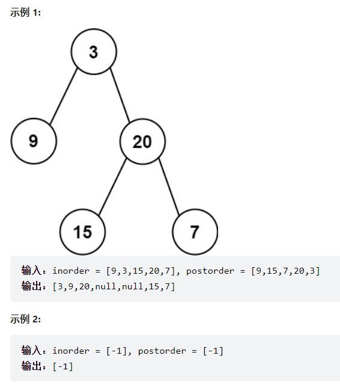

**题解思路**

中序遍历：左中右   后序遍历：左右中


- 第一步：如果数组大小为零的话，说明是空节点了。
- 第二步：如果不为空，那么取后序数组最后一个元素作为节点元素。
- 第三步：找到后序数组最后一个元素在中序数组的位置，作为切割点
- 第四步：切割中序数组，切成中序左数组和中序右数组 （顺序别搞反了，一定是先切中序数组）
- 第五步：切割后序数组，切成后序左数组和后序右数组
- 第六步：递归处理左区间和右区间

在上面的第四步和第五步中，**有一个很重的点，就是中序数组大小一定是和后序数组的大小相同的（这是必然）。**

中序数组我们都切成了左中序数组和右中序数组了，那么后序数组就可以按照左中序数组的大小来切割，切成左后序数组和右后序数组。

```js
var buildTree = function(inorder, postorder) {
    if(!inorder.length) return null;
    const rootVal = postorder.pop();//从后序遍历获取中间节点的值
    let rootIndex = inorder.indexOf(rootVal);//根据中间节点分出左右子树
    const root = new TreeNode(rootVal);
    root.left = buildTree(inorder.slice(0,rootIndex), postorder.slice(0, rootIndex));//左子树
    root.right = buildTree(inorder.slice(rootIndex+1), postorder.slice(rootIndex));//右子树
    return root;
};
```


## 105. 从前序与中序遍历序列构造二叉树

[105. 从前序与中序遍历序列构造二叉树](https://leetcode.cn/problems/construct-binary-tree-from-preorder-and-inorder-traversal/)

给定两个整数数组 preorder 和 inorder ，其中 preorder 是二叉树的先序遍历， inorder 是同一棵树的中序遍历，请构造二叉树并返回其根节点。

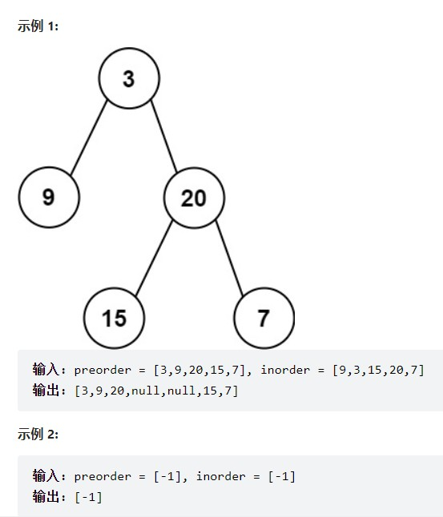

**题解思路**

前序：中左右   中序：左中右

```js
var buildTree = function(preorder, inorder) {
  if (!preorder.length) return null;
  const rootVal = preorder.shift(); // 从前序遍历的数组中获取中间节点的值， 即数组第一个值
  const index = inorder.indexOf(rootVal); // 获取中间节点在中序遍历中的下标
  const root = new TreeNode(rootVal); // 创建中间节点
  root.left = buildTree(preorder.slice(0, index), inorder.slice(0, index)); // 创建左节点
  root.right = buildTree(preorder.slice(index), inorder.slice(index + 1)); // 创建右节点
  return root;
};
```


**拓展**

前序和中序可以唯一确定一棵二叉树。

后序和中序可以唯一确定一棵二叉树。

那么前序和后序可不可以唯一确定一棵二叉树呢？

**前序和后序不能唯一确定一棵二叉树！**，因为没有中序遍历无法确定左右部分，也就是无法分割。

举一个例子：


tree1 的前序遍历是[1 2 3]， 后序遍历是[3 2 1]。

tree2 的前序遍历是[1 2 3]， 后序遍历是[3 2 1]。

那么tree1 和 tree2 的前序和后序完全相同，这是一棵树么，很明显是两棵树！

所以前序和后序不能唯一确定一棵二叉树！


## 654. 最大二叉树

[654. 最大二叉树](https://leetcode.cn/problems/maximum-binary-tree/)

给定一个不重复的整数数组 nums 。 最大二叉树 可以用下面的算法从 nums 递归地构建:

创建一个根节点，其值为 nums 中的最大值。
递归地在最大值 左边 的 子数组前缀上 构建左子树。
递归地在最大值 右边 的 子数组后缀上 构建右子树。
返回 nums 构建的 最大二叉树 。

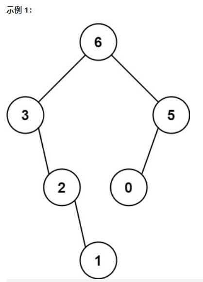

```
输入：nums = [3,2,1,6,0,5]
输出：[6,3,5,null,2,0,null,null,1]
解释：递归调用如下所示：
- [3,2,1,6,0,5] 中的最大值是 6 ，左边部分是 [3,2,1] ，右边部分是 [0,5] 。
    - [3,2,1] 中的最大值是 3 ，左边部分是 [] ，右边部分是 [2,1] 。
        - 空数组，无子节点。
        - [2,1] 中的最大值是 2 ，左边部分是 [] ，右边部分是 [1] 。
            - 空数组，无子节点。
            - 只有一个元素，所以子节点是一个值为 1 的节点。
    - [0,5] 中的最大值是 5 ，左边部分是 [0] ，右边部分是 [] 。
        - 只有一个元素，所以子节点是一个值为 0 的节点。
        - 空数组，无子节点。

```


**题解思路**

**注意类似用数组构造二叉树的题目，每次分隔尽量不要定义新的数组，而是通过下标索引直接在原数组上操作，这样可以节约时间和空间上的开销。**

1. 先要找到数组中最大的值和对应的下标， 最大的值构造根节点，下标用来下一步分割数组。

2. 最大值所在的下标左区间 构造左子树

3. 最大值所在的下标右区间 构造右子树

```js
var constructMaximumBinaryTree = function(nums) {
    const BuildTree = (arr,left,right) => {
        if(left > right){
            return null;
        }
        let maxIndex = -1, maxValue = -1;
        for(let i=left; i<=right; i++){
            if(arr[i] > maxValue){
                maxValue = arr[i];
                maxIndex = i;
            }
        }
        let root = new TreeNode(maxValue);
        root.left = BuildTree(arr,left, maxIndex-1);
        root.right = BuildTree(arr, maxIndex+1, right);
        return root;
    }
    let root = BuildTree(nums, 0, nums.length-1);
    return root;
};
```


## 617. 合并二叉树

[617. 合并二叉树](https://leetcode.cn/problems/merge-two-binary-trees/)

给你两棵二叉树： root1 和 root2 。

想象一下，当你将其中一棵覆盖到另一棵之上时，两棵树上的一些节点将会重叠（而另一些不会）。你需要将这两棵树合并成一棵新二叉树。合并的规则是：如果两个节点重叠，那么将这两个节点的值相加作为合并后节点的新值；否则，不为 null 的节点将直接作为新二叉树的节点。

返回合并后的二叉树。

注意: 合并过程必须从两个树的根节点开始。

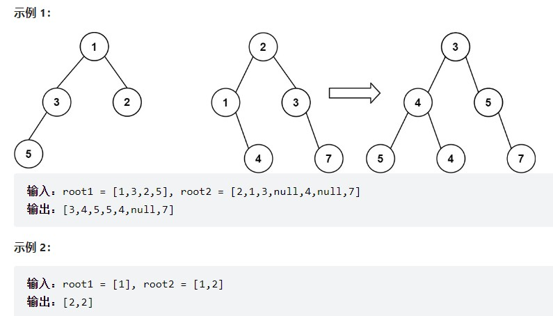

**题解思路**

```js
var mergeTrees = function(root1, root2) {
    const preOrder = (root1,root2) => {
        if(!root1){
            return root2;
        }
        if(!root2){
            return root1;
        }
        root1.val += root2.val; //中
        root1.left = preOrder(root1.left, root2.left); //左
        root1.right = preOrder(root1.right,root2.right); //右
        return root1;
    }
    return preOrder(root1,root2);
};
```


## 129. 求根节点到叶节点数字之和

[129. 求根节点到叶节点数字之和](https://leetcode.cn/problems/sum-root-to-leaf-numbers/)

给你一个二叉树的根节点 root ，树中每个节点都存放有一个 0 到 9 之间的数字。
每条从根节点到叶节点的路径都代表一个数字：

例如，从根节点到叶节点的路径 1 -> 2 -> 3 表示数字 123 。
计算从根节点到叶节点生成的 所有数字之和 。

叶节点 是指没有子节点的节点。

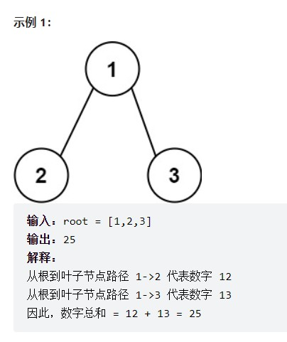

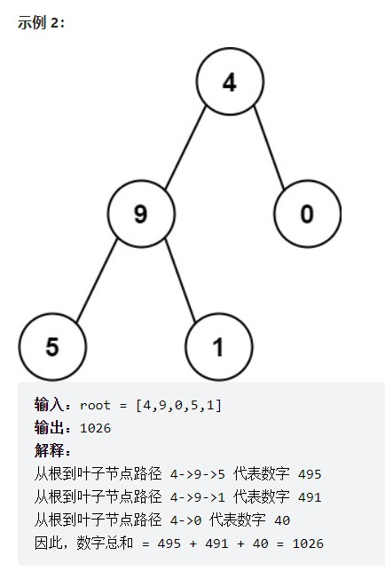

**题解思路**

```
   4
   / \
  9   0
 / \
5   1
```


DFS，先遍历节点4，遍历到9时，就有 4 * 10 + 9，为 49，再遍历到5时，有 49 * 10 + 5，为 495。

一个递归分支维护一个 cur 变量，在下探的过程中计算，更新 cur。

```
cur = 10 * cur + root.val;
```


当遍历到叶子节点时，当前分支计算结束，返回 cur。

遍历到非叶子节点时，基于当前cur，递归计算左右子分支，并把结果相加：

```
if (root.left == null && root.right == null) {
  return cur;
}
return helper(root.left, cur) + helper(root.right, cur);
```


注意这里默认root.left和root.right是存在的，如果不存在呢？或者，递归入口传的 root 就不存在呢？

设置一个递归的出口：当遍历到 null 时，不存在 root.val，直接返回 0（cur已经在叶子节点处返回了）

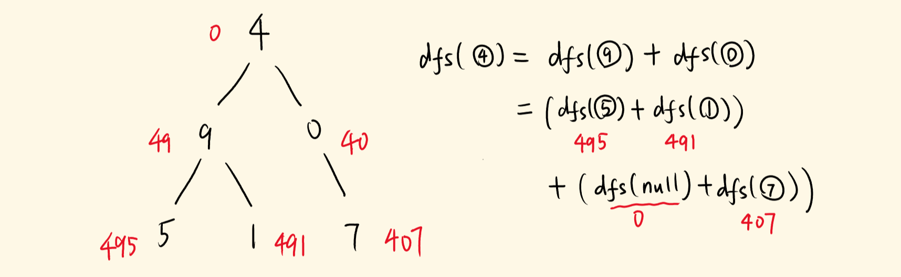

参考文章：[「手画图解」边DFS边计算，代码简短](https://leetcode.cn/problems/sum-root-to-leaf-numbers/solution/bian-dfsbian-ji-suan-dai-ma-jian-duan-129-qiu-gen-/)

**理解**：本题采用回溯的思想，

**向下遍历**时，使用`cur = 10*cur + root.val`来计算出每一个数字，然后到子节点时使用`return cur`将每个数字**向上返回**。

那么每个数字的相加体现在什么地方呢？

```
return helper(root.left, cur) + helper(root.right, cur);
```

完整代码：

```js
var sumNumbers = function(root) {
    const helper = (root, cur) => {
        if(root === null){
            return 0;
        }
        cur = 10*cur + root.val;
        if(root.left == null && root.right == null){
            return cur;
        }
        return helper(root.left, cur) + helper(root.right, cur);
    }
    return helper(root, 0);
};
```


## 236. 二叉树的最近公共祖先

[236. 二叉树的最近公共祖先](https://leetcode.cn/problems/lowest-common-ancestor-of-a-binary-tree/)

给定一个二叉树, 找到该树中两个指定节点的最近公共祖先。

百度百科中最近公共祖先的定义为：“对于有根树 T 的两个节点 p、q，最近公共祖先表示为一个节点 x，满足 x 是 p、q 的祖先且 x 的深度尽可能大（一个节点也可以是它自己的祖先）。”

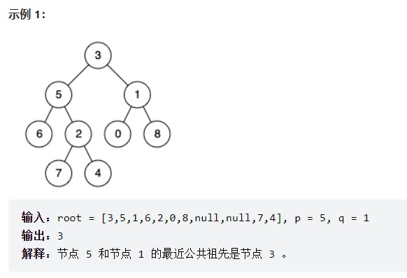

**题解思路**


**如果找到一个节点，发现左子树出现结点p，右子树出现节点q，或者 左子树出现结点q，右子树出现节点p，那么该节点就是节点p和q的最近公共祖先。**

**但是如果p或者q本身就是最近公共祖先呢？其实只需要找到一个节点是p或者q的时候，直接返回当前节点，无需继续递归子树。如果接下来的遍历中找到了后继节点满足第一种情况则修改返回值为后继节点，否则，继续返回已找到的节点即可。**

```js
var lowestCommonAncestor = function(root, p, q) {
    const travelTree = function(root, p, q) {
        if(root === null || root === p || root === q){
            return root;
        }
        //用left和right接住左子树和右子树的返回值
        let left = travelTree(root.left, p, q);
        let right = travelTree(root.right, p, q);

        //如果left 和 right都不为空，说明此时root就是最近公共节点。
        if(left !== null && right !== null){
            return root;
        }
        
        //如果left为空，right不为空，就返回right，说明目标节点是通过right返回的，反之依然。
        if(left === null){
            return right;
        }
        if(right === null){
            return left;
        }
    }
    return travelTree(root, p, q);
};
```


## 572. 另一棵树的子树

[572. 另一棵树的子树](https://leetcode.cn/problems/subtree-of-another-tree/)

给你两棵二叉树 root 和 subRoot 。检验 root 中是否包含和 subRoot 具有相同结构和节点值的子树。如果存在，返回 true ；否则，返回 false 。

二叉树 tree 的一棵子树包括 tree 的某个节点和这个节点的所有后代节点。tree 也可以看做它自身的一棵子树。

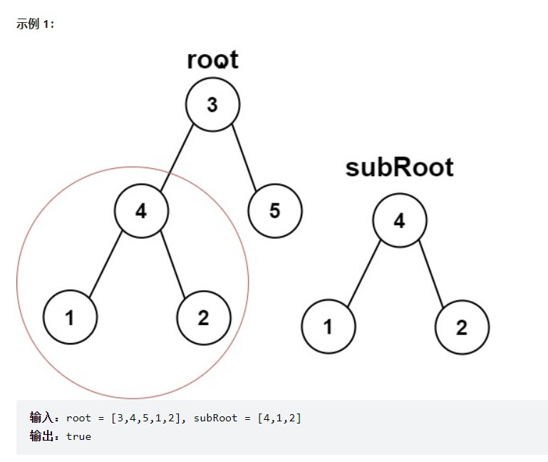

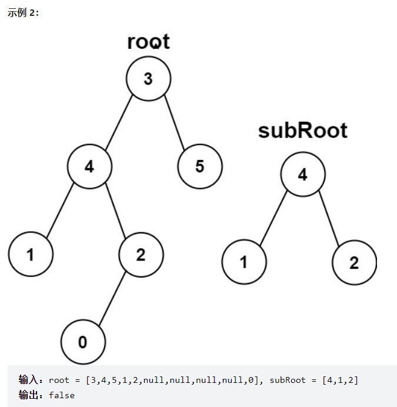

**题解思路**

要判断B是否是A的子树，像下面这样，我们只需要从根节点开始判断，通过递归的方式比较他的每一个子节点即可，

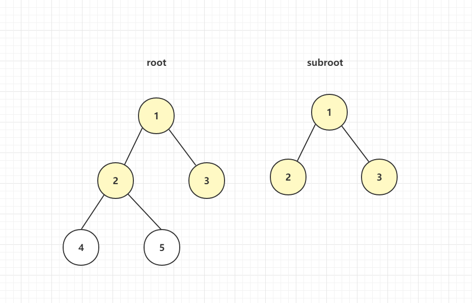

但实际上B如果是A的子树的话，不一定是从根节点开始的，也可能是下面这样

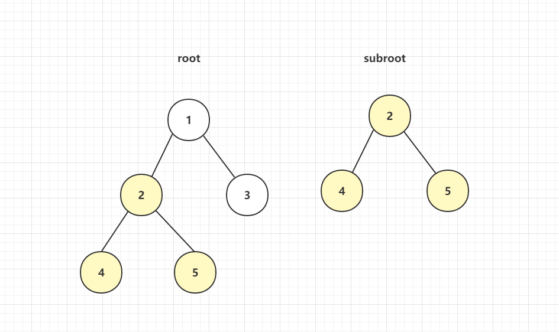

也就是说B不光有可能是A的子树，也有可能是A左子树的子树或者右子树的子树，所以如果从根节点判断B不是A的子树，还需要判断A的left和A的right

```js
var isSubtree = function(root, subRoot) {
    const compare = function(left, right){
        if(left==null&&right==null){
            return true;
        }
        if(left!==null&&right===null || left==null&&right!==null){
            return false;
        }
        if(left.val !== right.val){
            return false;
        }
        let leftSide = compare(left.left, right.left);
        let rightSide = compare(left.right, right.right);
        return leftSide&&rightSide;
    }

    if(root == null){
        return false;
    }
    if(compare(root, subRoot)){
        return true;
    }
    return isSubtree(root.left, subRoot) || isSubtree(root.right, subRoot);
};
```


## 二叉树的层序遍历相关题目

### 层序遍历模板

以 102. 二叉树的层序遍历 为例

```js
var levelOrder = function(root) {
    let res = [], queue = [];
    queue.push(root);
    if(root === null){
        return res;
    }
    while(queue.length !== 0){
        let length = queue.length;
        let curLevel = [];
        for(let i=0; i<length; i++){
            let node = queue.shift();
            curLevel.push(node.val);
            node.left && queue.push(node.left);
            node.right && queue.push(node.right);
        }
        res.push(curLevel);
    }
    return res;
};
```


### 相关题目

因为相关题目都是在模板代码上稍作修改，所以这里并没有做详细解释，只是记录相关题目

[102. 二叉树的层序遍历](https://leetcode.cn/problems/binary-tree-level-order-traversal/)

[107. 二叉树的层序遍历 II](https://leetcode.cn/problems/binary-tree-level-order-traversal-ii/)

[199. 二叉树的右视图](https://leetcode.cn/problems/binary-tree-right-side-view/)

[637. 二叉树的层平均值](https://leetcode.cn/problems/average-of-levels-in-binary-tree/)

[429. N 叉树的层序遍历](https://leetcode.cn/problems/n-ary-tree-level-order-traversal/)

[515. 在每个树行中找最大值](https://leetcode.cn/problems/find-largest-value-in-each-tree-row/)

[116. 填充每个节点的下一个右侧节点指针](https://leetcode.cn/problems/populating-next-right-pointers-in-each-node/)

[117. 填充每个节点的下一个右侧节点指针 II](https://leetcode.cn/problems/populating-next-right-pointers-in-each-node-ii/)

[104. 二叉树的最大深度](https://leetcode.cn/problems/maximum-depth-of-binary-tree/)

[111. 二叉树的最小深度](https://leetcode.cn/problems/minimum-depth-of-binary-tree/)

