# 【LeetCode】二叉搜索树相关题解汇总

[TOC]

## 写在前面

这里是小飞侠Pan🥳，立志成为一名优秀的前端程序媛！！！

本篇文章同时收录于我的[github](https://github.com/mengqiuleo)前端笔记仓库中，持续更新中，欢迎star~

👉[https://github.com/mengqiuleo/myNote](https://github.com/mengqiuleo/myNote)


## 700. 二叉搜索树中的搜索

[700. 二叉搜索树中的搜索](https://leetcode.cn/problems/search-in-a-binary-search-tree/)

给定二叉搜索树（BST）的根节点 root 和一个整数值 val。

你需要在 BST 中找到节点值等于 val 的节点。 返回以该节点为根的子树。 如果节点不存在，则返回 null 。

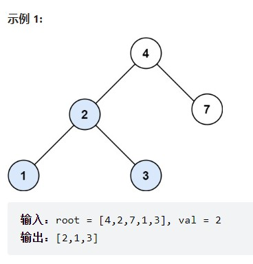

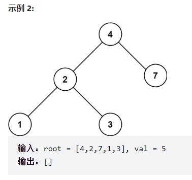

**题解思路**

二叉搜索树是一个有序树：

- 若它的左子树不空，则左子树上所有结点的值均小于它的根结点的值；
- 若它的右子树不空，则右子树上所有结点的值均大于它的根结点的值；
- 它的左、右子树也分别为二叉搜索树

```js
var searchBST = function(root, val) {
  // 如果root为空，或者找到这个数值了，就返回root节点。
    if(!root || root.val === val){
        return root;
    }
    if(root.val > val){
        return searchBST(root.left, val);
    }
    if(root.val < val){
        return searchBST(root.right, val);
    }
};
```


## 98. 验证二叉搜索树

[98. 验证二叉搜索树](https://leetcode.cn/problems/validate-binary-search-tree/)

给你一个二叉树的根节点 root ，判断其是否是一个有效的二叉搜索树。

有效 二叉搜索树定义如下：

- 节点的左子树只包含 小于 当前节点的数。
- 节点的右子树只包含 大于 当前节点的数。
- 所有左子树和右子树自身必须也是二叉搜索树。

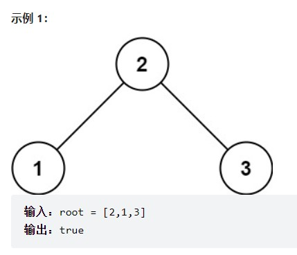

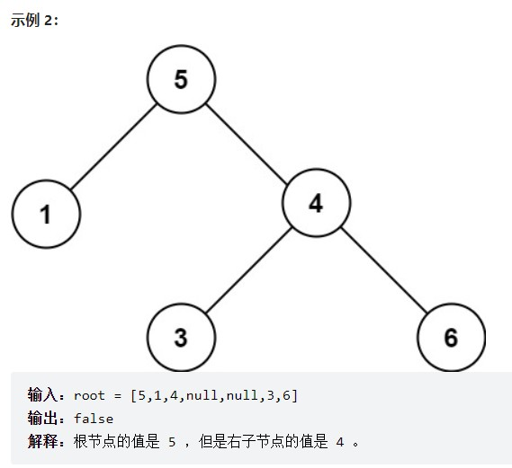

**题解思路**

二叉搜索树使用**中序遍历**是一个有序数组

所以**使用中序遍历，验证遍历的元素是不是从小到大**。

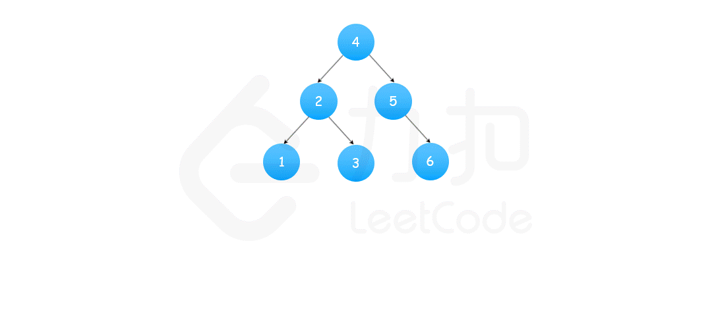

```js
if(pre !== null && pre.val >= root.val){ //当前节点的值要保证大于pre节点的值
      return false;
}
pre = root;
```

我们用一个变量pre记录上一个值，

中序遍历时，**判断当前节点是否大于中序遍历的前一个节点**，如果大于，说明满足 BST，继续遍历；否则直接返回 false。

完整代码：

```js
var isValidBST = function(root) {
    let pre = null;
    const inOrder = (root) => {
        if(root === null){
            return true;
        }
        let left = inOrder(root.left); // 左
        if(pre !== null && pre.val >= root.val){ // 中
            return false;
        }
        pre = root;
        let right = inOrder(root.right); // 右
        return left && right;
    }
    return inOrder(root);
};
```


## 530. 二叉搜索树的最小绝对差

[530. 二叉搜索树的最小绝对差](https://leetcode.cn/problems/minimum-absolute-difference-in-bst/)

给你一个二叉搜索树的根节点 `root` ，返回 **树中任意两不同节点值之间的最小差值** 。

差值是一个正数，其数值等于两值之差的绝对值。

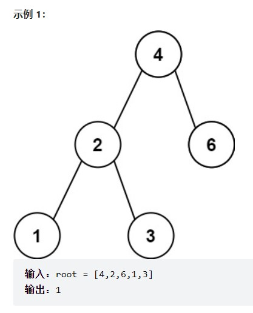

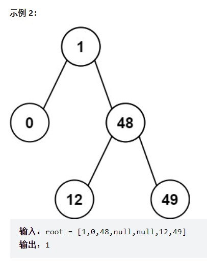

**题解思路**


依然是使用pre记录上一个节点

```js
var getMinimumDifference = function(root) {
    let res = Infinity;
    let preNode = null;
    const inOrder = (node) => {
        if(!node) return;
        inOrder(node.left);
        if(preNode) res = Math.min(res, node.val - preNode.val);
        preNode = node;
        inOrder(node.right);
    }
    inOrder(root);
    return res;
};
```


## 501. 二叉搜索树中的众数

[501. 二叉搜索树中的众数](https://leetcode.cn/problems/find-mode-in-binary-search-tree/)

给你一个含重复值的二叉搜索树（BST）的根节点 root ，找出并返回 BST 中的所有 众数（即，出现频率最高的元素）。

如果树中有不止一个众数，可以按 任意顺序 返回。

假定 BST 满足如下定义：

- 结点左子树中所含节点的值 小于等于 当前节点的值
- 结点右子树中所含节点的值 大于等于 当前节点的值
- 左子树和右子树都是二叉搜索树

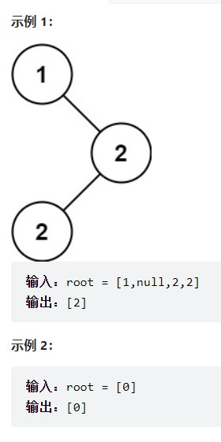


**题解思路**

对于二叉搜索树，一般都是使用中序遍历，在处理中间节点时进行操作。

因为最终答案可能不只一个，所以用数组存放答案。

对于每一个节点，因为中序遍历数组有序，所以我们只需要将当前节点与上一个节点比较即可。

如果相等，那么该值的次数加一，否则次数为一。

然后判断它的次数和maxCount，如果相等，加入答案数组。如果大于maxCount，那么说明当前节点为答案，此时就需要清空原先的答案数组。

```js
var findMode = function(root) {
    let count = 0, maxCount = 1;
    let pre = root, res = [];
    const travelTree = function(cur){
        if(cur === null) return;
        travelTree(cur.left);
        if(pre.val === cur.val){
            count++;
        }else{
            count = 1;
        }
        pre = cur;
        if(count === maxCount){
            res.push(cur.val);
        }
        if(count > maxCount){
            res = [];
            maxCount = count;
            res.push(cur.val);
        }
        travelTree(cur.right);
    }
    travelTree(root);
    return res;
};
```


## 235. 二叉搜索树的最近公共祖先

[235. 二叉搜索树的最近公共祖先](https://leetcode.cn/problems/lowest-common-ancestor-of-a-binary-search-tree/)

给定一个二叉搜索树, 找到该树中两个指定节点的最近公共祖先。

百度百科中最近公共祖先的定义为：“对于有根树 T 的两个结点 p、q，最近公共祖先表示为一个结点 x，满足 x 是 p、q 的祖先且 x 的深度尽可能大（一个节点也可以是它自己的祖先）。”

例如，给定如下二叉搜索树:  root = [6,2,8,0,4,7,9,null,null,3,5]

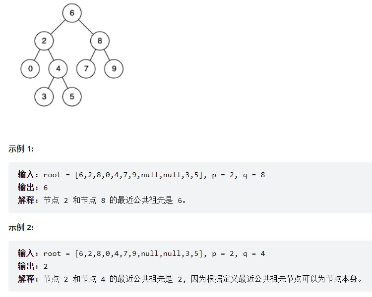

**题解思路**

那么本题是二叉搜索树，二叉搜索树是有序的，那得好好利用一下这个特点。

在有序树里，如果判断一个节点的左子树里有p，右子树里有q呢？

其实只要从上到下遍历的时候，cur节点是数值在[p, q]区间中则说明该节点cur就是最近公共祖先了。

那么我们可以采用前序遍历（其实这里没有中节点的处理逻辑，遍历顺序无所谓了）。

如图所示：p为节点3，q为节点5


完整代码：

```js
var lowestCommonAncestor = function(root, p, q) {
    if(root === null){
        return root;
    }
  ////如果 cur->val 大于 p->val，同时 cur->val 大于 q->val，那么就应该向左遍历（目标区间在左子树）。
    if(root.val > p.val && root.val > q.val){
        let left = lowestCommonAncestor(root.left, p, q);
        if(left !== null){
            return left;
        }
    }
  
  //如果 cur->val 小于 p->val，同时 cur->val 小于 q->val，那么就应该向右遍历（目标区间在右子树）。
    if(root.val < p.val && root.val < q.val){
        let right = lowestCommonAncestor(root.right, p, q);
        if(right !== null){
            return right;
        }
    }
  
  // 剩下的情况，就是cur节点在区间（p->val <= cur->val && cur->val <= q->val）或者 （q->val <= cur->val && cur->val <= p->val）中，那么cur就是最近公共祖先了，直接返回cur。
    return root;
};
```


## 701. 二叉搜索树中的插入操作

[701. 二叉搜索树中的插入操作](https://leetcode.cn/problems/insert-into-a-binary-search-tree/)

给定二叉搜索树（BST）的根节点 root 和要插入树中的值 value ，将值插入二叉搜索树。 返回插入后二叉搜索树的根节点。 输入数据 保证 ，新值和原始二叉搜索树中的任意节点值都不同。

注意，可能存在多种有效的插入方式，只要树在插入后仍保持为二叉搜索树即可。 你可以返回 任意有效的结果 。

示例 2：

```
输入：root = [40,20,60,10,30,50,70], val = 25
输出：[40,20,60,10,30,50,70,null,null,25]
```


示例 3：

```
输入：root = [4,2,7,1,3,null,null,null,null,null,null], val = 5
输出：[4,2,7,1,3,5]
```

**题解思路**

其实**可以不考虑题目中提示所说的改变树的结构的插入方式。**

只要按照二叉搜索树的规则去遍历，遇到空节点就插入节点就可以了。

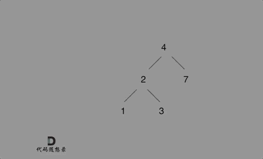

例如插入元素10 ，需要找到末尾节点插入便可，一样的道理来插入元素15，插入元素0，插入元素6，**需要调整二叉树的结构么？ 并不需要。**

只要遍历二叉搜索树，找到空节点 插入元素就可以了，

```js
var insertIntoBST = function(root, val) {
    const setInOrder = (root, val) => {
      //终止条件就是找到遍历的节点为null的时候，就是要插入节点的位置了，并把插入的节点返回。
        if(root === null){
            let node = new TreeNode(val);
            return node;
        }
        if(root.val > val)
            root.left = setInOrder(root.left, val);
        else if(root.val < val)
            root.right = setInOrder(root.right, val);
      
      // 最后将树返回
        return root;
    }
    return setInOrder(root, val);
};
```


## 669. 修剪二叉搜索树

[669. 修剪二叉搜索树](https://leetcode.cn/problems/trim-a-binary-search-tree/)

给你二叉搜索树的根节点 root ，同时给定最小边界low 和最大边界 high。通过修剪二叉搜索树，使得所有节点的值在[low, high]中。修剪树 不应该 改变保留在树中的元素的相对结构 (即，如果没有被移除，原有的父代子代关系都应当保留)。 可以证明，存在 唯一的答案 。

所以结果应当返回修剪好的二叉搜索树的新的根节点。注意，根节点可能会根据给定的边界发生改变。

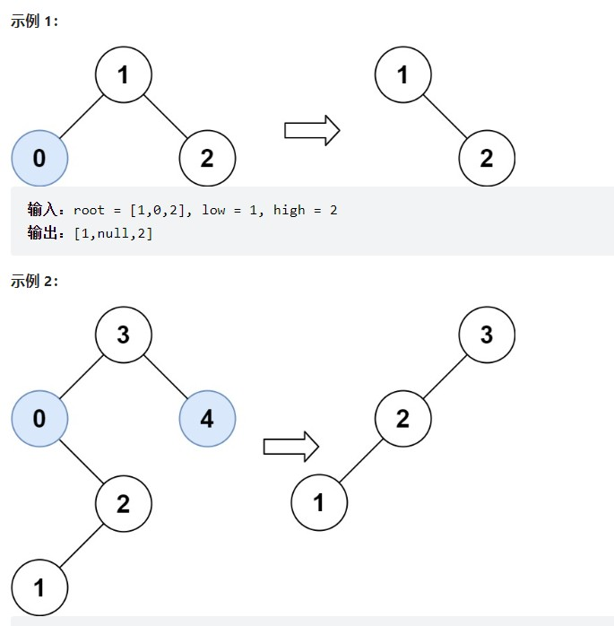、

```
输入：root = [3,0,4,null,2,null,null,1], low = 1, high = 3
输出：[3,2,null,1]
```

**题解思路**


**重点：多余的节点究竟是如何从二叉树中移除的呢？**

如下代码相当于把节点0的右孩子（节点2）返回给上一层，

```js
if (root->val < low) {
    TreeNode* right = trimBST(root->right, low, high); // 寻找符合区间[low, high]的节点
    return right;
}
```

如下代码相当于用节点3的左孩子 把下一层返回的 节点0的右孩子（节点2） 接住。

```js
root->left = trimBST(root->left, low, high);
```

此时节点3的左孩子就变成了节点2，将节点0从二叉树中移除了。

完整代码：

```js
var trimBST = function(root, low, high) {
    if(root === null){
        return null;
    }
    if(root.val < low){
        let right = trimBST(root.right, low, high);
        return right;
    }
    if(root.val > high){
        let left = trimBST(root.left, low, high);
        return left;
    }
    root.left = trimBST(root.left, low, high);
    root.right = trimBST(root.right, low, high);
    return root;
};
```


## 108. 将有序数组转换为二叉搜索树

[108. 将有序数组转换为二叉搜索树](https://leetcode.cn/problems/convert-sorted-array-to-binary-search-tree/)

给你一个整数数组 nums ，其中元素已经按 升序 排列，请你将其转换为一棵 高度平衡 二叉搜索树。

高度平衡 二叉树是一棵满足「每个节点的左右两个子树的高度差的绝对值不超过 1 」的二叉树。

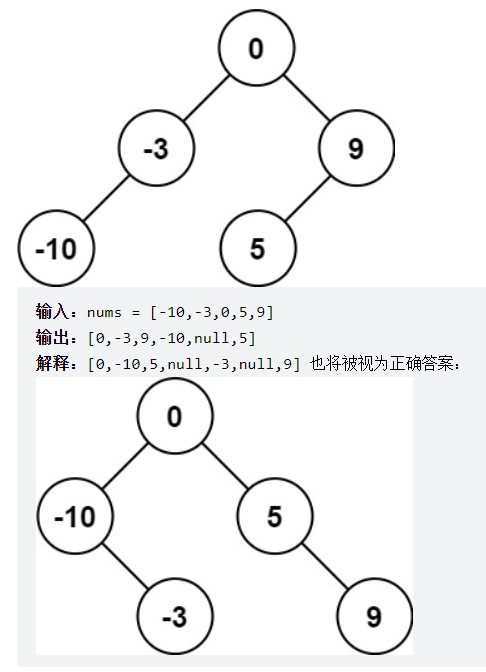

**题解思路**

直观地看，我们可以选择中间数字作为二叉搜索树的根节点，这样分给左右子树的数字个数相同或只相差 1，可以使得树保持平衡。如果数组长度是奇数，则根节点的选择是唯一的，如果数组长度是偶数，则可以选择中间位置左边的数字作为根节点或者选择中间位置右边的数字作为根节点，选择不同的数字作为根节点则创建的平衡二叉搜索树也是不同的。

**本质就是寻找分割点，分割点作为当前节点，然后递归左区间和右区间**。

确定平衡二叉搜索树的根节点之后，其余的数字分别位于平衡二叉搜索树的左子树和右子树中，左子树和右子树分别也是平衡二叉搜索树，因此可以通过递归的方式创建平衡二叉搜索树。

```js
var sortedArrayToBST = function(nums) {
    const buildTree = (nums, left, right) => {
        if(left > right){
            return null;
        }
        let mid = Math.floor(left + (right - left)/2);
        let root = new TreeNode(nums[mid]);
        root.left = buildTree(nums, left, mid - 1);
        root.right = buildTree(nums, mid + 1, right);
        return root;
    }
    return buildTree(nums, 0, nums.length-1);
};
```


## 95. 不同的二叉搜索树 II

[95. 不同的二叉搜索树 II](https://leetcode.cn/problems/unique-binary-search-trees-ii/)

给你一个整数 `n` ，请你生成并返回所有由 `n` 个节点组成且节点值从 `1` 到 `n` 互不相同的不同 **二叉搜索树** 。可以按 **任意顺序** 返回答案。

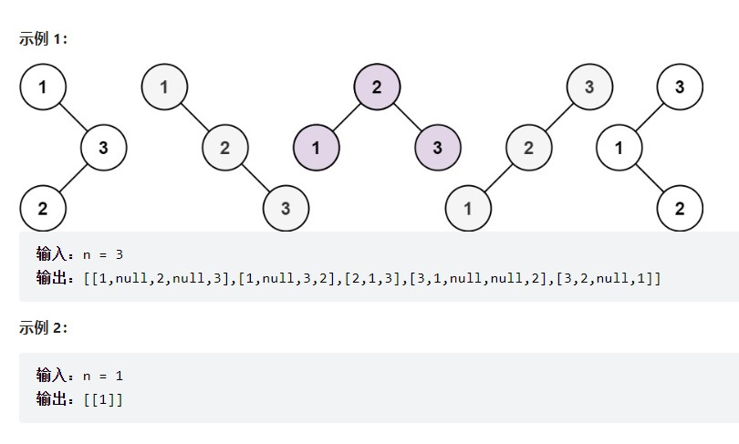

**题解思路**

- 按照 BST 的定义，如果整数 i 作为根节点，则整数 1 ~ i-1 会去构建左子树，i+1 ~ n 会去构建右子树
- 以 i 为根节点的 BST 种类数 = 左子树 BST 种类数 * 右子树 BST 种类数
- 所以，不同的 i 之下，左右 BST 子树任意搭配出不同的组合，就构成了不同的 BST

```js
var generateTrees = function(n) {
    if(n==0) return [];
    const getAllTrees = (low, high) => {
        if(low > high) return [null];
        if(low == high) return [new TreeNode(low)];
        const res = [];
        for(let i=low; i<=high; i++){ //把每一个节点当做根节点
            const leftTrees = getAllTrees(low, i-1);//获取左子树的集合
            const rightTrees = getAllTrees(i+1, high);//获取右子树的集合
            for(let leftTree of leftTrees){//选出一个左子树和右子树，拼接到根节点上
                for(let rightTree of rightTrees){
                    const root = new TreeNode(i);
                    root.left = leftTree;
                    root.right = rightTree;
                    res.push(root);
                }
            }
        }
        return res;
    }
    return getAllTrees(1, n);
};
```


## 96. 不同的二叉搜索树

[96. 不同的二叉搜索树](https://leetcode.cn/problems/unique-binary-search-trees/)

给你一个整数 `n` ，求恰由 `n` 个节点组成且节点值从 `1` 到 `n` 互不相同的 **二叉搜索树** 有多少种？返回满足题意的二叉搜索树的种数。

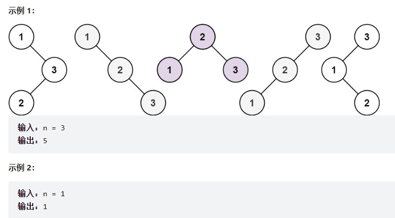

**题解思路**

dp[3]，就是 元素1为头结点搜索树的数量 + 元素2为头结点搜索树的数量 + 元素3为头结点搜索树的数量

元素1为头结点搜索树的数量 = 右子树有2个元素的搜索树数量 * 左子树有0个元素的搜索树数量

元素2为头结点搜索树的数量 = 右子树有1个元素的搜索树数量 * 左子树有1个元素的搜索树数量

元素3为头结点搜索树的数量 = 右子树有0个元素的搜索树数量 * 左子树有2个元素的搜索树数量

有2个元素的搜索树数量就是dp[2]。

有1个元素的搜索树数量就是dp[1]。

有0个元素的搜索树数量就是dp[0]。

所以dp[3] = dp[2] * dp[0] + dp[1] * dp[1] + dp[0] * dp[2]

dp[i] += dp[j - 1] * dp[i - j]; ，j-1 为j为头结点左子树节点数量，i-j 为以j为头结点右子树节点数量

```js
var numTrees = function(n) {
    let dp = new Array(n+1).fill(0);
    dp[0] = 1;
    dp[1] = 1;

    for(let i=2; i<=n; i++){
        for(let j=1; j<=i; j++){
            dp[i] += dp[j-1]*dp[i-j];
        }
    }

    return dp[n];
};
```


## 109. 有序链表转换二叉搜索树

[109. 有序链表转换二叉搜索树](https://leetcode.cn/problems/convert-sorted-list-to-binary-search-tree/)

给定一个单链表的头节点  head ，其中的元素 按升序排序 ，将其转换为高度平衡的二叉搜索树。

本题中，一个高度平衡二叉树是指一个二叉树每个节点 的左右两个子树的高度差不超过 1。

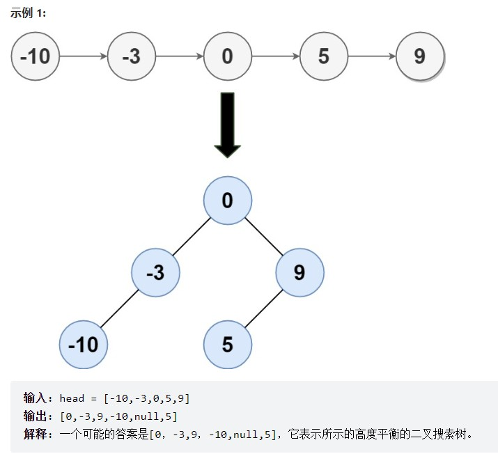

**题解思路**

快慢指针
寻找链表的中间点有个小技巧：

快慢指针起初都指向头结点，分别一次走两步和一步，当快指针走到尾节点时，慢指针正好走到链表的中间。断成两个链表，分而治之。

为了断开，我们需要保存慢指针的前一个节点，因为单向链表的结点没有前驱指针。


```js
const sortedListToBST = (head) => {
  if (head == null) return null;
  let slow = head;
  let fast = head;
  let preSlow; // 保存slow的前一个节点

  while (fast && fast.next) {
    preSlow = slow;        // 保存当前slow
    slow = slow.next;      // slow走一步
    fast = fast.next.next; // fast走两步
  }
  const root = new TreeNode(slow.val);     // 根据slow指向的节点值，构建节点

  if (preSlow != null) {   // 如果preSlow有值，即slow左边有节点，需要构建左子树
    preSlow.next = null;   // 切断preSlow和中点slow
    root.left = sortedListToBST(head);     // 递归构建左子树
  }
  root.right = sortedListToBST(slow.next); // 递归构建右子树
  return root;
};
```


## 230. 二叉搜索树中第K小的元素

[230. 二叉搜索树中第K小的元素](https://leetcode.cn/problems/kth-smallest-element-in-a-bst/)

给定一个二叉搜索树的根节点 `root` ，和一个整数 `k` ，请你设计一个算法查找其中第 `k` 个最小元素（从 1 开始计数）。

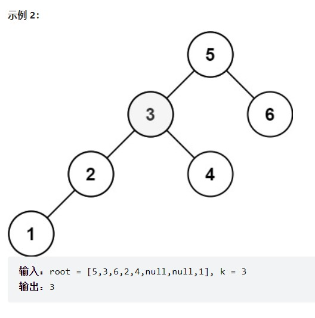

**题解思路**

二叉搜索树的中序遍历是有序的，那么我们以迭代的方式进行中序遍历，用count变量记录当前是第几小的元素，当`count == k`时，退出。

```js
var kthSmallest = function(root, k) {
    let count = 0;
    let stack = [];

    while(root || stack.length){
        while(root){
            stack.push(root);
            root = root.left; // 左
        }

        // 中
        root = stack.pop();
        count++;
        if(count === k){
            return root.val;
        }

        root = root.right; //右
    }
};
```

