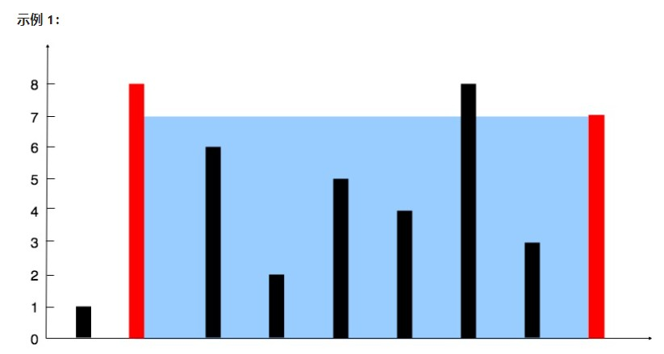
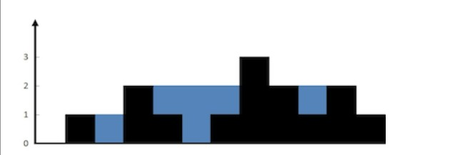
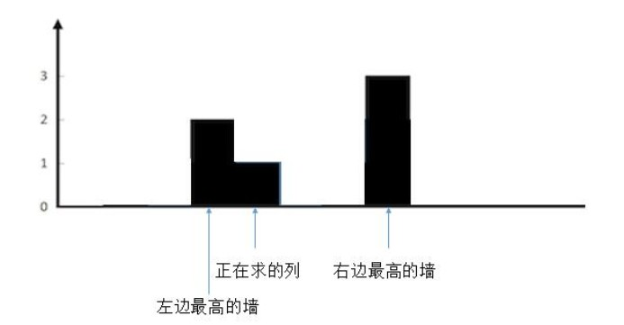
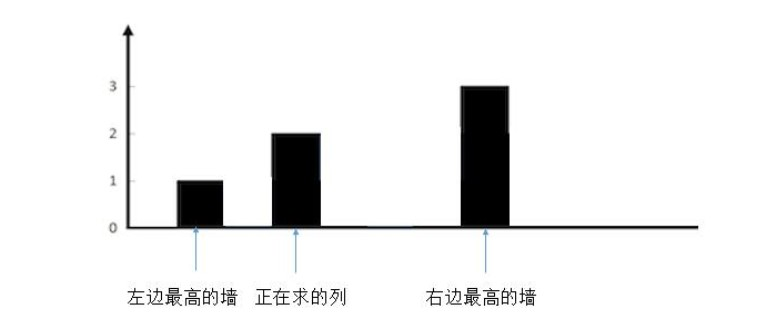
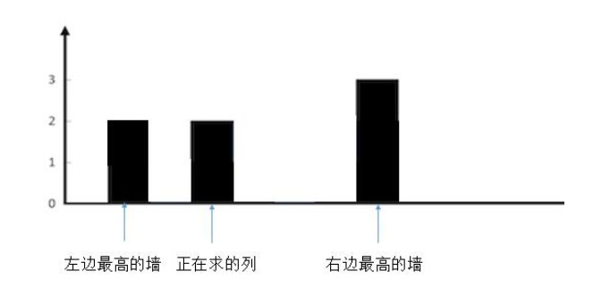

# 【LeetCode】双指针题解汇总

[TOC]

## 写在前面

这里是小飞侠Pan🥳，立志成为一名优秀的前端程序媛！！！

本篇文章同时收录于我的[github](https://github.com/mengqiuleo)前端笔记仓库中，持续更新中，欢迎star~

👉[https://github.com/mengqiuleo/myNote](https://github.com/mengqiuleo/myNote)


## 11. 盛最多水的容器

[11. 盛最多水的容器](https://leetcode.cn/problems/container-with-most-water/)

给定一个长度为 n 的整数数组 height 。有 n 条垂线，第 i 条线的两个端点是 (i, 0) 和 (i, height[i]) ，找出其中的两条线，使得它们与 x 轴共同构成的容器可以容纳最多的水。

返回容器可以储存的最大水量。



```
输入：[1,8,6,2,5,4,8,3,7]
输出：49 
解释：图中垂直线代表输入数组 [1,8,6,2,5,4,8,3,7]。在此情况下，容器能够容纳水（表示为蓝色部分）的最大值为 49。
```

**示例 2：**

```
输入：height = [1,1]
输出：1
```

**题解思路**

- 使用双指针，左右指针分别指向数组的开始和结束的位置
- 每次都会计算出左右指针的容量，然后向中间逐渐移动指针，直到两个指针相遇
- 如果左指针的高度小于右指针，那就移动左指针。反之亦然。

```js
var maxArea = function(height) {
    let left = 0, right = height.length - 1;
    let ans = 0;
    while(left < right){
        let area = Math.min(height[left],height[right])*(right - left); //每次计算出容量
        ans = Math.max(ans,area);//更新最大值
        if(height[left] <= height[right]){
            left++;
        }else{
            right--;
        }
    }
    return ans;
};
```


## 15. 三数之和

[15. 三数之和](https://leetcode.cn/problems/3sum/)

给你一个包含 n 个整数的数组 nums，判断 nums 中是否存在三个元素 a，b，c ，使得 a + b + c = 0 ？请你找出所有和为 0 且不重复的三元组。

注意：答案中不可以包含重复的三元组。

示例 1：

```
输入：nums = [-1,0,1,2,-1,-4]
输出：[[-1,-1,2],[-1,0,1]]
```


示例 2：

```
输入：nums = []
输出：[]
```


示例 3：

```
输入：nums = [0]
输出：[]
```

**题解思路**

- 首先对数组进行排序
- 固定一个第一个数，然后后两个数使用双指针，因为数组此时是按顺序排的，所以如果和大于0，那就右指针向左移。
- 另外，在每次固定第一个指针时的循环中，我们可以进行剪枝操作
  - 如果遇见相同的数，直接continue
  - 如果固定的第一个数大于0，直接break跳出循环，因为数组是有序的，后面的数一定比前面的大，那么永远不可能为0

```js
var threeSum = function(nums) {
    let ans = [];
    const len = nums.length;
    if(len < 3) return ans;
    nums.sort((a,b) => a - b);
    for(let i = 0; i < len; i++){
        if(nums[i] > 0) break;
        if(i > 0 && nums[i] == nums[i-1]) continue;
        let left = i + 1;
        let right = len - 1;
        while(left < right){
            let sum = nums[i] + nums[left] + nums[right];
            if(sum === 0){
                ans.push([nums[i],nums[left],nums[right]]);
                while(left < right && nums[left] === nums[left + 1]) left++;
                while(left < right && nums[right] === nums[right - 1]) right--;
                left++;
                right--;
            }
            else if(sum < 0) left++;
            else if(sum > 0) right--;
        }
    }
    return ans;
};
```


## 16. 最接近的三数之和

[16. 最接近的三数之和](https://leetcode.cn/problems/3sum-closest/)

给你一个长度为 n 的整数数组 nums 和 一个目标值 target。请你从 nums 中选出三个整数，使它们的和与 target 最接近。

返回这三个数的和。

假定每组输入只存在恰好一个解。

 

示例 1：

```
输入：nums = [-1,2,1,-4], target = 1
输出：2
```


解释：与 target 最接近的和是 2 (-1 + 2 + 1 = 2) 。
示例 2：

```
输入：nums = [0,0,0], target = 1
输出：0
```


**题解思路**

- 和第十五题相似，也是固定第一个数，双指针指向下一个数和最后一个数
- 首先需要对数组进行排序
- 用变量res来存储最终的答案
- 每次比较当前的绝对值和res中的决定值，并更新结果
- 如果相同，就返回，不必再比较了

```js
var threeSumClosest = function(nums, target) {
    let res = Number.MAX_SAFE_INTEGER;
    nums.sort((a,b) => a - b);
    let len = nums.length;
    for(let i = 0; i < len; i++){
        let left = i + 1, right = len - 1;
        while(left < right){
            let sum = nums[i] + nums[left] + nums[right];
            if(Math.abs(sum - target) < Math.abs(res - target)){
                res = sum;
            }
            if(sum < target){
                left++;
            }else if(sum > target){
                right--;
            }else{
                return sum;
            }
        }
    }
    return res;
};
```


## 18. 四数之和

[18. 四数之和](https://leetcode.cn/problems/4sum/)

给你一个由 n 个整数组成的数组 nums ，和一个目标值 target 。请你找出并返回满足下述全部条件且不重复的四元组 [nums[a], nums[b], nums[c], nums[d]] （若两个四元组元素一一对应，则认为两个四元组重复）：

- 0 <= a, b, c, d < n
- a、b、c 和 d 互不相同
- nums[a] + nums[b] + nums[c] + nums[d] == target

 

示例 1：

```
输入：nums = [1,0,-1,0,-2,2], target = 0
输出：[[-2,-1,1,2],[-2,0,0,2],[-1,0,0,1]]
```


示例 2：

```
输入：nums = [2,2,2,2,2], target = 8
输出：[[2,2,2,2]]
```


**题解思路**

- 循环前两个数，后两个数使用双指针

- 首先对数组排序

- 可以进行剪枝：

  - ```js
    if(i > 0 && nums[i] === nums[i-1]) continue;
    //如果当前最小的和比目标值大，那就结束循环，因为数组有序，后面的和一定更大
    if(nums[i] + nums[i+1] + nums[i+2] + nums[i+3] > target) break;
    //如果当前的最大的和比目标值还小，那就直接跳过这个要循环的数
    if(nums[i] + nums[len-1] + nums[len-2] + nums[len-3] < target) continue;
    ```

- 在while循环中，要根据sum和target的大小，左右移动指针，并且因为可以出现同样的数，所以要排除掉相同的数

  - ```js
    while(left < right){
    	if(nums[left] !== nums[++left]) break;
    }
    ```

完整代码

```js
var fourSum = function(nums, target) {
  let res = [];
  let len = nums.length;
  if(len < 4) return [];
  nums.sort((a,b) => a - b);
  for(let i = 0; i < len - 3; i++){
    if(i > 0 && nums[i] === nums[i-1]) continue;
    if(nums[i] + nums[i+1] + nums[i+2] + nums[i+3] > target) break;
    if(nums[i] + nums[len-1] + nums[len-2] + nums[len-3] < target) continue;
    for(let j = i + 1; j < len - 2; j++){
      if(j > i + 1 && nums[j] === nums[j-1]) continue;
      if(nums[i] + nums[j] + nums[j+1] + nums[j+2] > target) break;
      if(nums[i] + nums[j] + nums[len-1] + nums[len-2] < target) continue;
      let left = j+1, right = len-1;
      while(left < right){
        let sum = nums[i] + nums[j] + nums[left] + nums[right];
        if(sum === target){
          res.push([nums[i], nums[j], nums[left], nums[right]]);
          while(left < right && nums[left] === nums[left+1]){
            left++;
          }
          while(left < right && nums[right] === nums[right-1]){
            right--;
          }
          left++;
          right--;
        } else if(sum > target){
          while(left < right){
            if(nums[right] !== nums[--right]) break;
          }
        } else if(sum < target){
          while(left < right){
            if(nums[left] !== nums[++left]) break;
          }
        }
      } 
    }
  }
  return res;
};
```


## 42. 接雨水

[42. 接雨水](https://leetcode.cn/problems/trapping-rain-water/)

给定 `n` 个非负整数表示每个宽度为 `1` 的柱子的高度图，计算按此排列的柱子，下雨之后能接多少雨水。

示例 1：



```
输入：height = [0,1,0,2,1,0,1,3,2,1,2,1]
输出：6
解释：上面是由数组 [0,1,0,2,1,0,1,3,2,1,2,1] 表示的高度图，在这种情况下，可以接 6 个单位的雨水（蓝色部分表示雨水）。 
```


示例 2：

```
输入：height = [4,2,0,3,2,5]
输出：9
```

**题解思路**

- 这里我们按照求每一列的雨水，最后将每一列的雨水加起来

- 对于当前要求的这一列，设两个指针，从当前列向两边走，分别求出两侧最高的列

- 此时就要分情况讨论

  - 当正在求的列是最矮的，此时就可以计算

    

  - 当正在求的列不是最矮的，那么就无法盛到水

    

    

```js
var trap = function(height) {
    let sum = 0;
    for(let i = 0; i < height.length; i++){//遍历每一列，求出每一列可以存储的水
        if(i == 0 || i == height.length - 1) continue; //跳过最左边和最右边的列
        let lHeight = height[i], rHeight = height[i];
        for(let r = i + 1; r < height.length; r++){//右边的指针
            if(height[r] > rHeight) rHeight = height[r];//拿到右边最高的列
        }
        for(let l = i - 1; l >= 0; l--){
            if(height[l] > lHeight) lHeight = height[l];//拿到左边最高的列
        }
        let h = Math.min(lHeight,rHeight) - height[i];//计算两边列的最小值与要求的当前列的差值
        if(h > 0) sum += h;//当差值大于0，即当前要求的列是最矮的
    }
    return sum;
};
```


## 167. 两数之和 II - 输入有序数组

[167. 两数之和 II - 输入有序数组](https://leetcode.cn/problems/two-sum-ii-input-array-is-sorted/)

给你一个下标从 1 开始的整数数组 numbers ，该数组已按 非递减顺序排列  ，请你从数组中找出满足相加之和等于目标数 target 的两个数。如果设这两个数分别是 numbers[index1] 和 numbers[index2] ，则 1 <= index1 < index2 <= numbers.length 。

以长度为 2 的整数数组 [index1, index2] 的形式返回这两个整数的下标 index1 和 index2。

你可以假设每个输入 只对应唯一的答案 ，而且你 不可以 重复使用相同的元素。

你所设计的解决方案必须只使用常量级的额外空间。


示例 1：

```
输入：numbers = [2,7,11,15], target = 9
输出：[1,2]
解释：2 与 7 之和等于目标数 9 。因此 index1 = 1, index2 = 2 。返回 [1, 2] 。
```


示例 2：

```
输入：numbers = [2,3,4], target = 6
输出：[1,3]
解释：2 与 4 之和等于目标数 6 。因此 index1 = 1, index2 = 3 。返回 [1, 3] 。
```


示例 3：

```
输入：numbers = [-1,0], target = -1
输出：[1,2]
解释：-1 与 0 之和等于目标数 -1 。因此 index1 = 1, index2 = 2 。返回 [1, 2] 。
```

**题解**

- 设置两个指针，指向数组的开头和结尾
- 因为数组是有序的，那么每次计算出两个指针的和，如果计算出的结果偏大，那么右指针向左移...
- 如果相等，返回指针下标+1

```js
var twoSum = function(numbers, target) {
    let i = 0, j = numbers.length - 1;
    while(i < j){
        let sum = numbers[i] + numbers[j];
        if(sum > target){
            j--;
        }else if(sum < target){
            i++;
        }else{
            return [i+1,j+1];
        }
    }
};
```


## 283. 移动零

[283. 移动零](https://leetcode.cn/problems/move-zeroes/)

给定一个数组 nums，编写一个函数将所有 0 移动到数组的末尾，同时保持非零元素的相对顺序。

请注意 ，必须在不复制数组的情况下原地对数组进行操作。

 

示例 1:

```
输入: nums = [0,1,0,3,12]
输出: [1,3,12,0,0]
```


示例 2:

```
输入: nums = [0]
输出: [0]
```

**题解**

- 两个指针都指向数组的开始
- 实现移动0的思想就是：将慢指针指向新生成的那个数组的末尾，快指针负责扫描原数组
- 如果快指针扫到了非0 的数，并且快慢指针不重合，那就交换快慢指针的数
- 如果快慢指针重合，此时不用交换，另外因为这个数非0，那么慢指针向后移动，表示将这个数加入新数组

```js
var moveZeroes = function(nums) {
    let slow = 0, fast = 0;
    while(fast < nums.length){
        if(nums[fast]){//扫到了非0的数
            if(fast !== slow){
                let temp = nums[slow];
                nums[slow] = nums[fast];
                nums[fast] = temp;
            }
            slow++;//在这个if条件中，说明扫到了非0的数，那么慢指针+1，因为慢指针要指向新数组的末尾
        }
        fast++;//快指针负责扫描原数组，所以每次向后移动
    }
};
```


## 344. 反转字符串

[344. 反转字符串](https://leetcode.cn/problems/reverse-string/)

编写一个函数，其作用是将输入的字符串反转过来。输入字符串以字符数组 s 的形式给出。

不要给另外的数组分配额外的空间，你必须原地修改输入数组、使用 O(1) 的额外空间解决这一问题。

 

示例 1：

```
输入：s = ["h","e","l","l","o"]
输出：["o","l","l","e","h"]
```


示例 2：

```
输入：s = ["H","a","n","n","a","h"]
输出：["h","a","n","n","a","H"]
```

**题解**

```js
var reverseString = function(s) {
    let i = 0, j = s.length - 1;
    let temp = '';
    while(i < j){
        temp = s[i];
        s[i] = s[j];
        s[j] = temp;
        i++;
        j--;
    }
};
```


## 345. 反转字符串中的元音字母

[345. 反转字符串中的元音字母](https://leetcode.cn/problems/reverse-vowels-of-a-string/)

给你一个字符串 s ，仅反转字符串中的所有元音字母，并返回结果字符串。

元音字母包括 'a'、'e'、'i'、'o'、'u'，且可能以大小写两种形式出现。

 

示例 1：

```
输入：s = "hello"
输出："holle"
```


示例 2：

```
输入：s = "leetcode"
输出："leotcede"
```

**题解**

- 将字符串转换成数组
- 两个指针指向开头和结尾
- 设置循环条件为两个指针相撞时退出
- 如果 i指针 是元音字母，进入if循环，判断 j指针是否是元音字母，如果是，交换，否则，如果 j指针不是元音字母，j指针左移
- 如果 i指针 不是元音字母，i指针 右移
- 最后将数组拼接成字符串返回

```js
var reverseVowels = function(s) {
    let vowels = ['a','e','i','o','u','A','E','I','O','U'];
    let i = 0, j = s.length - 1;
    let arr = s.split('');
    while(i < j){
        if(vowels.includes(arr[i])){
            if(vowels.includes(arr[j])){
                let temp = arr[i];
                arr[i] = arr[j];
                arr[j] = temp;
                i++;
                j--;
            }else {
                j--;
            }
        }else{
            i++;
        }
    }
    return arr.join('');
};
```


## 844. 比较含退格的字符串

[844. 比较含退格的字符串](https://leetcode.cn/problems/backspace-string-compare/)

给定 s 和 t 两个字符串，当它们分别被输入到空白的文本编辑器后，如果两者相等，返回 true 。# 代表退格字符。

注意：如果对空文本输入退格字符，文本继续为空。

 

示例 1：

```
输入：s = "ab#c", t = "ad#c"
输出：true
解释：s 和 t 都会变成 "ac"。
```


示例 2：

```
输入：s = "ab##", t = "c#d#"
输出：true
解释：s 和 t 都会变成 ""。
```


示例 3：

```
输入：s = "a#c", t = "b"
输出：false
解释：s 会变成 "c"，但 t 仍然是 "b"。
```

**题解**

- 因为题目中说如果出现#，那么它前面的字符退格。那么我们就可以从后往前遍历字符串，并且设置标志边量用来记录是否遇见#
- 如果遇见#，指针向左移动一位，并且用标志变量记录
- 如果遇见普通字符并且标志变量存在，那么指针向左移动一位，表示退格，并且消除标志变量
- 否则如果遇见普通字符但没有标志变量，那就退出循环，比较两个指针指向的字符

```js
var backspaceCompare = function(s, t) {
    let i = s.length - 1, j = t.length - 1;
    let skipS = 0, skipT = 0;//标志变量
    while(i >= 0 || j >= 0){
        while(i >= 0){
            if(s[i] === '#'){
                skipS++;
                i--;
            }else if(skipS > 0){
                i--;
                skipS--;
            }else break;
        }
        while(j >= 0){
            if(t[j] === '#'){
                skipT++;
                j--;
            }else if(skipT > 0){
                skipT--;
                j--;
            }else break;
        }
        if(s[i] !== t[j]) return false;
        i--;
        j--;
    }
    return true;
};
```


## 881. 救生艇

[881. 救生艇](https://leetcode.cn/problems/boats-to-save-people/)

给定数组 people 。people[i]表示第 i 个人的体重 ，船的数量不限，每艘船可以承载的最大重量为 limit。

每艘船最多可同时载两人，但条件是这些人的重量之和最多为 limit。

返回 承载所有人所需的最小船数 。

 

示例 1：

```
输入：people = [1,2], limit = 3
输出：1
解释：1 艘船载 (1, 2)
```


示例 2：

```
输入：people = [3,2,2,1], limit = 3
输出：3
解释：3 艘船分别载 (1, 2), (2) 和 (3)
```


示例 3：

```
输入：people = [3,5,3,4], limit = 5
输出：4
解释：4 艘船分别载 (3), (3), (4), (5)
```

**题解**

- 注意审题，题目中说明，一艘船只允许最多载两个人
- 两个指针指向开始和末尾
- 如果 `people[left] + people[right] <= limit` ：说明 `left` 和 `right` 指向的人可以配对（乘坐同一艘船），此时 `left` 和 `right` 各向中间走一步；
- 如果 `people[left] + people[right] > limit` ：说明 `right` 指向的人太重了，他应该单独乘坐一艘船。即 `right` 向中间走一步（`right--`）。

按照上面的方式，直到 `left` 与 `right` 重合，这样就可以完成任务。

- 注意，while循环退出的条件是 left === right，那么此时left指针执行的人还未坐船，那么应该再加上一艘船

```js
var numRescueBoats = function(people, limit) {
    if(people.length === 0) return 0;
    people = people.sort((a,b) => a - b);
    let left = 0, right = people.length - 1;
    let nums = 0;
    while(left < right){
        if(people[left] + people[right] <= limit){
            left++;
            right--;
        }else{
            right--;
        }
        nums++;
    }
    if(left === right) nums++;//此时left指针执行的人还未坐船，那么应该再加上一艘船
    return nums;
};
```


## 977. 有序数组的平方

[977. 有序数组的平方](https://leetcode.cn/problems/squares-of-a-sorted-array/)

给你一个按 非递减顺序 排序的整数数组 nums，返回 每个数字的平方 组成的新数组，要求也按 非递减顺序 排序。

 

示例 1：

```
输入：nums = [-4,-1,0,3,10]
输出：[0,1,9,16,100]
解释：平方后，数组变为 [16,1,0,9,100]
排序后，数组变为 [0,1,9,16,100]
```


示例 2：

```
输入：nums = [-7,-3,2,3,11]
输出：[4,9,9,49,121]
```

**题解**

- 因为数组有序，那么两边的数平方后的值最大，中间的数平方后的值较小
- 两个指针分别指向数组的开头与结尾，然后求出平方，将比较后的较大值放入数组的开头
- 因为两个指针是向中间走的，那么所求的平方值也应该是越来越小，所以应该插入到数组的最前面

```js
var sortedSquares = function(nums) {
    let res = [];
    let i = 0, j = nums.length - 1;
    while(i <= j){
        let left = Math.abs(nums[i]);
        let right = Math.abs(nums[j]);
        if(right > left){
            res.unshift(right * right);
            j--;
        }else{
            res.unshift(left * left);
            i++;
        }
    }
    return res;
};
```

