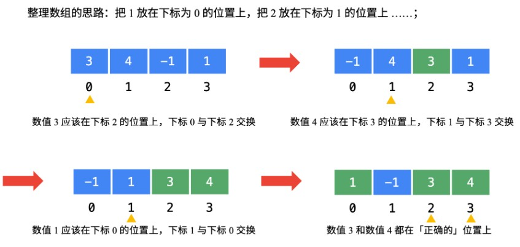

题目链接：[41. 缺失的第一个正数](https://leetcode.cn/problems/first-missing-positive/)

给你一个未排序的整数数组 nums ，请你找出其中没有出现的最小的正整数。

请你实现时间复杂度为 O(n) 并且只使用常数级别额外空间的解决方案。


示例 1：

```
输入：nums = [1,2,0]
输出：3
```


示例 2：

```
输入：nums = [3,4,-1,1]
输出：2
```


示例 3：

```
输入：nums = [7,8,9,11,12]
输出：1
```

**题解思路**

- 题目要求返回缺失的第一个正整数，那么我们可以采用“一个萝卜一个坑”的思想
- 将数组中的所有数字归位，当下标为[0,N]时，数字应该为[1,N+1]
- 那么数值为i的数应该放在下标为i-1的位置
- 比如数字：nums[i]，它的下标应该为nums[i]-1，
- 所以，反过来说，下标为nums[i]-1的地方对应的数字应该为nums[nums[i]-1]
- 通过上面的推导，我们可以得出一个结论：`nums[nums[i]-1] === nums[i]`
- 于是，我们可以遍历一遍，将所有的数组交换到正确的位置，然后再进行一次遍历，找到`nums[i] != i + 1`的数



**这个题要重点理解：nums[nums[i]-1] === nums[i] 的意思**

```js
var firstMissingPositive = function(nums) {
    for(let i = 0; i < nums.length; i++){
        while(nums[i] > 0 && nums[i] <= nums.length && nums[nums[i]-1] != nums[i]){
            [ nums[nums[i]-1], nums[i] ] = [ nums[i], nums[nums[i]-1] ];
        }
    }
    for(let i = 0; i < nums.length; i++){
        if(nums[i] != i + 1){
            return i + 1;
        }
    }
    return nums.length + 1;
};
```

