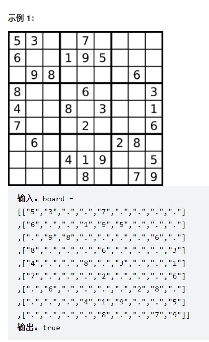
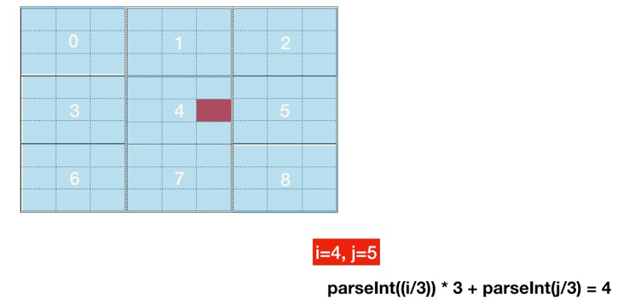
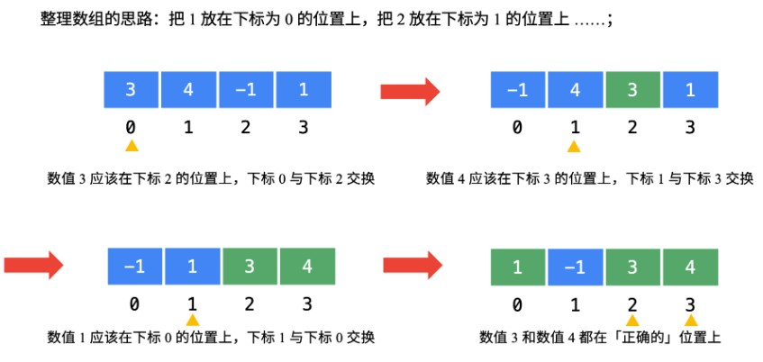
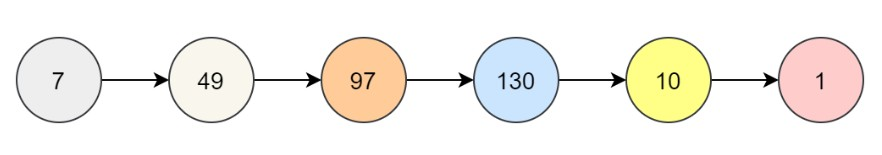
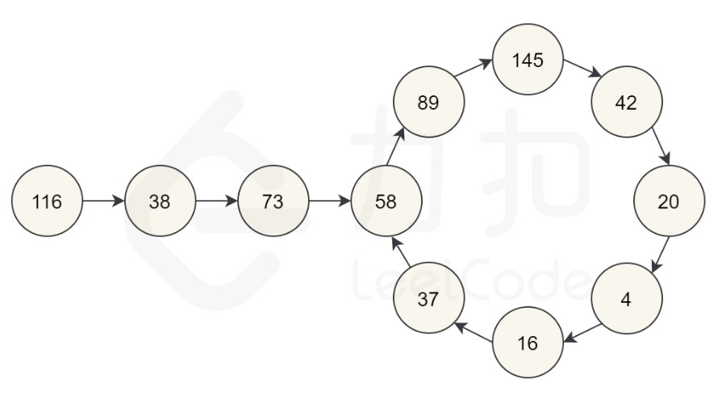

# 【LeetCode】哈希表题解汇总

[TOC]

## 写在前面

这里是小飞侠Pan🥳，立志成为一名优秀的前端程序媛！！！

本篇文章同时收录于我的[github](https://github.com/mengqiuleo)前端笔记仓库中，持续更新中，欢迎star~

👉[https://github.com/mengqiuleo/myNote](https://github.com/mengqiuleo/myNote)


## 1. 两数之和

[1. 两数之和](https://leetcode.cn/problems/two-sum/)

给定一个整数数组 nums 和一个整数目标值 target，请你在该数组中找出 和为目标值 target  的那 两个 整数，并返回它们的数组下标。

你可以假设每种输入只会对应一个答案。但是，数组中同一个元素在答案里不能重复出现。

你可以按任意顺序返回答案。

示例 1：

```
输入：nums = [2,7,11,15], target = 9
输出：[0,1]
解释：因为 nums[0] + nums[1] == 9 ，返回 [0, 1] 。
```


示例 2：

```
输入：nums = [3,2,4], target = 6
输出：[1,2]
```


示例 3：

```
输入：nums = [3,3], target = 6
输出：[0,1]
```

**题解思路**

- 用哈希表存储每个元素，key为值，value为下标
- 从头遍历每个元素，对于nums[i]，根据给定的target，那么另一个数应该为`target-nums[i]`
- 如果这个数`target-nums[i]`在哈希表中出现了，说明已找到答案

```js
var twoSum = function(nums, target) {
    let hash = {};
    for(let i = 0; i < nums.length; i++){
        if(hash[target - nums[i]] !== undefined){
            return [i, hash[target - nums[i]]];
        }
        hash[nums[i]] = i;
    }
    return [];
};
```


## 36. 有效的数独

[36. 有效的数独](https://leetcode.cn/problems/valid-sudoku/)

请你判断一个 9 x 9 的数独是否有效。只需要 根据以下规则 ，验证已经填入的数字是否有效即可。

数字 1-9 在每一行只能出现一次。
数字 1-9 在每一列只能出现一次。
数字 1-9 在每一个以粗实线分隔的 3x3 宫内只能出现一次。（请参考示例图）


注意：

一个有效的数独（部分已被填充）不一定是可解的。
只需要根据以上规则，验证已经填入的数字是否有效即可。
空白格用 '.' 表示。



示例 2：

```
输入：board = 
[["8","3",".",".","7",".",".",".","."]
,["6",".",".","1","9","5",".",".","."]
,[".","9","8",".",".",".",".","6","."]
,["8",".",".",".","6",".",".",".","3"]
,["4",".",".","8",".","3",".",".","1"]
,["7",".",".",".","2",".",".",".","6"]
,[".","6",".",".",".",".","2","8","."]
,[".",".",".","4","1","9",".",".","5"]
,[".",".",".",".","8",".",".","7","9"]]
输出：false
解释：除了第一行的第一个数字从 5 改为 8 以外，空格内其他数字均与 示例1 相同。 但由于位于左上角的 3x3 宫内有两个 8 存在, 因此这个数独是无效的。
```

**题解思路**

- 首先需要三个哈希表来记录行，列，3*3小方块里面的数值情况

- 遍历每一个值，分别判断上面三种情况：是否出现重复

- 注意点：求得该数值在哪个小方块：`parseInt((i/3))*3 + parseInt(j/3)`

  

```js
var isValidSudoku = function(board) {
    let rows = {};//行
    let columns = {};//列
    let boxes = {};//3*3小方块
    for(let i = 0; i < 9; i++){
        for(let j = 0; j < 9; j++){
            let num = board[i][j];
            if(num != '.'){//遇到有效的数字
                let boxIndex = parseInt((i/3))*3 + parseInt(j/3);//子数独序号：即位于第几个小方块
                if(rows[i+'-'+num] || columns[j+'-'+num] || boxes[boxIndex+'-'+num]){
                    return false;
                }
                //记录当前的值
                rows[i+'-'+num] = true;
                columns[j+'-'+num] = true;
                boxes[boxIndex+'-'+num] = true;
            }
        }
    }
    return true;
};
```


## 41. 缺失的第一个正数

[41. 缺失的第一个正数](https://leetcode.cn/problems/first-missing-positive/)

给你一个未排序的整数数组 nums ，请你找出其中没有出现的最小的正整数。

请你实现时间复杂度为 O(n) 并且只使用常数级别额外空间的解决方案。


示例 1：

```
输入：nums = [1,2,0]
输出：3
```


示例 2：

```
输入：nums = [3,4,-1,1]
输出：2
```


示例 3：

```
输入：nums = [7,8,9,11,12]
输出：1
```

**题解思路**

```js
var firstMissingPositive = function(nums) {
    for(let i = 0; i < nums.length; i++){
        while(nums[i] > 0 && nums[i] <= nums.length && nums[nums[i]-1] != nums[i]){
            [ nums[nums[i]-1], nums[i] ] = [ nums[i], nums[nums[i]-1] ];
        }
    }
    for(let i = 0; i < nums.length; i++){
        if(nums[i] != i + 1){
            return i + 1;
        }
    }
    return nums.length + 1;
};
```

**题解思路**

- 题目要求返回缺失的第一个正整数，那么我们可以采用“一个萝卜一个坑”的思想
- 将数组中的所有数字归位，当下标为[0,N]时，数字应该为[1,N+1]
- 那么数值为i的数应该放在下标为i-1的位置
- 比如数字：nums[i]，它的下标应该为nums[i]-1，
- 所以，反过来说，下标为nums[i]-1的地方对应的数字应该为nums[nums[i]-1]
- 通过上面的推导，我们可以得出一个结论：`nums[nums[i]-1] === nums[i]`
- 于是，我们可以遍历一遍，将所有的数组交换到正确的位置，然后再进行一次遍历，找到`nums[i] != i + 1`的数



**这个题要重点理解：nums[nums[i]-1] === nums[i] 的意思**

```js
var firstMissingPositive = function(nums) {
    for(let i = 0; i < nums.length; i++){
        while(nums[i] > 0 && nums[i] <= nums.length && nums[nums[i]-1] != nums[i]){
            [ nums[nums[i]-1], nums[i] ] = [ nums[i], nums[nums[i]-1] ];
        }
    }
    for(let i = 0; i < nums.length; i++){
        if(nums[i] != i + 1){
            return i + 1;
        }
    }
    return nums.length + 1;
};
```


## 49. 字母异位词分组

[49. 字母异位词分组](https://leetcode.cn/problems/group-anagrams/)

给你一个字符串数组，请你将 字母异位词 组合在一起。可以按任意顺序返回结果列表。

字母异位词 是由重新排列源单词的字母得到的一个新单词，所有源单词中的字母通常恰好只用一次。

 

示例 1:

```
输入: strs = ["eat", "tea", "tan", "ate", "nat", "bat"]
输出: [["bat"],["nat","tan"],["ate","eat","tea"]]
```


示例 2:

```
输入: strs = [""]
输出: [[""]]
```


示例 3:

```
输入: strs = ["a"]
输出: [["a"]]
```

**题解思路**

- 用res数组存放最终的答案
- map：key存放以排序号好的字母组合，value是一个数组，存放所有相同的字母组合

```js
var groupAnagrams = function(strs) {
    let res = [];
    let map = new Map();
    for(let i = 0; i < strs.length; i++){
        let k = strs[i].split('').sort().join('');
        if(map.has(k)){
            map.get(k).push(strs[i]);
        } else {
            map.set(k,[strs[i]]);
        }
    }
    map.forEach((value, key) => {
        res.push(value);
    })
    return res;
};
```


## 202. 快乐数

[202. 快乐数](https://leetcode.cn/problems/happy-number/)

编写一个算法来判断一个数 n 是不是快乐数。

「快乐数」 定义为：

对于一个正整数，每一次将该数替换为它每个位置上的数字的平方和。
然后重复这个过程直到这个数变为 1，也可能是 无限循环 但始终变不到 1。
如果这个过程 结果为 1，那么这个数就是快乐数。
如果 n 是 快乐数 就返回 true ；不是，则返回 false 。

 

示例 1：

```
输入：n = 19
输出：true
解释：
12 + 92 = 82
82 + 22 = 68
62 + 82 = 100
12 + 02 + 02 = 1
```


示例 2：

```
输入：n = 2
输出：false
```

**题解思路**

先举几个例子。我们从 7 开始。则下一个数字是 49（因为 7*7=49），然后下一个数字是 97（因为 4^2+9^2=97）。我们可以不断重复该的过程，直到我们得到 1。因为我们得到了 1，我们知道 7 是一个快乐数，函数应该返回 true。



再举一个例子，让我们从 116 开始。通过反复通过平方和计算下一个数字，我们最终得到 58，再继续计算之后，我们又回到 58。由于我们回到了一个已经计算过的数字，可以知道有一个循环，因此不可能达到 1。所以对于 116，函数应该返回 false。




```js
var squareSum = (n) => { // 求出平方的功能函数
    let sum = 0;
    while(n > 0){
        let digit = n % 10;
        sum += digit * digit;
        n = Math.floor(n /10);
    }
    return sum;
}

var isHappy = function(n) {
    let slow = n, fast = squareSum(n);
    //有可能第一步就判断出是快乐数
    while(fast !== 1){
        slow = squareSum(slow);
        fast = squareSum(squareSum(fast));
        if(slow === fast){
            return false;
        }
    }
    return fast === 1;
};
```


## 205. 同构字符串

[205. 同构字符串](https://leetcode.cn/problems/isomorphic-strings/)

给定两个字符串 s 和 t ，判断它们是否是同构的。

如果 s 中的字符可以按某种映射关系替换得到 t ，那么这两个字符串是同构的。

每个出现的字符都应当映射到另一个字符，同时不改变字符的顺序。不同字符不能映射到同一个字符上，相同字符只能映射到同一个字符上，字符可以映射到自己本身。

 

示例 1:

```
输入：s = "egg", t = "add"
输出：true
```


示例 2：

```
输入：s = "foo", t = "bar"
输出：false
```


示例 3：

```
输入：s = "paper", t = "title"
输出：true
```

**题解思路**

举个具体的例子。

```
egg 和 add 同构，就意味着下边的映射成立
e -> a
g -> d
也就是将 egg 的 e 换成 a, g 换成 d, 就变成了 add

同时倒过来也成立
a -> e
d -> g
也就是将 add 的 a 换成 e, d 换成 g, 就变成了 egg

foo 和 bar 不同构，原因就是映射不唯一
o -> a
o -> r
其中 o 映射到了两个字母
```


我们可以利用一个 map 来处理映射。对于 s 到 t 的映射，我们同时遍历 s 和 t ，假设当前遇到的字母分别是 c1 和 c2 。

如果 map[c1] 不存在，那么就将 c1 映射到 c2 ，即 map[c1] = c2。

如果 map[c1] 存在，那么就判断 map[c1] 是否等于 c2，也就是验证之前的映射和当前的字母是否相同。

**注意：**

对于这道题，我们只需要验证 s -> t 和 t -> s 两个方向即可。如果验证一个方向，是不可以的。

举个例子，s = ab, t = cc，如果单看 s -> t ，那么 a -> c, b -> c 是没有问题的。

必须再验证 t -> s，此时，c -> a, c -> b，一个字母对应了多个字母，所以不是同构的。

```js
var isIsomorphic = function(s, t) {
    let len = s.length;
    const sMap = new Map(), tMap = new Map();
    for(let i = 0; i < len; i++){
        const sValue = sMap.get(s[i]);
        const tValue = tMap.get(t[i]);
        if((sValue && sValue !== t[i]) || (tValue && tValue !== s[i])){
            return false;
        }
        sMap.set(s[i], t[i]);//建立双层关系
        tMap.set(t[i], s[i]);
    }
    return true;
};
```


## 217. 存在重复元素

[217. 存在重复元素](https://leetcode.cn/problems/contains-duplicate/)

给你一个整数数组 nums 。如果任一值在数组中出现 至少两次 ，返回 true ；如果数组中每个元素互不相同，返回 false 。


示例 1：

```
输入：nums = [1,2,3,1]
输出：true
```


示例 2：

```
输入：nums = [1,2,3,4]
输出：false
```


示例 3：

```
输入：nums = [1,1,1,3,3,4,3,2,4,2]
输出：true
```

**题解思路**

```js
var containsDuplicate = function(nums) {
    let map = new Map();
    let len = nums.length;
    for(let i = 0; i < len; i++){
        if(map.has(nums[i])){
            return true;
        }
        map.set(nums[i], 1);
    }
    return false;
};
```


## 219. 存在重复元素 II

[219. 存在重复元素 II](https://leetcode.cn/problems/contains-duplicate-ii/)

给你一个整数数组 nums 和一个整数 k ，判断数组中是否存在两个 不同的索引 i 和 j ，满足 nums[i] == nums[j] 且 abs(i - j) <= k 。如果存在，返回 true ；否则，返回 false 。

 

示例 1：

```
输入：nums = [1,2,3,1], k = 3
输出：true
```


示例 2：

```
输入：nums = [1,0,1,1], k = 1
输出：true
```


示例 3：

```
输入：nums = [1,2,3,1,2,3], k = 2
输出：false
```

**题解思路**

- 维护一个哈希表，里面始终最多包含 k 个元素，当出现重复值时则说明在 k 距离内存在重复元素
- 每次遍历一个元素则将其加入哈希表中，如果哈希表的大小大于 k，则移除最前面的数字

画图模拟：[画解算法：219. 存在重复元素 II](https://leetcode.cn/problems/contains-duplicate-ii/solution/hua-jie-suan-fa-219-cun-zai-zhong-fu-yuan-su-ii-by/)

```js
var containsNearbyDuplicate = function(nums, k) {
    const map = new Map();
    for(let i = 0; i < nums.length; i++){
        if(map.has(nums[i])){
            return true;
        }
        map.set(nums[i],1);
        if(map.size > k){
            map.delete(nums[i - k]);
        }
    }
    return false;
};
```


## 242. 有效的字母异位词

[242. 有效的字母异位词](https://leetcode.cn/problems/valid-anagram/)

给定两个字符串 s 和 t ，编写一个函数来判断 t 是否是 s 的字母异位词。

注意：若 s 和 t 中每个字符出现的次数都相同，则称 s 和 t 互为字母异位词。

 

示例 1:

```
输入: s = "anagram", t = "nagaram"
输出: true
```


示例 2:

```
输入: s = "rat", t = "car"
输出: false
```

**题解思路**

- 首先使用一个map存放每个字符串的字母信息
- 然后循环遍历，对两个map进行比较

```js
var getMap = function(str){ //得到每个字符串的map
    //if(typeof str !== 'string') return false;
    let map = new Map();
    for(let i of str){
        if(map.has(i)){
            map.set(i, map.get(i) + 1);
        }else{
            map.set(i, 1);
        }
    }
    return map;
}

var compareTwoMap = function(map1, map2){ //比较两个map
    if(map1.size !== map2.size) return false;
    if(map1.size === map2.size && map1.size === 0) return true;
    for(let i  of map1.keys()){
        if(!map2.has(i)) return false;
        if(map1.get(i) !== map2.get(i)) return false;
    }
    return true;
}

var isAnagram = function(s, t) {
    return compareTwoMap(getMap(s), getMap(t));
};
```


## 290. 单词规律

[290. 单词规律](https://leetcode.cn/problems/word-pattern/)

给定一种规律 pattern 和一个字符串 s ，判断 s 是否遵循相同的规律。

这里的 遵循 指完全匹配，例如， pattern 里的每个字母和字符串 s 中的每个非空单词之间存在着双向连接的对应规律。

 

示例1:

```
输入: pattern = "abba", s = "dog cat cat dog"
输出: true
```


示例 2:

```
输入:pattern = "abba", s = "dog cat cat fish"
输出: false
```


示例 3:

```
输入: pattern = "aaaa", s = "dog cat cat dog"
输出: false
```

**题解思路**

这个题和 [205. 同构字符串](https://leetcode.cn/problems/isomorphic-strings/)相似

我们还是使用两个map来存储对应的映射关系

```js
var wordPattern = function(pattern, s) {
    const patternMap = new Map(), sMap = new Map();
    const words = s.split(' ');
    if (pattern.length !== words.length) {
        return false;
    }
    for(const [i, word] of words.entries()){
        const ch = pattern[i];
        if((patternMap.has(word) && patternMap.get(word) !== ch) || (sMap.has(ch) && sMap.get(ch) !== word)){
            return false;
        }
        patternMap.set(word, ch);
        sMap.set(ch, word);
    }
    return true;
};
```


## 349. 两个数组的交集

[349. 两个数组的交集](https://leetcode.cn/problems/intersection-of-two-arrays/)

给定两个数组 nums1 和 nums2 ，返回 它们的交集 。输出结果中的每个元素一定是 唯一 的。我们可以 不考虑输出结果的顺序 。

 

示例 1：

```
输入：nums1 = [1,2,2,1], nums2 = [2,2]
输出：[2]
```


示例 2：

```
输入：nums1 = [4,9,5], nums2 = [9,4,9,8,4]
输出：[9,4]
解释：[4,9] 也是可通过的
```

**题解思路**

```js
var intersection = function(nums1, nums2) {
    let set = new Set(nums1);
    return [...new Set(nums2)].filter(val => set.has(val));
};
```


## 350. 两个数组的交集 II

[350. 两个数组的交集 II](https://leetcode.cn/problems/intersection-of-two-arrays-ii/)

给你两个整数数组 nums1 和 nums2 ，请你以数组形式返回两数组的交集。返回结果中每个元素出现的次数，应与元素在两个数组中都出现的次数一致（如果出现次数不一致，则考虑取较小值）。可以不考虑输出结果的顺序。

 

示例 1：

```
输入：nums1 = [1,2,2,1], nums2 = [2,2]
输出：[2,2]
```


示例 2:

```
输入：nums1 = [4,9,5], nums2 = [9,4,9,8,4]
输出：[4,9]
```

**题解思路**

这个题和上面的那个题的不同点是：我们可以返回相同的值，不需要去重。

那就可以采用“一一对应”的思想。

遍历一个数组，如果某个元素在另一个数组中出现，那就要把它返回，并且要把另一个数组的该值去除。

```js
var intersect = function(nums1, nums2) {
    const res = [];
    nums2.forEach((item) => {
        const index = nums1.indexOf(item);
        if(index !== -1){
            res.push(item);
            nums1[index] = null;
        } 
    })
    return res;
};
```


## 383.赎金信

两种方法

https://leetcode.cn/problems/ransom-note/solution/shu-jin-xin-by-gemini-lin-m707/

https://leetcode.cn/problems/ransom-note/solution/javascriptban-jie-ti-si-lu-by-ityou-o-pgtl/


