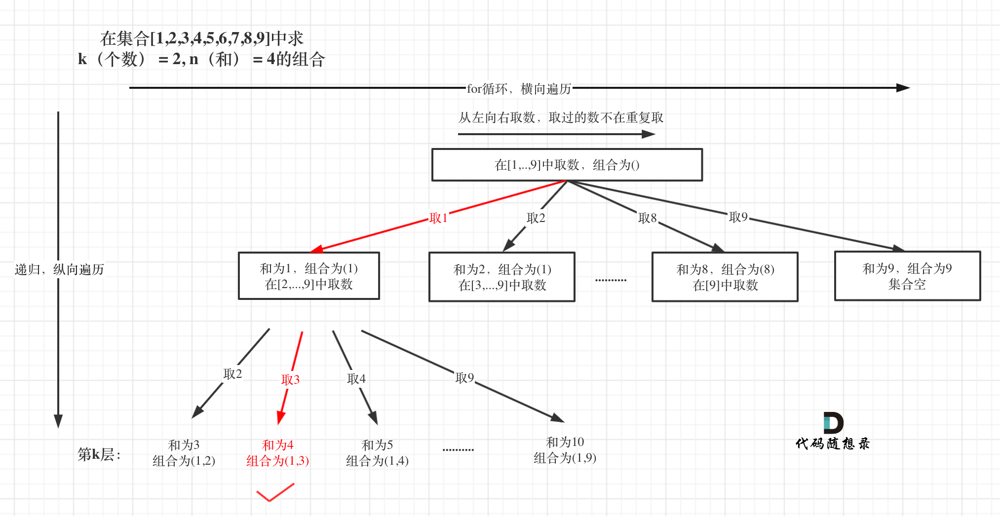
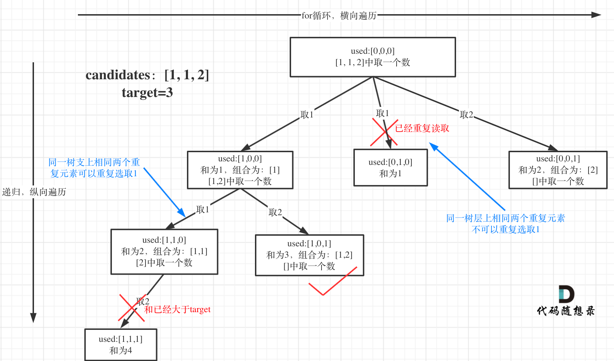
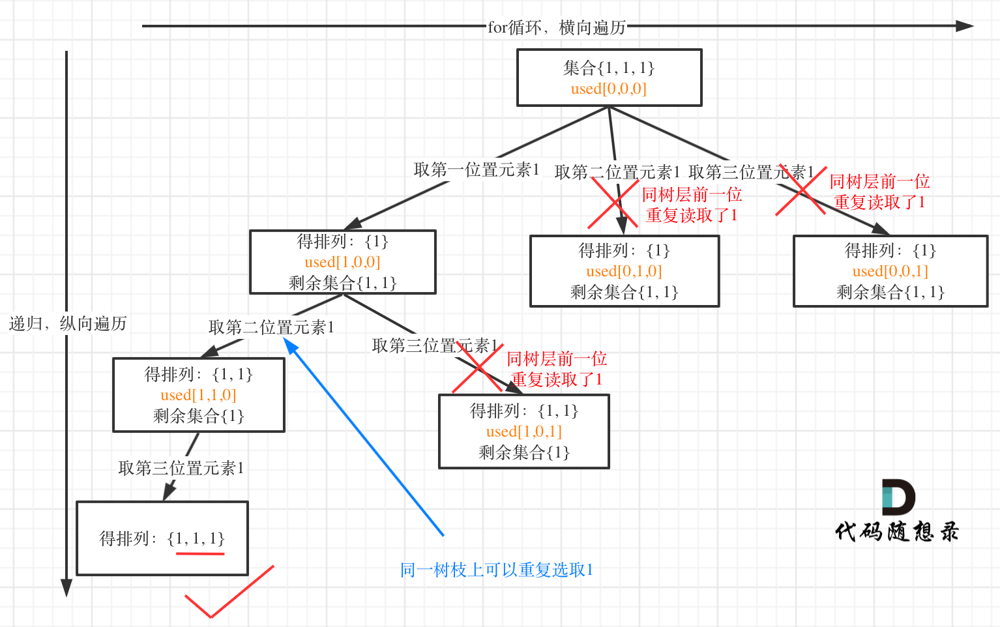

# 【LeetCode】回溯题解汇总

[TOC]


## 77. 组合

[77. 组合](https://leetcode.cn/problems/combinations/)

给定两个整数 `n` 和 `k`，返回范围 `[1, n]` 中所有可能的 `k` 个数的组合。

你可以按 **任何顺序** 返回答案。

示例 1：

```
输入：n = 4, k = 2
输出：
[
  [2,4],
  [3,4],
  [2,3],
  [1,2],
  [1,3],
  [1,4],
]
```


示例 2：

```
输入：n = 1, k = 1
输出：[[1]]
```

**题解思路**


定义两个全局变量，一个用来存放符合条件单一结果，一个用来存放符合条件结果的集合。

需要一个参数，为变量startIndex，它控制每一层遍历的起点。在集合[1,2,3,4]取1之后，下一层递归，就要在[2,3,4]中取数了，那么下一层递归如何知道从[2,3,4]中取数呢，靠的就是startIndex。

path这个数组的大小如果达到k，说明我们找到了一个子集大小为k的组合了。

**剪枝**

举一个例子，n = 4，k = 4的话，那么第一层for循环的时候，从元素2开始的遍历都没有意义了。 在第二层for循环，从元素3开始的遍历都没有意义了。


**可以剪枝的地方就在递归中每一层的for循环所选择的起始位置**。

**如果for循环选择的起始位置之后的元素个数 已经不足 我们需要的元素个数了，那么就没有必要搜索了**。

优化过程如下：

1. 已经选择的元素个数：path.size();
2. 还需要的元素个数为: k - path.size();
3. 在集合n中至多要从该起始位置 : n - (k - path.size()) + 1，开始遍历

为什么有个+1呢，因为包括起始位置，我们要是一个左闭的集合。

举个例子，n = 4，k = 3， 目前已经选取的元素为0（path.size为0），n - (k - 0) + 1 即 4 - ( 3 - 0) + 1 = 2。

从2开始搜索都是合理的，可以是组合[2, 3, 4]。

```js
let path = [];
let result = [];
var combine = function(n, k) {
    result = [];
    combineHelper(n,k,1);
    return result;
};

const combineHelper = (n,k, startIndex) => {
    if(path.length === k){
        result.push([...path]);
        return;
    }
    for(let i=startIndex; i<=n-(k-path.length)+1; i++){
        path.push(i);
        combineHelper(n,k,i+1);
        path.pop();
    }
}
```


## 216. 组合总和 III

[216. 组合总和 III](https://leetcode.cn/problems/combination-sum-iii/)

找出所有相加之和为 n 的 k 个数的组合，且满足下列条件：

只使用数字1到9
每个数字 最多使用一次 
返回 所有可能的有效组合的列表 。该列表不能包含相同的组合两次，组合可以以任何顺序返回。

 

示例 1:

```
输入: k = 3, n = 7
输出: [[1,2,4]]
解释:
1 + 2 + 4 = 7
没有其他符合的组合了。
```


示例 2:

```
输入: k = 3, n = 9
输出: [[1,2,6], [1,3,5], [2,3,4]]
解释:
1 + 2 + 6 = 9
1 + 3 + 5 = 9
2 + 3 + 4 = 9
没有其他符合的组合了。
```


示例 3:

```
输入: k = 4, n = 1
输出: []
解释: 不存在有效的组合。
在[1,9]范围内使用4个不同的数字，我们可以得到的最小和是1+2+3+4 = 10，因为10 > 1，没有有效的组合。
```

**题解思路**



- 在回溯中累加当前路径的和，如果保证了k个数并且和满足要求，将当前路径放入答案数组。
- 同样也可以使用回溯：`i<=9-(k-path.length)+1`

```js
let result = [];
let path = [];
const backtracking = (targetSum,k,sum,startIndex) => {
    if(sum > targetSum){
        return;
    }
    if(path.length === k){
        if(sum === targetSum) result.push([...path]);
        return;
    }
    for(let i=startIndex; i<=9-(k-path.length)+1; i++){
        sum += i;
        path.push(i);
        backtracking(targetSum,k,sum,i+1);
        sum -= i;
        path.pop();
    }
}

var combinationSum3 = function(k, n) {
    result = [];
    backtracking(n,k,0,1);
    return result;
};
```


## 17. 电话号码的字母组合

[17. 电话号码的字母组合](https://leetcode.cn/problems/letter-combinations-of-a-phone-number/)

给定一个仅包含数字 2-9 的字符串，返回所有它能表示的字母组合。答案可以按 任意顺序 返回。

给出数字到字母的映射如下（与电话按键相同）。注意 1 不对应任何字母。


示例 1：

```
输入：digits = "23"
输出：["ad","ae","af","bd","be","bf","cd","ce","cf"]
```


示例 2：

```
输入：digits = ""
输出：[]
```


示例 3：

```
输入：digits = "2"
输出：["a","b","c"]
```

**题解思路**

```js
var letterCombinations = function(digits) {
    const k = digits.length;
  // 先存放每个数字对应的字母
    const map = ['','','abc','def','ghi','jkl','mno','pqrs','tuv','wxyz'];
    if(!k) return [];
    if(k==1) return map[digits].split('');

  
  // result存放最终结果， path存放每次遍历的路径
    const result = [], path = [];
    backtracking(digits,k,0);
    return result;
    
// digits:题目给的要遍历的数，k:最终每个结果应该的长度，index:当前遍历到了哪个数
    function backtracking(digits,k,index){
        if(path.length === k){
            result.push(path.join(''));
            return;
        }
      //digits[index] 表示当前数字对应的字符串，并且遍历当前字符串
        for(const ch of map[digits[index]]){
            path.push(ch);
            backtracking(digits,k,index+1);
            path.pop();
        }
    }
};
```


## 39. 组合总和

[39. 组合总和](https://leetcode.cn/problems/combination-sum/)

给你一个 无重复元素 的整数数组 candidates 和一个目标整数 target ，找出 candidates 中可以使数字和为目标数 target 的 所有 不同组合 ，并以列表形式返回。你可以按 任意顺序 返回这些组合。

candidates 中的 同一个 数字可以 无限制重复被选取 。如果至少一个数字的被选数量不同，则两种组合是不同的。 

对于给定的输入，保证和为 target 的不同组合数少于 150 个。

 

示例 1：

```
输入：candidates = [2,3,6,7], target = 7
输出：[[2,2,3],[7]]
解释：
2 和 3 可以形成一组候选，2 + 2 + 3 = 7 。注意 2 可以使用多次。
7 也是一个候选， 7 = 7 。
仅有这两种组合。
```


示例 2：

```
输入: candidates = [2,3,5], target = 8
输出: [[2,2,2,2],[2,3,3],[3,5]]
```


示例 3：

```
输入: candidates = [2], target = 1
输出: []
```

**题解思路**


**注意本题和 77.组合，216.组合总和III 的一个区别是：本题元素为可重复选取的**。

如何重复选取呢：

```cpp
for (int i = startIndex; i < candidates.size(); i++) {
    sum += candidates[i];
    path.push_back(candidates[i]);
    backtracking(candidates, target, sum, i); // 关键点:不用i+1了，表示可以重复读取当前的数
    sum -= candidates[i];   // 回溯
    path.pop_back();        // 回溯
}
```

剪枝：

如果已经知道下一层的sum会大于target，就没有必要进入下一层递归了。

那么可以在for循环的搜索范围上做做文章了。

**对总集合排序之后，如果下一层的sum（就是本层的 sum + candidates[i]）已经大于target，就可以结束本轮for循环的遍历**。


完整代码：

```js
var combinationSum = function(candidates, target) {
    const result = [], path = [];
    candidates.sort((a,b) => a-b);
    backtracking(0,0);
    return result;

    function backtracking(index,sum){
      // 剪枝：如果当前和已经大于目标值，那就没有必要继续递归了
        if (sum > target) {
            return;
        }
        if(sum === target){
            result.push([...path]);
            return;
        }
      //剪枝
        for(let i=index; i<candidates.length&&sum+candidates[i]<=target; i++){
            path.push(candidates[i]);
            sum += candidates[i];
            backtracking(i,sum);//下一次递归的下标仍为i, 表示可以重复取值
            path.pop();
            sum -= candidates[i];
        }
    }
};
```


## 40. 组合总和 II

[40. 组合总和 II](https://leetcode.cn/problems/combination-sum-ii/)

给定一个候选人编号的集合 candidates 和一个目标数 target ，找出 candidates 中所有可以使数字和为 target 的组合。

candidates 中的每个数字在每个组合中只能使用 一次 。

注意：解集不能包含重复的组合。 

 

示例 1:

```
输入: candidates = [10,1,2,7,6,1,5], target = 8,
输出:
[
[1,1,6],
[1,2,5],
[1,7],
[2,6]
]
```


示例 2:

```
输入: candidates = [2,5,2,1,2], target = 5,
输出:
[
[1,2,2],
[5]
]
```

**题解思路**

**本题的难点在于：集合（数组candidates）有重复元素，但还不能有重复的组合**。

题目中，元素在同一个组合内是可以重复的，怎么重复都没事，但两个组合不能相同。

**去重**

**所以我们要去重的是同一树层上的“使用过”，同一树枝上的都是一个组合里的元素，不用去重**。



如果：`i > index && candidates[i]===candidates[i-1]`，那就需要跳过当前元素


```js
var combinationSum2 = function(candidates, target) {
    const result = [], path = [], len = candidates.length;
    candidates.sort((a,b) => a-b);
    backtracking(0,0);
    return result;

    function backtracking(sum,index){
        if(sum === target){
            result.push([...path]);
            return;
        }
        for(let i=index; i<len&&sum+candidates[i]<=target; i++){
          // 对同一树层使用过的元素进行跳过
            if(i > index && candidates[i]===candidates[i-1]){
                continue;
            }
            path.push(candidates[i]);
            sum += candidates[i];
            backtracking(sum, i+1);
            path.pop();
            sum -= candidates[i];
        }
    }
};
```


## 131. 分割回文串

[131. 分割回文串](https://leetcode.cn/problems/palindrome-partitioning/)

给你一个字符串 s，请你将 s 分割成一些子串，使每个子串都是 回文串 。返回 s 所有可能的分割方案。

回文串 是正着读和反着读都一样的字符串。

 

示例 1：

```
输入：s = "aab"
输出：[["a","a","b"],["aa","b"]]
```


示例 2：

```
输入：s = "a"
输出：[["a"]]
```

**题解思路**


- 切割线切到了字符串最后面，说明找到了一种切割方法，此时就是本层递归的终止终止条件。

```js
const isPalindrome = (s,l,r) => {
    for(let i=l,j=r; i<j; i++,j--){
        if(s[i] !== s[j]) return false;
    }
    return true;
}

var partition = function(s) {
    const result = [], path = [], len = s.length;
    backtracking(0);
    return result;

    function backtracking(index){
        // 如果起始位置已经大于s的大小，说明已经找到了一组分割方案了
        if(index >= len){
            result.push([...path]);
            return;
        }
        for(let i=index; i<len; i++){
            if(!isPalindrome(s,index,i)) continue;
            path.push(s.slice(index,i+1));
            backtracking(i+1);
            path.pop();
        }
    }
};
```


## 93. 复原 IP 地址

[93. 复原 IP 地址](https://leetcode.cn/problems/restore-ip-addresses/)

有效 IP 地址 正好由四个整数（每个整数位于 0 到 255 之间组成，且不能含有前导 0），整数之间用 '.' 分隔。

例如："0.1.2.201" 和 "192.168.1.1" 是 有效 IP 地址，但是 "0.011.255.245"、"192.168.1.312" 和 "192.168@1.1" 是 无效 IP 地址。
给定一个只包含数字的字符串 s ，用以表示一个 IP 地址，返回所有可能的有效 IP 地址，这些地址可以通过在 s 中插入 '.' 来形成。你 不能 重新排序或删除 s 中的任何数字。你可以按 任何 顺序返回答案。

 

示例 1：

```
输入：s = "25525511135"
输出：["255.255.11.135","255.255.111.35"]
```


示例 2：

```
输入：s = "0000"
输出：["0.0.0.0"]
```


示例 3：

```
输入：s = "101023"
输出：["1.0.10.23","1.0.102.3","10.1.0.23","10.10.2.3","101.0.2.3"]
```

**题解思路**


```js
var restoreIpAddresses = function(s) {
    const result = [], path = [];
    backtracking(0);
    return result;

    function backtracking(index) {
        const len = path.length;
      //如果截取的数字个数超过4个，不符合条件
        if(len > 4) return;
        if(len===4 && index===s.length){
            result.push(path.join('.'));
            return;
        }
        for(let i=index; i<s.length; i++){
            const str = s.slice(index, i+1);
          //如果数字超过255，不合法
            if(str.length > 3 || +str > 255) break;
          //如果数字开头是0，不合法
            if(str.length > 1 && str[0] === '0') break;
            path.push(str);
            backtracking(i+1);
            path.pop();
        }
    }
};
```


## 78. 子集

[78. 子集](https://leetcode.cn/problems/subsets/)

给你一个整数数组 nums ，数组中的元素 互不相同 。返回该数组所有可能的子集（幂集）。

解集 不能 包含重复的子集。你可以按 任意顺序 返回解集。

 

示例 1：

```
输入：nums = [1,2,3]
输出：[[],[1],[2],[1,2],[3],[1,3],[2,3],[1,2,3]]
```


示例 2：

```
输入：nums = [0]
输出：[[],[0]]
```

**题解思路**


终止条件为：

```cpp
if (startIndex >= nums.size()) {
    return;
}
```

**其实可以不需要加终止条件，因为startIndex >= nums.size()，本层for循环本来也结束了**。

完整代码：

```js
var subsets = function(nums) {
    let result = [], path = [];
    function backtracking(index){
        result.push([...path]);
      	if(index > nums.length){ //终止条件可以不加
          return;
        }
        for(let i=index; i<nums.length; i++){
            path.push(nums[i]);
            backtracking(i+1);
            path.pop();
        }
    }
    backtracking(0);
    return result;
};
```


## 90. 子集 II

[90. 子集 II](https://leetcode.cn/problems/subsets-ii/)

给你一个整数数组 nums ，其中可能包含重复元素，请你返回该数组所有可能的子集（幂集）。

解集 不能 包含重复的子集。返回的解集中，子集可以按 任意顺序 排列。

 

示例 1：

```
输入：nums = [1,2,2]
输出：[[],[1],[1,2],[1,2,2],[2],[2,2]]
```


示例 2：

```
输入：nums = [0]
输出：[[],[0]]
```

**题解思路**

**去重需要先对集合排序**


同一树层上重复取2 就要过滤掉，同一树枝上就可以重复取2，因为同一树枝上元素的集合才是唯一子集！

**去重**

对同一树层使用过的元素进行跳过

```js
if(i>index && nums[i]===nums[i-1]){ //// 注意这里使用 i > index
   continue;
}
```

完整代码：

```js
var subsetsWithDup = function(nums) {
    let result = [], path = [];
    let sortNums = nums.sort((a,b) => { //去重需要先对集合排序
        return a - b;
    })
    function backtracking(index, nums){
        result.push([...path]);
      	if(index > nums.length - 1) { //终止条件其实可以不加，因为for循环中要求index小于数组长度，在循环时就不允许越界
            return
        }
        for(let i=index; i<nums.length; i++){
          // 对同一树层使用过的元素进行跳过
            if(i>index && nums[i]===nums[i-1]){
                continue;
            }
            path.push(nums[i]);
            backtracking(i+1,nums);
            path.pop();
        }
    }
    backtracking(0,sortNums);
    return result;
};
```


## 491. 递增子序列

[491. 递增子序列](https://leetcode.cn/problems/increasing-subsequences/)

给你一个整数数组 nums ，找出并返回所有该数组中不同的递增子序列，递增子序列中 至少有两个元素 。你可以按 任意顺序 返回答案。

数组中可能含有重复元素，如出现两个整数相等，也可以视作递增序列的一种特殊情况。

 

示例 1：

```
输入：nums = [4,6,7,7]
输出：[[4,6],[4,6,7],[4,6,7,7],[4,7],[4,7,7],[6,7],[6,7,7],[7,7]]
```


示例 2：

```
输入：nums = [4,4,3,2,1]
输出：[[4,4]]
```

**题解思路**

本题求自增子序列，是不能对原数组经行排序的，排完序的数组都是自增子序列了。

**所以不能使用之前的去重逻辑！**


**同一父节点下的同层上使用过的元素就不能在使用了**

注意：这里的去重数组，并不需要进行`pop`操作。

**在同一树枝下元素可以重复使用**

**uset数组 是记录本层元素是否重复使用，新的一层uset都会重新定义（清空），所以要知道uset只负责本层！**

```js
var findSubsequences = function(nums) {
    let result = [], path = [];
    function backtracking(index){
        if(path.length > 1){
            result.push(path.slice());
        }
        let uset = [];
        for(let i=index; i<nums.length; i++){
          
          // 如果当前元素小于path数组的最后一个，或者当前数已经使用过了
            if((path.length&&nums[i]<path[path.length-1]) || uset[nums[i]+100]){
                continue;
            }
            uset[nums[i]+100] = true;
            path.push(nums[i]);
            backtracking(i+1);
            path.pop();
          // 注意，这里并没有对uset数组进行pop操作
        }
    }
    backtracking(0);
    return result;
};
```


## 46. 全排列

[46. 全排列](https://leetcode.cn/problems/permutations/)

给定一个不含重复数字的数组 nums ，返回其 所有可能的全排列 。你可以 按任意顺序 返回答案。

 

示例 1：

```
输入：nums = [1,2,3]
输出：[[1,2,3],[1,3,2],[2,1,3],[2,3,1],[3,1,2],[3,2,1]]
```


示例 2：

```
输入：nums = [0,1]
输出：[[0,1],[1,0]]
```


示例 3：

```
输入：nums = [1]
输出：[[1]]
```

**题解思路**


当收集元素的数组path的大小达到和nums数组一样大的时候，说明找到了一个全排列，也表示到达了叶子节点。

每一个树枝都需要一个自己的used数组。

```js
var permute = function(nums) {
    const result = [], path = [];
    function backtracking(nums, k, used){
        if(path.length === k){
            result.push([...path]);
            return;
        }
        for(let i=0; i<k; i++){
            if(used[i]) continue;
            path.push(nums[i]);
            used[i] = true;
            backtracking(nums, k, used);
            path.pop();
            used[i] = false;
        }
    }

    backtracking(nums, nums.length, []);
    return result;
};
```


## 47. 全排列 II

[47. 全排列 II](https://leetcode.cn/problems/permutations-ii/)

给定一个可包含重复数字的序列 nums ，按任意顺序 返回所有不重复的全排列。

 

示例 1：

```
输入：nums = [1,1,2]
输出：
[[1,1,2],
 [1,2,1],
 [2,1,1]]
```


示例 2：

```
输入：nums = [1,2,3]
输出：[[1,2,3],[1,3,2],[2,1,3],[2,3,1],[3,1,2],[3,2,1]]
```

**题解思路**

**去重一定要对元素进行排序，这样我们才方便通过相邻的节点来判断是否重复使用了**。

对同一树层，前一位（也就是nums[i-1]）如果使用过，那么就进行去重。


```js
var permuteUnique = function(nums) {
    nums.sort((a,b) => a - b);
    let result = [], path = [];
    function backtracking(used){
        if(path.length === nums.length){
            result.push([...path]);
            return;
        }
        for(let i=0; i<nums.length; i++){
            // 同一树层：used[i-1]===false表示同一树层被使用了
            // used[i - 1] == true，说明同一树枝nums[i - 1]使用过
            if(i>0 && nums[i]===nums[i-1] && used[i-1]===false){ //如果同一树层被使用过，则跳过
                continue;
            }
            //同一树枝下
            if(!used[i]){
                used[i] = true;
                path.push(nums[i]);
                backtracking(used);
                path.pop();
                used[i] = false;
            }
        }
    }
    backtracking([]);
    return result;
};
```

其实这个题对树层去重和对树枝去重都可以，

也就是说：`used[i-1]===false` 和 `used[i-1]===true`都可以

但是**对树层去重效率更高**

树层上去重(used[i - 1] == false)，的树形结构如下：



树枝上去重（used[i - 1] == true）的树型结构如下：

