# 图解kmp算法

[TOC]

## kmp算法的具体执行过程

为了方便描述，我们使用 子串 和 文本串 来进行表述。

首先使**子串**和**文本串**左边对齐，并且使用一个指针向右移动到两个串不相等的地方

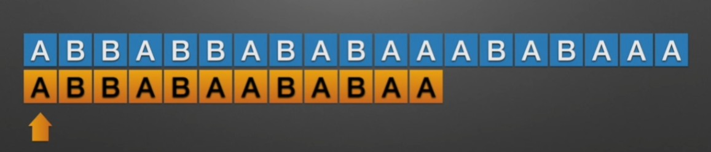

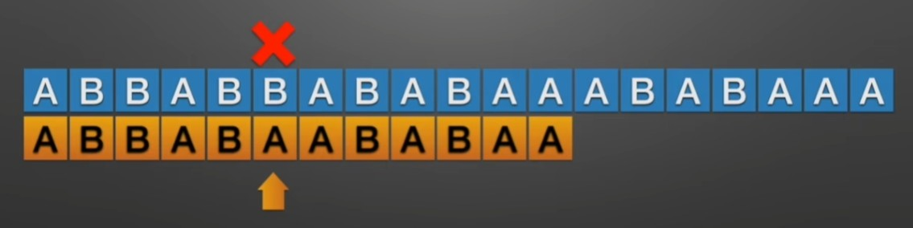


然后，找到指针左边的串的**最长公共前后缀**，并且将前缀向后移动到后缀的地方，这样就可以保证**当前指针所在的位置，它左边的串是匹配的**

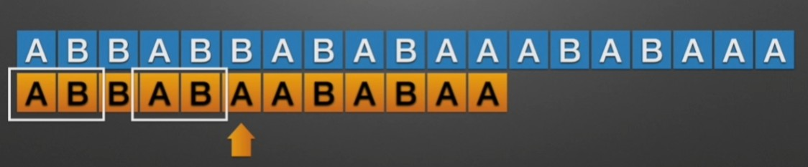

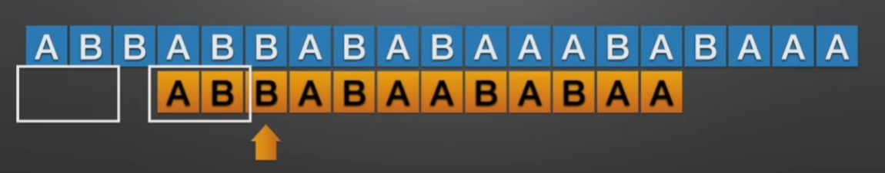

然后继续向后比较，并且找到**最长公共前后缀**，重复上面的步骤

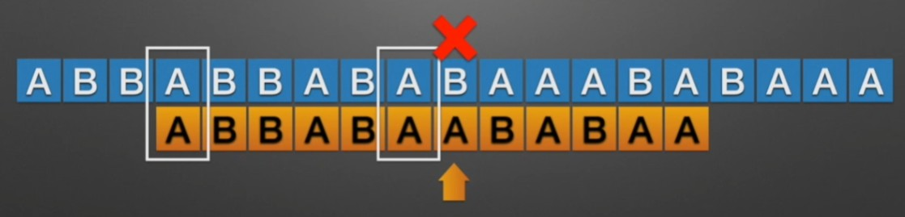

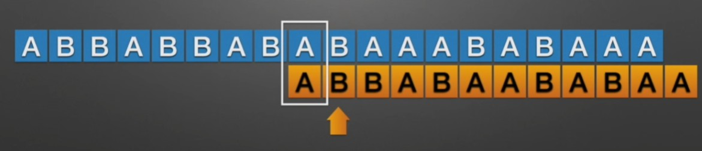


> kmp算法巧妙的地方在于：
>
> 首先使用一个指针指向子串，如果在比较的过程中，这个指针可以完全移动到子串的末尾，那么表示子串可以被匹配到。要注意：这个指针指向的是当前匹配到子串的什么地方了，**指针前面的字符应该都被匹配到了**。
>
> 当匹配到不同的字符时，普通的想法应该是将子串整体向后移动一位，并且从头开始比较。
>
> 但是对于kmp算法，如果遇到了不同字符，其实此次你已经知道了前面比较过的字符是什么，那么就设法利用这个已知信息，不要把"搜索位置"移回已经比较过的位置(注意，这里的比较过的位置指的是文本串中已经进行比较过的位置)，继续把它向后移，这样就提高了效率。
>
> 既然不想让指针移回已经比较过的位置，那么我们就要使得指针左边的字符保持一致，如果保持一致？使用**最长公共前后缀**，然后将前缀的位置移动到后缀上。然后继续向后匹配。


## next数组

上面的案例是对kmp流程的介绍，并且上面的图给我们的印象是子串在一直向后移动，但实际上我们是让指针在不停的移动，下面再次通过画图来演示整个流程。

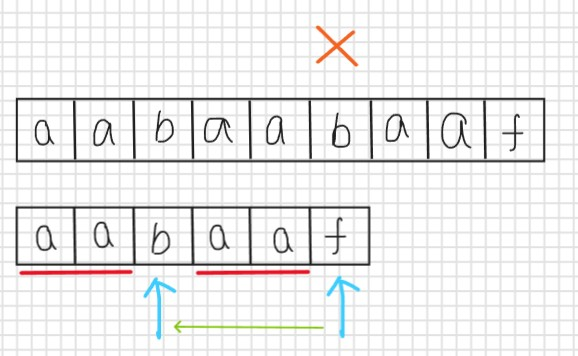

可以看到，当比较到 f 时，比较错误，然后找到指针左边(不包括该指针)的最长公共前后缀的长度为2，那么指针就移动到下标为2的地方继续向后比较，这个过程就相当于将前缀的位置移动到后缀上。

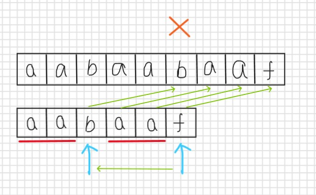

此时就已经完全匹配上了。

接下来就是要讨论，指针具体应该向前回退到什么地方，根据上图我们可以看出，指针应该回退到下标为最长公共前后缀的长度的地方。

那么我们此时需要一个数组来记录每个位置的最长公共前后缀的长度。

当指针不匹配时，直接通过next数组查找到最长公共前后缀的长度，然后将指针移动。

因为这个数组可以告诉我们下一步指针应该移动到哪里，所以叫next数组。

注意，这里求的next数组的中的前后缀包括自身元素。

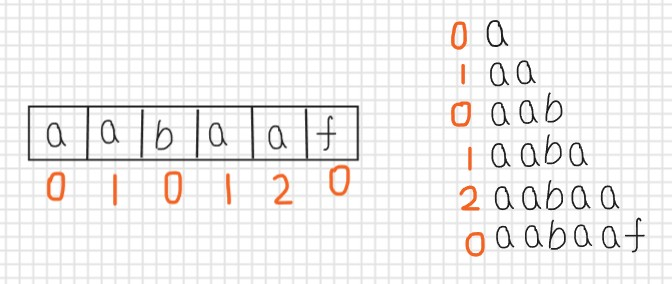

根据上面的这个next数组，当指针移动到 f，然后发现不匹配，然后要看指针左边的最长公共前后缀(**并不包括当前指针**)，从next数组中可以发现，f 左边的长度为2，所以要移动到下标为2的地方。


## 整体代码

现在开始写整体的代码，具体的求next数组的代码先不写，假设现在已经求出了next数组。

两个字符串，文本串haystack，子串needle

两个指针，i指针遍历文本串，j指针遍历子串，如果j指针可以遍历完整个子串，那就表示匹配到了，

在最后匹配的时候，j指针和i指针指向的字符相同，那么匹配的起点应该是`i - needle.length + 1`

用匹配的终点减去子串的长度加一就算出了匹配的起点。

如果当前匹配的字符不同，即`haystack[i] !== needle[j]`。现在就需要使用next数组找到指针需要移动的位置，即`j = next[j - 1]`，注意，这里使用的是while，因为我们需要让i指针和j指针指向的字符完全相同，如果不相同，就不能退出循环。

```js
	  let next = getNext(needle);//拿到next数组
 	  let j = 0;
    for (let i = 0; i < haystack.length; ++i) { //遍历文本串，i指针每次都要向后移动一位
        while (j > 0 && haystack[i] !== needle[j])
            j = next[j - 1];
        if (haystack[i] === needle[j])
            j++;
        if (j === needle.length)
            return (i - needle.length + 1);
    }
```


## 求next数组

对于第一个字母，next[0]=0，因为已经是第一个字母了，没法再往前退了。

然后我们使用一个i指针，通过for循环，依次求出 next[i] 的值。**i指针也代表当前的后缀的末尾**。

**j指针代表前缀的末尾**，也代表当前求出来的**公共前后缀的最大长度**。

```js
    void getNext(int* next, const string& s) {
        int j = 0;
        next[0] = 0;
        for(int i = 1; i < s.size(); i++) {
            while (j > 0 && s[i] != s[j]) { // j要保证大于0，因为下面有取j-1作为数组下标的操作
                j = next[j - 1]; // 注意这里，是要找前一位的对应的回退位置了
            }
            if (s[i] == s[j]) {//如果
                j++;
            }
            next[i] = j;
        }
    }
```

比如对于字符串`aabaaf`，

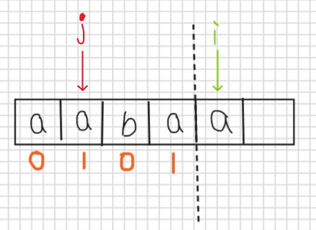

我们要求出当前 i指针位置上的next值是多少。

可以发现，s[i] == s[j]，那么让 j指针向后移动一位，并且最大前后缀的长度为j。

对应的代码就是： 

```cpp
if (s[i] == s[j]) {
   j++;
}
next[i] = j;
```

上面的情况是前缀与后缀相同的时候，当前缀与后缀不适配时，同样是移动j指针，

**这里还是使用了kmp的思想**，这里我们把**j指针以及它前面的那一部分看做子串**，而整个字符串看做文本串，当不匹配时，我们需要将子串的j指针移动到next[j-1]的位置，因为next[j-1]代表的就是j指针左边的前后缀的最大长度。

举例：

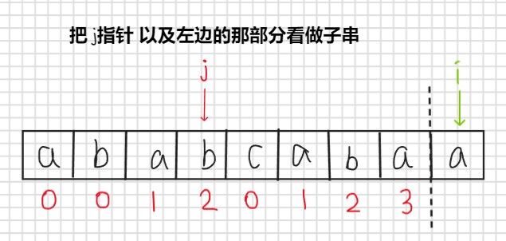

此时要求出指针i的next值，如果指针i指向位置的元素为b的话，那就可以将j指针向后移动一位，并且`next[i] = j`，因为 j也代表了当前最大前缀的长度，但是很不巧的是，i指针的元素不为b，

那么就是出现了不匹配的情况，

那么就需要求出子串左边(即 j指针左边，且不包括 j指针)的串的最大前后缀，那么对应到next数组就是，求出`next[j-1]`，令`j = next[j-1]`。

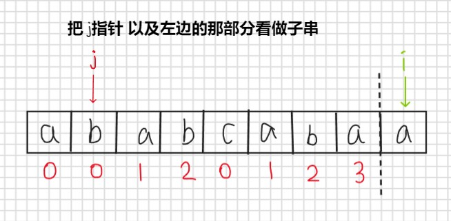

然后继续判断，s[i] != s[j]，所以继续 j = next[j-1]。

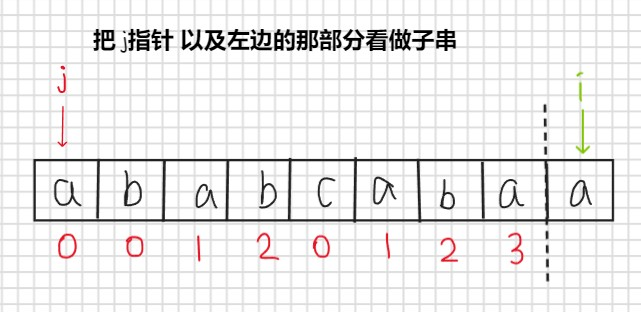

此时相等，那么就执行

```
if (s[i] == s[j]) {
   j++;
}
next[i] = j;
```


## 例题

[28. 实现 strStr()](https://leetcode.cn/problems/implement-strstr/)

实现 strStr() 函数。

给你两个字符串 haystack 和 needle ，请你在 haystack 字符串中找出 needle 字符串出现的第一个位置（下标从 0 开始）。如果不存在，则返回  -1 。

说明：

当 needle 是空字符串时，我们应当返回什么值呢？这是一个在面试中很好的问题。

对于本题而言，当 needle 是空字符串时我们应当返回 0 。这与 C 语言的 strstr() 以及 Java 的 indexOf() 定义相符。

示例 1：

```
输入：haystack = "hello", needle = "ll"
输出：2
```


示例 2：

```
输入：haystack = "aaaaa", needle = "bba"
输出：-1
```

**题解**

```js
var strStr = function(haystack, needle) {
    if(needle.length == 0)
        return 0;
    
    const getNext = (needle) => {
        let next = [];
        let j = 0;
        next.push(j);

        for(let i = 1; i < needle.length; i++){
            while(j > 0 && needle[i] !== needle[j]){
                j = next[j - 1];
            }
            if(needle[i] === needle[j]){
                j++;
            }
            next.push(j);
        }
        return next;
    }

    let next = getNext(needle);
    let j = 0;
    for(let i = 0; i < haystack.length; i++){
        while(j > 0 && haystack[i] !== needle[j]){
            j = next[j - 1];
        }
        if(haystack[i] === needle[j]){
            j++;
        }
        if(j === needle.length){
            return (i - needle.length + 1);
        }
    }
    return -1;
};
```

