# 矩阵模拟相关题目汇总

[TOC]

## 写在前面

这里是小飞侠Pan🥳，立志成为一名优秀的前端程序媛！！！

本篇文章同时收录于我的[github](https://github.com/mengqiuleo)前端笔记仓库中，持续更新中，欢迎star~

👉[https://github.com/mengqiuleo/myNote](https://github.com/mengqiuleo/myNote)


## 59.螺旋矩阵 II

[59. 螺旋矩阵 II](https://leetcode.cn/problems/spiral-matrix-ii/)

给你一个正整数 `n` ，生成一个包含 `1` 到 `n2` 所有元素，且元素按顺时针顺序螺旋排列的 `n x n` 正方形矩阵 `matrix` 。

**示例 1：**

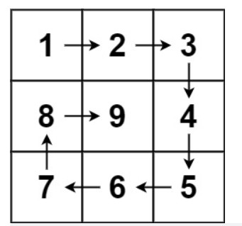

```
输入：n = 3
输出：[[1,2,3],[8,9,4],[7,6,5]]
```

**示例 2：**

```
输入：n = 1
输出：[[1]]
```

**题解思路**

这里的思路只是搬运，原文链接在下方

- 生成一个 n×n 空矩阵 dep，随后模拟整个向内环绕的填入过程：
  - 定义当前左右上下边界 left,right,top,bottom，初始值 count，迭代终止值 total = n * n；
  - 当 count < total 时，始终按照 从左到右 从上到下 从右到左 从下到上 填入顺序循环，每次填入后：
    - 执行 ++count：得到下一个需要填入的数字；
    - 更新边界：例如从左到右填完后，上边界 top ++，相当于上边界向内缩 1。
- 最终返回 mat 即可。

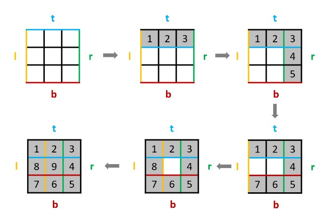

原文链接：[Spiral Matrix II （模拟法，设定边界，代码简短清晰）](https://leetcode.cn/problems/spiral-matrix-ii/solution/spiral-matrix-ii-mo-ni-fa-she-ding-bian-jie-qing-x/)

```js
var generateMatrix = function(n) {
    //四个边界
    let left = 0;
    let right = n - 1;
    let bottom = n - 1;
    let top = 0;
    const total = n * n;//矩阵总数
    const dep = [];//初始化矩阵
    for(let i = 0; i < n; i++){
        dep[i] = [];
    }
    let count = 0;
    while(count < total){
        for(let i = left; i <= right; i++) dep[top][i] = ++count;//从左到右
        top++;
        for(let i = top; i <= bottom; i++) dep[i][right] = ++count;//从上到下
        right--;
        for(let i = right; i >= left; i--) dep[bottom][i] = ++count;//从右到左
        bottom--;
        for(let i = bottom; i >= top; i--) dep[i][left] = ++count;//从下到上
        left++;
    }
    return dep;
};
```


## 54. 螺旋矩阵

[54. 螺旋矩阵](https://leetcode.cn/problems/spiral-matrix/)

给你一个 `m` 行 `n` 列的矩阵 `matrix` ，请按照 **顺时针螺旋顺序** ，返回矩阵中的所有元素。

**示例 1：**

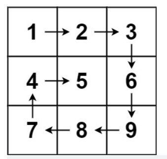

```
输入：matrix = [[1,2,3],[4,5,6],[7,8,9]]
输出：[1,2,3,6,9,8,7,4,5]
```

**示例 2：**

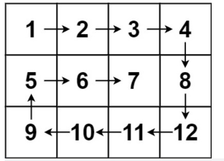

```
输入：matrix = [[1,2,3,4],[5,6,7,8],[9,10,11,12]]
输出：[1,2,3,4,8,12,11,10,9,5,6,7]
```

**题解思路**

- 遍历完所有项时，res 数组构建完毕。我们可以用 **res 数组的长度** 等于 **矩阵的项的个数**，作为循环的结束条件
- 不等于就继续遍历，等于就 break

**举例说明**

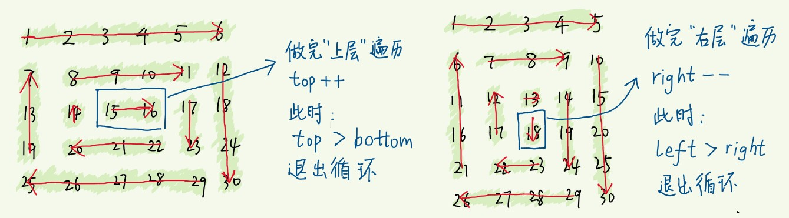

- 每遍历一条边，下一条边遍历的起点被“挤占”，要更新相应的边界
- 注意到，可能在循环途中，突然不再满足循环的条件，即top > bottom或left > right，其中一对边界彼此交错了
- 这意味着所有项都遍历完了，要break了，如果没有及时 break ，就会重复遍历

对于上图中的左边的矩阵：
初始化上下左右四个边界值分别为：

- top = 0， right = 5, bottom = 4, left = 0

当对最外层的一圈遍历完毕后，四个边界值此时为：

- top = 1, right = 4, bottom = 3, left = 1

当对第二次遍历完毕后，四个边界值此时为：

- top = 2, right = 3, bottom = 2, left = 2

**此时开始遍历最中间的两个数： 15,16**，当从左至右遍历完后，此时执行top++，那么此时 top=3.

如果不结束循环，那么接下来的值就会覆盖图中已经赋过值的22

所以此时应该退出循环

**解决办法**

- 每遍历完一条边，更新相应的边界后，都加上一句if (top > bottom || left > right) break;，避免因没有及时退出循环而导致重复遍历。
- 且，“遍历完成”这个时间点，要么发生在遍历完“上边”，要么发生在遍历完“右边”
- 所以只需在这两步操作之后，加 if (top > bottom || left > right) break 即可

```js
var spiralOrder = function (matrix) {
  if (matrix.length == 0) return []
  const res = []
  let top = 0, bottom = matrix.length - 1, left = 0, right = matrix[0].length - 1
  const size = matrix.length * matrix[0].length
  while (res.length !== size) { // 仍未遍历结束
    for (let i = left; i <= right; i++) res.push(matrix[top][i])
    top++
    for (let i = top; i <= bottom; i++) res.push(matrix[i][right])
    right--
    if (res.length === size) break // 遍历结束
    for (let i = right; i >= left; i--)  res.push(matrix[bottom][i])
    bottom--
    for (let i = bottom; i >= top; i--) res.push(matrix[i][left])
    left++
  }
  return res
};
```


## 剑指 Offer 29. 顺时针打印矩阵

[剑指 Offer 29. 顺时针打印矩阵](https://leetcode.cn/problems/shun-shi-zhen-da-yin-ju-zhen-lcof/)

输入一个矩阵，按照从外向里以顺时针的顺序依次打印出每一个数字。

 

示例 1：

```
输入：matrix = [[1,2,3],[4,5,6],[7,8,9]]
输出：[1,2,3,6,9,8,7,4,5]
```


示例 2：

```
输入：matrix = [[1,2,3,4],[5,6,7,8],[9,10,11,12]]
输出：[1,2,3,4,8,12,11,10,9,5,6,7]
```

**题解思路**

- 这个题与54题类似

```js
var spiralOrder = function(matrix) {
    if(matrix.length === 0){
        return [];
    }
    let res = [];
    const total = matrix.length * matrix[0].length;
    let top = 0, right = matrix[0].length - 1, bottom = matrix.length - 1, left = 0;
    while(res.length !== total){
        for(let i = left; i <= right; i++) res.push(matrix[top][i]);
        top++;
        for(let i = top; i <= bottom; i++) res.push(matrix[i][right]);
        right--;
        if(res.length === total) break;
        for(let i = right; i >= left; i--) res.push(matrix[bottom][i]);
        bottom--;
        for(let i = bottom; i >= top; i--) res.push(matrix[i][left]);
        left++;
    }
    return res;
};
```


## 48. 旋转图像

[48. 旋转图像](https://leetcode.cn/problems/rotate-image/)

给定一个 n × n 的二维矩阵 matrix 表示一个图像。请你将图像顺时针旋转 90 度。

你必须在 原地 旋转图像，这意味着你需要直接修改输入的二维矩阵。请不要 使用另一个矩阵来旋转图像。

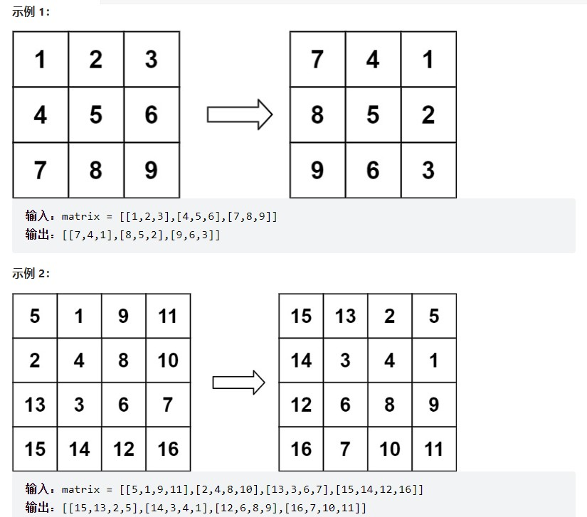

**题解思路**

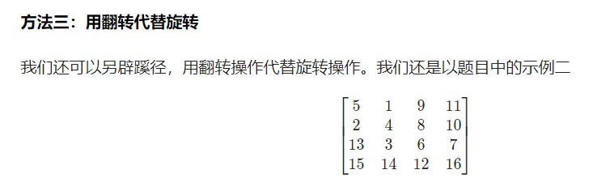

作为例子，先将其通过水平轴翻转得到：

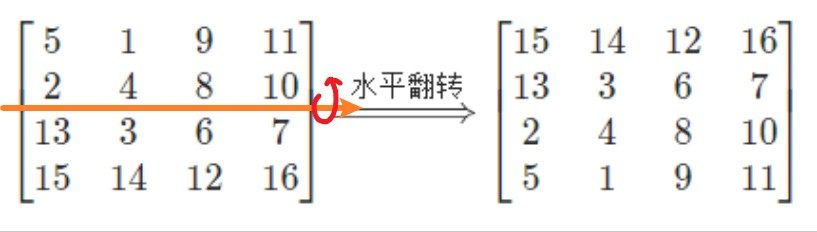

再根据主对角线翻转得到：

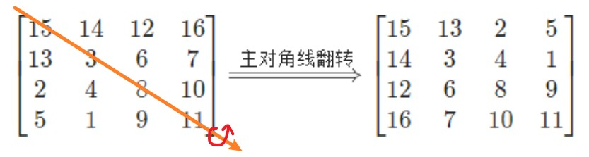

就得到了答案。这是为什么呢？对于水平轴翻转而言，我们只需要枚举矩阵上半部分的元素，和下半部分的元素进行交换，即

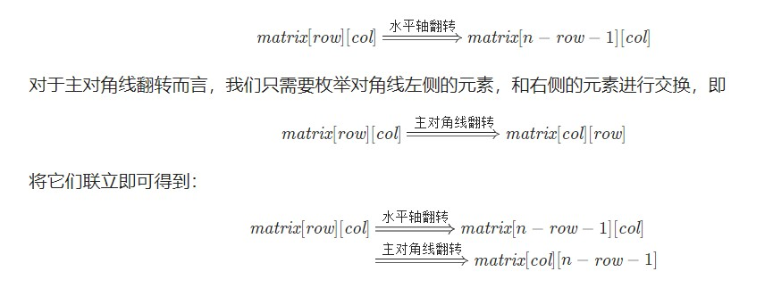

```js
var rotate = function(matrix) {
    const n = matrix.length;
    //水平中轴线翻转
    for(let i = 0; i < Math.floor(n/2); i++){
        for(let j = 0; j < n; j++){
            [matrix[i][j], matrix[n - i - 1][j]] = [matrix[n - i - 1][j], matrix[i][j]];
        }
    }
    //主对角线翻转
    for(let i = 0; i < n; i++){
        for(let j = 0; j < i; j++){
            [matrix[i][j], matrix[j][i]] = [matrix[j][i], matrix[i][j]];
        }
    }
};
```

与本题类似的题目还有：[面试题 01.07. 旋转矩阵](https://leetcode.cn/problems/rotate-matrix-lcci/)

做法相同，在这里不再赘述

## 566. 重塑矩阵

[566. 重塑矩阵](https://leetcode.cn/problems/reshape-the-matrix/)

在 MATLAB 中，有一个非常有用的函数 reshape ，它可以将一个 m x n 矩阵重塑为另一个大小不同（r x c）的新矩阵，但保留其原始数据。

给你一个由二维数组 mat 表示的 m x n 矩阵，以及两个正整数 r 和 c ，分别表示想要的重构的矩阵的行数和列数。

重构后的矩阵需要将原始矩阵的所有元素以相同的 行遍历顺序 填充。

如果具有给定参数的 reshape 操作是可行且合理的，则输出新的重塑矩阵；否则，输出原始矩阵。

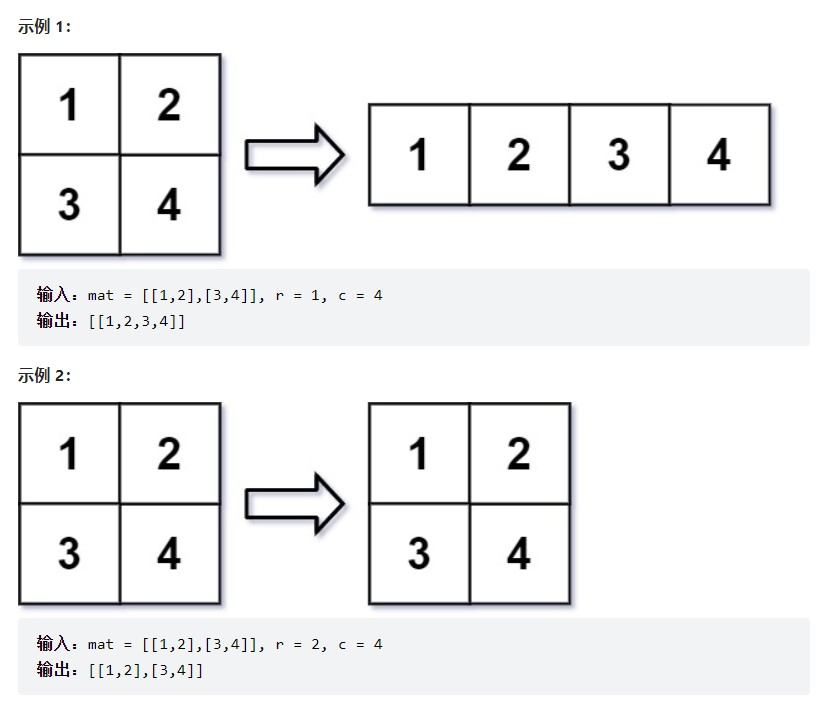

**题解思路**

- 先将原来的二维数组转成一维
- 然后判断长度是否符合
- 最后进行填充

```js
var matrixReshape = function(mat, r, c) {
    const newMat = [];
    //将二维数组转换为一维数组
    for(let i = 0; i < mat.length; i++){
        newMat.push(...mat[i]);
    }
    //判断长度是否符合要求
    if(r * c !== newMat.length) return mat;
    
    //重塑矩阵
    for(let i = 0; i < r; i++){
        const item = [];
        //每行c个
        for(let j = 0; j < c; j++){
            //将c个元素从头部拿出，并放入暂存的item数组
            item.push(newMat.shift());
        }
        //当前行收集完毕，推入新数组的末尾
        newMat.push(item);
    }
    return newMat;
};
```

注意：**JS 中没有二维数组的概念，需要自己创建二维数组对象**
首先JS创建二维数组的方法不能直接new Array[][]，
而是要先new一个一维数组，再把这个一维数组的每一个元素都 new 为一个数组

```js
    const dep = [];//初始化矩阵
    for(let i = 0; i < n; i++){
        dep[i] = [];
    }
```

或者将每一行写成一个数组，具体代码参考本题