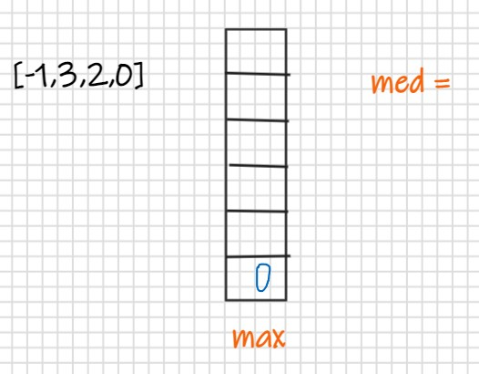
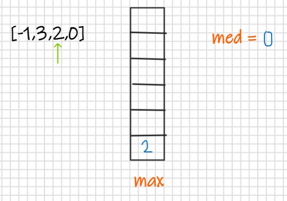
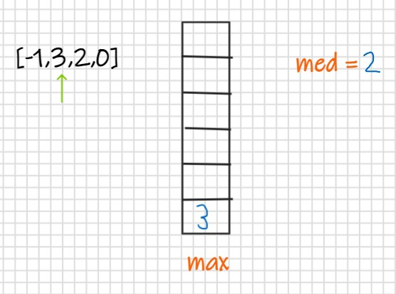
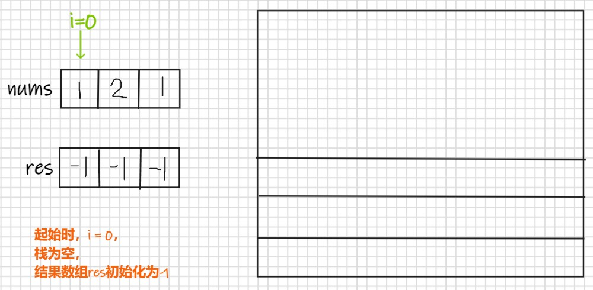
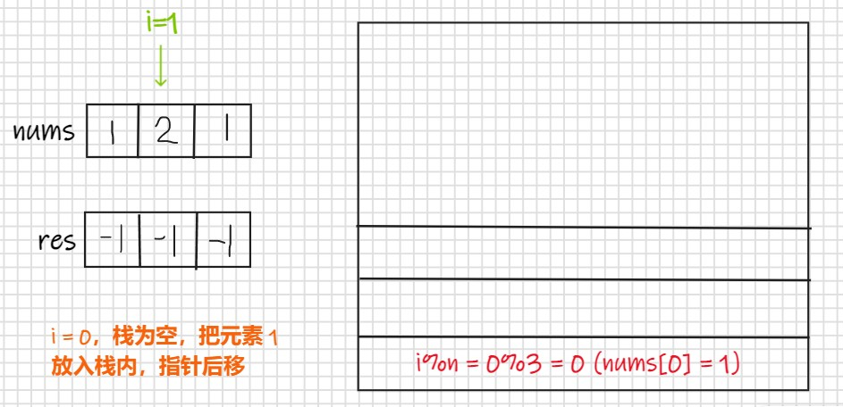
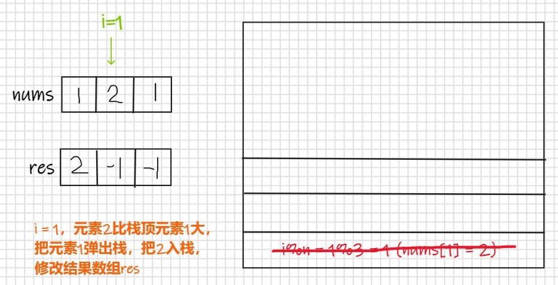
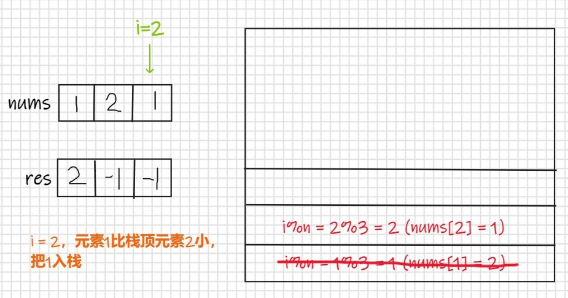
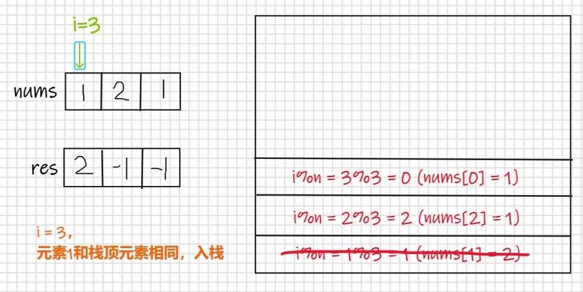
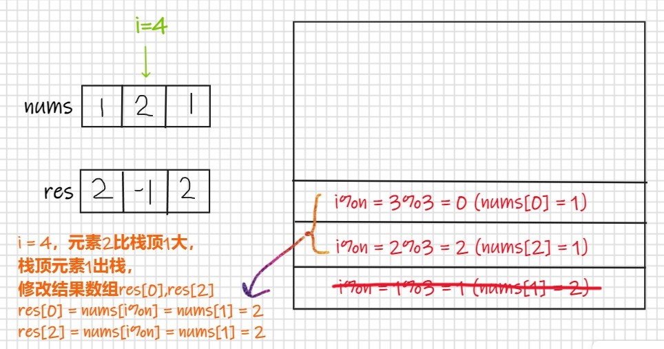

# 【LeetCode】栈与单调栈题解汇总

[TOC]

## 写在前面

这里是小飞侠Pan🥳，立志成为一名优秀的前端程序媛！！！

本篇文章同时收录于我的[github](https://github.com/mengqiuleo)前端笔记仓库中，持续更新中，欢迎star~

👉[https://github.com/mengqiuleo/myNote](https://github.com/mengqiuleo/myNote)


## 20. 有效的括号

[20. 有效的括号](https://leetcode.cn/problems/valid-parentheses/)

给定一个只包括 '('，')'，'{'，'}'，'['，']' 的字符串 s ，判断字符串是否有效。

有效字符串需满足：

左括号必须用相同类型的右括号闭合。
左括号必须以正确的顺序闭合。


示例 1：

```
输入：s = "()"
输出：true
```


示例 2：

```
输入：s = "()[]{}"
输出：true
```


示例 3：

```
输入：s = "(]"
输出：false
```


示例 4：

```
输入：s = "([)]"
输出：false
```


示例 5：

```
输入：s = "{[]}"
输出：true
```

**题解思路**

- 我们可以让左括号入栈，然后如果遇到右括号，那就取出栈顶的左括号，
- 如果匹配，那就抵消。如果不匹配，返回false
- 如果所有的括号都遍历完了，最后判断栈中还有没有剩余的括号


上图演示了三种不同的情况：

- 字符串里左方向的括号多余了 ，所以不匹配。
- 括号没有多余，但是 括号的类型没有匹配上。
- 字符串里右方向的括号多余了，所以不匹配。

```js
var isValid = function(s) {
    const stack = [];
    const map = {
        "(": ")",
        "{": "}",
        "[": "]"
    }
    for(const x of s){
        if(x in map){// 左括号入栈
            //console.log(x);这里只是测试一下x是不是左括号
            stack.push(x);
            continue;
        }
        if(map[stack.pop()] !== x) return false;//如果x是右括号，与栈顶元素比较
    }
    return !stack.length;
};
```


## 71. 简化路径

[71. 简化路径](https://leetcode.cn/problems/simplify-path/)

给你一个字符串 path ，表示指向某一文件或目录的 Unix 风格 绝对路径 （以 '/' 开头），请你将其转化为更加简洁的规范路径。

在 Unix 风格的文件系统中，一个点（.）表示当前目录本身；此外，两个点 （..） 表示将目录切换到上一级（指向父目录）；两者都可以是复杂相对路径的组成部分。任意多个连续的斜杠（即，'//'）都被视为单个斜杠 '/' 。 对于此问题，任何其他格式的点（例如，'...'）均被视为文件/目录名称。

请注意，返回的 规范路径 必须遵循下述格式：

始终以斜杠 '/' 开头。
两个目录名之间必须只有一个斜杠 '/' 。
最后一个目录名（如果存在）不能 以 '/' 结尾。
此外，路径仅包含从根目录到目标文件或目录的路径上的目录（即，不含 '.' 或 '..'）。
返回简化后得到的 规范路径 。

 

示例 1：

```
输入：path = "/home/"
输出："/home"
解释：注意，最后一个目录名后面没有斜杠。 
```


示例 2：

```
输入：path = "/../"
输出："/"
解释：从根目录向上一级是不可行的，因为根目录是你可以到达的最高级。
```


示例 3：

```
输入：path = "/home//foo/"
输出："/home/foo"
解释：在规范路径中，多个连续斜杠需要用一个斜杠替换。
```


示例 4：

```
输入：path = "/a/./b/../../c/"
输出："/c"
```

**题解思路**

首先理解一下题意：

- `'.'` 代表当前目录，其实没啥用，比如，` /a/./b === /a/b `，它是可以去掉的
- `'..'`代表的是当前目录的上一个目录，如果出现`..`，那么它的前一个目录需要去掉。比如，`/a/b/../c === /a/c`，中间出现了`..`，那么它前面的`/b`就要去掉
- 而对于例子中的`/home//foo/`，需要把`//`换成`/`

**具体实现**

- 首先使用`/`将字符串分割，例如 "/home//foo/../fn" 变成了 ['home','','foo','..','fn']
- 那么就是会出现：空格(当出现`//`时会出现空格)，两个点，一个点
- 用栈存储所有路径
- 遍历数组，依次将路径名放入栈中，
- 当出现两个点时说明它的前一个目录需要去掉，那就将栈顶元素取出
- 当出现一个点是，不用管
- 最后再将栈用`/`连接返回

```js
var simplifyPath = function(path) {
    const names = path.split('/');
    const stack = [];
    for(const name of names){
        if(name === '..'){
            if(stack.length){
                stack.pop();
            }
        }else if(name.length && name != '.'){
            stack.push(name);
        }
    }
    return '/' + stack.join('/');
};
```


## 150. 逆波兰表达式求值

[150. 逆波兰表达式求值](https://leetcode.cn/problems/evaluate-reverse-polish-notation/)

根据 逆波兰表示法，求表达式的值。

有效的算符包括 +、-、*、/ 。每个运算对象可以是整数，也可以是另一个逆波兰表达式。

注意 两个整数之间的除法只保留整数部分。

可以保证给定的逆波兰表达式总是有效的。换句话说，表达式总会得出有效数值且不存在除数为 0 的情况。

 

示例 1：

```
输入：tokens = ["2","1","+","3","*"]
输出：9
解释：该算式转化为常见的中缀算术表达式为：((2 + 1) * 3) = 9
```


示例 2：

```
输入：tokens = ["4","13","5","/","+"]
输出：6
解释：该算式转化为常见的中缀算术表达式为：(4 + (13 / 5)) = 6
```


示例 3：

```
输入：tokens = ["10","6","9","3","+","-11","*","/","*","17","+","5","+"]
输出：22
解释：该算式转化为常见的中缀算术表达式为：
  ((10 * (6 / ((9 + 3) * -11))) + 17) + 5
= ((10 * (6 / (12 * -11))) + 17) + 5
= ((10 * (6 / -132)) + 17) + 5
= ((10 * 0) + 17) + 5
= (0 + 17) + 5
= 17 + 5
= 22
```

**题解思路**

遇到数字则入栈；遇到算符则取出栈顶两个数字进行计算，并将结果压入栈中

```js
var evalRPN = function(tokens) {
    const s = new Map([
        ['+', (a,b) => a*1 + b*1],
        ['-', (a,b) => b - a],
        ['*', (a,b) => b*a],
        ['/', (a,b) => (b/a)|0]
    ])
    const stack = [];
    for(const i of tokens){
        if(!s.has(i)){
            stack.push(i);
            continue;
        }
        stack.push(s.get(i)(stack.pop(), stack.pop()));
    }
    return stack.pop();
};
```


## 155. 最小栈

[155. 最小栈](https://leetcode.cn/problems/min-stack/)

设计一个支持 push ，pop ，top 操作，并能在常数时间内检索到最小元素的栈。

实现 MinStack 类:

- MinStack() 初始化堆栈对象。
- void push(int val) 将元素val推入堆栈。
- void pop() 删除堆栈顶部的元素。
- int top() 获取堆栈顶部的元素。
- int getMin() 获取堆栈中的最小元素。


示例 1:

```
输入：
["MinStack","push","push","push","getMin","pop","top","getMin"]
[[],[-2],[0],[-3],[],[],[],[]]

输出：
[null,null,null,null,-3,null,0,-2]

解释：
MinStack minStack = new MinStack();
minStack.push(-2);
minStack.push(0);
minStack.push(-3);
minStack.getMin();   --> 返回 -3.
minStack.pop();
minStack.top();      --> 返回 0.
minStack.getMin();   --> 返回 -2.
```

**题解思路**

创建两个栈，一个栈是主栈 stack，另一个是辅助栈 minStack，

辅助栈用来存放每个元素对应的：截止到当前元素的最小值

当主栈元素弹出时，辅助栈的元素也要弹出

```js
var MinStack = function() {
    this.x_stack = [];
    this.min_stack = [Infinity];
};

/** 
 * @param {number} val
 * @return {void}
 */
MinStack.prototype.push = function(val) {
    this.x_stack.push(val);
  //当往辅助栈中添加元素时，此时辅助栈中的栈顶存放的是之前所有元素的最小值，然后将当前元素和以前的元素进行比较
    this.min_stack.push(Math.min(this.min_stack[this.min_stack.length-1], val));
};

/**
 * @return {void}
 */
MinStack.prototype.pop = function() {
    this.x_stack.pop();
    this.min_stack.pop();
};

/**
 * @return {number}
 */
MinStack.prototype.top = function() {
    return this.x_stack[this.x_stack.length-1];
};

/**
 * @return {number}
 */
MinStack.prototype.getMin = function() {
    return this.min_stack[this.min_stack.length-1];
};

```


## 225. 用队列实现栈

[225. 用队列实现栈](https://leetcode.cn/problems/implement-stack-using-queues/)

请你仅使用两个队列实现一个后入先出（LIFO）的栈，并支持普通栈的全部四种操作（push、top、pop 和 empty）。

实现 MyStack 类：

- void push(int x) 将元素 x 压入栈顶。
- int pop() 移除并返回栈顶元素。
- int top() 返回栈顶元素。
- boolean empty() 如果栈是空的，返回 true ；否则，返回 false 。


注意：

你只能使用队列的基本操作 —— 也就是 push to back、peek/pop from front、size 和 is empty 这些操作。
你所使用的语言也许不支持队列。 你可以使用 list （列表）或者 deque（双端队列）来模拟一个队列 , 只要是标准的队列操作即可。


示例：

```
输入：
["MyStack", "push", "push", "top", "pop", "empty"]
[[], [1], [2], [], [], []]
输出：
[null, null, null, 2, 2, false]

解释：
MyStack myStack = new MyStack();
myStack.push(1);
myStack.push(2);
myStack.top(); // 返回 2
myStack.pop(); // 返回 2
myStack.empty(); // 返回 False
```

**题解思路**

```js
var MyStack = function() {
    this.queue = [];
    this.helpQueue = [];
};

/** 
 * @param {number} x
 * @return {void}
 */
MyStack.prototype.push = function(x) {
    this.helpQueue.push(x);
    while(this.queue.length !== 0) {
        this.helpQueue.push(this.queue.shift());
    }
    while(this.helpQueue.length !== 0){
        this.queue.push(this.helpQueue.shift())
    }
};

/**
 * @return {number}
 */
MyStack.prototype.pop = function() {
    if(this.queue.length !== 0){
        return this.queue.shift()
    }
};

/**
 * @return {number}
 */
MyStack.prototype.top = function() {
    if(this.queue.length !== 0){
        return this.queue[0];
    }
};

/**
 * @return {boolean}
 */
MyStack.prototype.empty = function() {
    return this.queue.length == 0;
};

```


## 232. 用栈实现队列

[232. 用栈实现队列](https://leetcode.cn/problems/implement-queue-using-stacks/)

请你仅使用两个栈实现先入先出队列。队列应当支持一般队列支持的所有操作（push、pop、peek、empty）：

实现 MyQueue 类：

- void push(int x) 将元素 x 推到队列的末尾

- int pop() 从队列的开头移除并返回元素

- int peek() 返回队列开头的元素

- boolean empty() 如果队列为空，返回 true ；否则，返回 false

  说明：

你 只能 使用标准的栈操作 —— 也就是只有 push to top, peek/pop from top, size, 和 is empty 操作是合法的。
你所使用的语言也许不支持栈。你可以使用 list 或者 deque（双端队列）来模拟一个栈，只要是标准的栈操作即可。


示例 1：

```
输入：
["MyQueue", "push", "push", "peek", "pop", "empty"]
[[], [1], [2], [], [], []]
输出：
[null, null, null, 1, 1, false]

解释：
MyQueue myQueue = new MyQueue();
myQueue.push(1); // queue is: [1]
myQueue.push(2); // queue is: [1, 2] (leftmost is front of the queue)
myQueue.peek(); // return 1
myQueue.pop(); // return 1, queue is [2]
myQueue.empty(); // return false
```

**题解思路**

```js
var MyQueue = function() {
    this.s1 = [];
    this.s2 = [];
    this.top = null;
};

/** 
 * @param {number} x
 * @return {void}
 */
MyQueue.prototype.push = function(x) {
    if(!this.s1.length){
        this.top = x;
    }
    this.s1.push(x);
};

/**
 * @return {number}
 */
MyQueue.prototype.pop = function() {
    if(this.s2.length){
        return this.s2.pop();
    }
    while(this.s1.length){
        this.s2.push(this.s1.pop());
    }
    return this.s2.pop()
};

/**
 * @return {number}
 */
MyQueue.prototype.peek = function() {
    if(this.s2.length){
        return this.s2[this.s2.length - 1];
    }
    return this.top;
};

/**
 * @return {boolean}
 */
MyQueue.prototype.empty = function() {
    return !this.s1.length && !this.s2.length
};

```


## 239. 滑动窗口最大值

[239. 滑动窗口最大值](https://leetcode.cn/problems/sliding-window-maximum/)

给你一个整数数组 nums，有一个大小为 k 的滑动窗口从数组的最左侧移动到数组的最右侧。你只可以看到在滑动窗口内的 k 个数字。滑动窗口每次只向右移动一位。

返回 滑动窗口中的最大值 。

 

示例 1：

```
输入：nums = [1,3,-1,-3,5,3,6,7], k = 3
输出：[3,3,5,5,6,7]
解释：
滑动窗口的位置                最大值

---------------               -----

[1  3  -1] -3  5  3  6  7       3
 1 [3  -1  -3] 5  3  6  7       3
 1  3 [-1  -3  5] 3  6  7       5
 1  3  -1 [-3  5  3] 6  7       5
 1  3  -1  -3 [5  3  6] 7       6
 1  3  -1  -3  5 [3  6  7]      7
```


示例 2：

```
输入：nums = [1], k = 1
输出：[1]
```

**题解思路**

思路：维护单调递减队列，当进入滑动窗口的元素大于等于队尾的元素时 不断从队尾出队，直到进入滑动窗口的元素小于队尾的元素，才可以入队，以保证单调递减的性质，当队头元素已经在滑动窗口外了，移除队头元素，当i大于等于k-1的时候，单调递减队头就是滑动窗口的最大值


```js
var maxSlidingWindow = function (nums, k) {
    const q = [];//单递减的双端队列
    const ans = [];//最后的返回结果
    for (let i = 0; i < nums.length; i++) {//循环nums
        //当进入滑动窗口的元素大于等于队尾的元素时 不断从队尾出队，
        //直到进入滑动窗口的元素小于队尾的元素，以保证单调递减的性质
        while (q.length && nums[i] >= nums[q[q.length - 1]]) {
            q.pop();
        }
        q.push(i);//元素的索引入队
        while (q[0] <= i - k) {//队头元素已经在滑动窗口外了，移除队头元素
            q.shift();
        }
        //当i大于等于k-1的时候，单调递减队头就是滑动窗口的最大值
        if (i >= k - 1) ans.push(nums[q[0]]);
    }
    return ans;
};
```


## 946. 验证栈序列

[946. 验证栈序列](https://leetcode.cn/problems/validate-stack-sequences/)

给定 pushed 和 popped 两个序列，每个序列中的 值都不重复，只有当它们可能是在最初空栈上进行的推入 push 和弹出 pop 操作序列的结果时，返回 true；否则，返回 false 。

 

示例 1：

```
输入：pushed = [1,2,3,4,5], popped = [4,5,3,2,1]
输出：true
解释：我们可以按以下顺序执行：
push(1), push(2), push(3), push(4), pop() -> 4,
push(5), pop() -> 5, pop() -> 3, pop() -> 2, pop() -> 1
```


示例 2：

```
输入：pushed = [1,2,3,4,5], popped = [4,3,5,1,2]
输出：false
解释：1 不能在 2 之前弹出。
```

**题解思路**

思路

所有的元素一定是按顺序 push 进去的，重要的是怎么 pop 出来？

假设当前栈顶元素值为 2，同时对应的 popped 序列中下一个要 pop 的值也为 2，那就必须立刻把这个值 pop 出来。因为之后的 push 都会让栈顶元素变成不同于 2 的其他值，这样再 pop 出来的数 popped 序列就不对应了。

算法

将 pushed 队列中的每个数都 push 到栈中，同时检查这个数是不是 popped 序列中下一个要 pop 的值，如果是就把它 pop 出来。

最后，检查不是所有的该 pop 出来的值都是 pop 出来了。

```js
var validateStackSequences = function(pushed, popped) {
    let stack = [];
    let i=0, j=0;
    while(i < pushed.length){
        stack.push(pushed[i]);
        while(stack[stack.length-1] === popped[j] && stack.length){
            j++;
            stack.pop();
        }
        i++;
    }
    return stack.length === 0;
};
```


## 316. 去除重复字母

[316. 去除重复字母](https://leetcode.cn/problems/remove-duplicate-letters/)

给你一个字符串 s ，请你去除字符串中重复的字母，使得每个字母只出现一次。需保证 返回结果的字典序最小（要求不能打乱其他字符的相对位置）。

 

示例 1：

```
输入：s = "bcabc"
输出："abc"
```


示例 2：

```
输入：s = "cbacdcbc"
输出："acdb"
```

**题解思路**

- 将res作为栈存放字符
- 如果字符已经存在则直接跳过循环
- 由于两个字符直接比较大小会根据字典序输出true/false
- 所以直接将循环字符和栈顶元素比较,如果栈顶元素大于当前字符且后续还有其他字符可以作为替代时,栈顶元素出栈
- 当前元素入栈

```js
var removeDuplicateLetters = function(s) {
    let res = [];
    for(let i=0;i<s.length;i++){
        if(res.includes(s[i])) continue;
        while(res[res.length-1] > s[i] && s.indexOf(res[res.length-1], i) > i){
            res.pop();
        }
        res.push(s[i]);
    }
    return res.join('');
};
```


## 347. 前 K 个高频元素

[347. 前 K 个高频元素](https://leetcode.cn/problems/top-k-frequent-elements/)

给你一个整数数组 nums 和一个整数 k ，请你返回其中出现频率前 k 高的元素。你可以按 任意顺序 返回答案。

 

示例 1:

```
输入: nums = [1,1,1,2,2,3], k = 2
输出: [1,2]
```


示例 2:

```
输入: nums = [1], k = 1
输出: [1]
```

**题解思路**

Map + 桶排序

- 利用Map的key和value值保存整数和频率关系
- 若元素数量小于等于k -> 直接返回key的数组
- 若大于 -> 桶排序（具有不同整数，相同频率情况）
- 用数组存放具有相同频率的数：key为频率，value为一个数组，里面放所有的具有key频率的数
- 相同频率时 -> 将整数放入该频率的桶
  不同频率时 -> 创建一个新桶放入
- 最后倒序排序将桶一个个拿出 -> 至到拿到第k个整数

```js
let topKFrequent = function(nums, k) {
    // 利用Map来记录key-整数和value-频率的关系
    let map = new Map()
    nums.map((num) => {
        if (map.has(num)) map.set(num, map.get(num) + 1)
        else map.set(num, 1)
    })
    
    // 如果元素数量小于等于k -> 直接返回字典key-整数
    if(map.size <= k) {
        return [...map.keys()]
    }
    
    // 返回桶排序结果
    return bucketSort(map, k)
};

// 桶排序
let bucketSort = (map, k) => {
    let arr = [], res = []
    map.forEach((value, key) => {
        // 利用映射关系（出现频率作为下标）将数据分配到各个桶中
        if(!arr[value]) {
            // key的数组 -> 有不同整数，相同频率的情况
            arr[value] = [key]
        } else {
            // 相同频率时
            arr[value].push(key)
        }
    })
  // 从大到小遍历频率，最大频率为数组的末尾，如果当前频率存在，那就将它放入答案数组
    for(let i = arr.length - 1; i >= 0 && res.length < k; i--){
        // 若有数据 -> 放入该数组
        if(arr[i]) {
            res.push(...arr[i])
        }
	}
	return res
}
```


## 456. 132 模式

[456. 132 模式](https://leetcode.cn/problems/132-pattern/)

给你一个整数数组 nums ，数组中共有 n 个整数。132 模式的子序列 由三个整数 nums[i]、nums[j] 和 nums[k] 组成，并同时满足：i < j < k 和 nums[i] < nums[k] < nums[j] 。

如果 nums 中存在 132 模式的子序列 ，返回 true ；否则，返回 false 。

 

示例 1：

```
输入：nums = [1,2,3,4]
输出：false
解释：序列中不存在 132 模式的子序列。
```


示例 2：

```
输入：nums = [3,1,4,2]
输出：true
解释：序列中有 1 个 132 模式的子序列： [1, 4, 2] 。
```


示例 3：

```
输入：nums = [-1,3,2,0]
输出：true
解释：序列中有 3 个 132 模式的的子序列：[-1, 3, 2]、[-1, 3, 0] 和 [-1, 2, 0] 。
```

**题解思路**

所谓「单调栈」就是栈中的元素都是依次递增或者递减的 如 [4, 3, 2, 1]

- 132模式至少存在三个数字 分别为 min， max， med
- min， max， med 顺序不可调换
- 遍历数组找 med 的位置
- 本题用单调栈存储 max 位置的值
- 从后向前遍历数组
- 如果当前遍历大于栈顶元素 则栈的单调性被破坏，清空栈 将当前值作为max并压入栈底， 将栈底元素作为med
- 如果 med max 都存在，遍历到 比med小的值 可放入min位置 返回true
- 因为在循环中会进行当前值和med值的比较`if(nums[i] < med)`，所以med 初始值设置为理论最小值，

举例：

初始化如下：

并且**从后往前遍历**



然后遍历到2，此时当前值大于栈顶元素，清空栈，并将栈底元素作为med值，当前值作为max压入栈，



继续向前遍历，当前值为3，大于栈顶元素，重复上面的步骤



继续向前遍历，当前值为-1，小于med，所以返回true

```js
var find132pattern = function(nums) {
    let stack = [], med = -Infinity;
    for(let i=nums.length-1; i >=0; i--){
        if(nums[i] < med) return true;
        while(stack.length>0 && stack[stack.length-1] < nums[i]){
            med = stack.pop();
        }
        stack.push(nums[i]);
    }
    return false;
};
```


## 496. 下一个更大元素 I

[496. 下一个更大元素 I](https://leetcode.cn/problems/next-greater-element-i/)

nums1 中数字 x 的 下一个更大元素 是指 x 在 nums2 中对应位置 右侧 的 第一个 比 x 大的元素。

给你两个 没有重复元素 的数组 nums1 和 nums2 ，下标从 0 开始计数，其中nums1 是 nums2 的子集。

对于每个 0 <= i < nums1.length ，找出满足 nums1[i] == nums2[j] 的下标 j ，并且在 nums2 确定 nums2[j] 的 下一个更大元素 。如果不存在下一个更大元素，那么本次查询的答案是 -1 。

返回一个长度为 nums1.length 的数组 ans 作为答案，满足 ans[i] 是如上所述的 下一个更大元素 。

 

示例 1：
 ```
  输入：nums1 = [4,1,2], nums2 = [1,3,4,2].
  输出：[-1,3,-1]
  解释：nums1 中每个值的下一个更大元素如下所述：
  
  - 4 ，用加粗斜体标识，nums2 = [1,3,4,2]。不存在下一个更大元素，所以答案是 -1 。
  - 1 ，用加粗斜体标识，nums2 = [1,3,4,2]。下一个更大元素是 3 。
  - 2 ，用加粗斜体标识，nums2 = [1,3,4,2]。不存在下一个更大元素，所以答案是 -1 。
 ```


示例 2：

```
输入：nums1 = [2,4], nums2 = [1,2,3,4].
输出：[3,-1]
解释：nums1 中每个值的下一个更大元素如下所述：

- 2 ，用加粗斜体标识，nums2 = [1,2,3,4]。下一个更大元素是 3 。
- 4 ，用加粗斜体标识，nums2 = [1,2,3,4]。不存在下一个更大元素，所以答案是 -1 。
```

**题解思路**


参考思路：

[【栈】下一个更大元素 I](https://leetcode.cn/problems/next-greater-element-i/solution/zhan-xia-yi-ge-geng-da-yuan-su-i-by-demi-cumj/)

```js
var nextGreaterElement = function(nums1, nums2) {
    let map = new Map(), stack = [], ans = [];
    nums2.forEach(item => {
        while(stack.length && item > stack[stack.length-1]){
            map.set(stack.pop(), item);
        }
        stack.push(item);
    })
    stack.forEach(item => map.set(item, -1));
    nums1.forEach(item => ans.push(map.get(item)));
    return ans;
};
```


## 503. 下一个更大元素 II

[503. 下一个更大元素 II](https://leetcode.cn/problems/next-greater-element-ii/)

给定一个循环数组 nums （ nums[nums.length - 1] 的下一个元素是 nums[0] ），返回 nums 中每个元素的 下一个更大元素 。

数字 x 的 下一个更大的元素 是按数组遍历顺序，这个数字之后的第一个比它更大的数，这意味着你应该循环地搜索它的下一个更大的数。如果不存在，则输出 -1 。

 

示例 1:

```
输入: nums = [1,2,1]
输出: [2,-1,2]
解释: 第一个 1 的下一个更大的数是 2；
数字 2 找不到下一个更大的数； 
第二个 1 的下一个最大的数需要循环搜索，结果也是 2。
```


示例 2:

```
输入: nums = [1,2,3,4,3]
输出: [2,3,4,-1,4]
```

**题解思路**

我们可以使用单调栈解决本题。单调栈中保存的是下标，从栈底到栈顶的下标在数组 nums 中对应的值是单调不升的。

每次我们移动到数组中的一个新的位置 i，我们就将当前单调栈中所有对应值小于 nums[i] 的下标弹出单调栈，这些值的下一个更大元素即为 nums[i]（证明很简单：如果有更靠前的更大元素，那么这些位置将被提前弹出栈）。随后我们将位置 i 入栈。

但是注意到只遍历一次序列是不够的，例如序列 [2,3,1]，最后单调栈中将剩余 [3,1]，其中元素 [1] 的下一个更大元素还是不知道的。

一个朴素的思想是，我们可以把这个循环数组「拉直」，即复制该序列的前 n-1 个元素拼接在原序列的后面。这样我们就可以将这个新序列当作普通序列，用上文的方法来处理。

而在本题中，我们不需要显性地将该循环数组「拉直」，而只需要在处理时对下标取模即可。

**举例**













```js
var nextGreaterElements = function(nums) {
    const n = nums.length;
    const ret = new Array(n).fill(-1);
    const stk = [];
    for (let i = 0; i < n * 2 - 1; i++) {
        while (stk.length && nums[stk[stk.length - 1]] < nums[i % n]) {
            ret[stk[stk.length - 1]] = nums[i % n];
            stk.pop();
        }
        stk.push(i % n);
    }
    return ret;
};
```


## 581. 最短无序连续子数组

[581. 最短无序连续子数组](https://leetcode.cn/problems/shortest-unsorted-continuous-subarray/)

给你一个整数数组 nums ，你需要找出一个 连续子数组 ，如果对这个子数组进行升序排序，那么整个数组都会变为升序排序。

请你找出符合题意的 最短 子数组，并输出它的长度。

 

示例 1：

```
输入：nums = [2,6,4,8,10,9,15]
输出：5
解释：你只需要对 [6, 4, 8, 10, 9] 进行升序排序，那么整个表都会变为升序排序。
```


示例 2：

```
输入：nums = [1,2,3,4]
输出：0
```


示例 3：

```
输入：nums = [1]
输出：0
```

**题解思路**

- 将数组的值先克隆一份并排序
- 比较新数组和原数组的值，找出不同元素出现的开始位置和结束位置
- 两者距离就是我们要的结果

```js
var findUnsortedSubarray = function(nums) {
    let snums = nums.slice();
    snums.sort((a,b) => a-b);
    let start = nums.length, end = 0;
    for(let i=0; i<nums.length;i++){
        if(snums[i] !== nums[i]){
            start = Math.min(start, i);
            end = Math.max(end, i);
        }
    }
    return end-start > 0 ? end-start+1 : 0;
};
```


## 739. 每日温度

[739. 每日温度](https://leetcode.cn/problems/daily-temperatures/)

给定一个整数数组 temperatures ，表示每天的温度，返回一个数组 answer ，其中 answer[i] 是指对于第 i 天，下一个更高温度出现在几天后。如果气温在这之后都不会升高，请在该位置用 0 来代替。

 

示例 1:

```
输入: temperatures = [73,74,75,71,69,72,76,73]
输出: [1,1,4,2,1,1,0,0]
```


示例 2:

```
输入: temperatures = [30,40,50,60]
输出: [1,1,1,0]
```


示例 3:

```
输入: temperatures = [30,60,90]
输出: [1,1,0]
```

**题解思路**

参考题解：[LeetCode 图解 | 739.每日温度](https://leetcode.cn/problems/daily-temperatures/solution/leetcode-tu-jie-739mei-ri-wen-du-by-misterbooo/)

```js
var dailyTemperatures = function(temperatures) {
    let ans = new Array(temperatures.length).fill(0);
    let stack = [];
    for(let i=0; i < temperatures.length; i++){
        while(stack.length && temperatures[i] > temperatures[stack[stack.length - 1]]){
            let t = stack[stack.length - 1];
            stack.pop();
            ans[t] = i - t;
        }
        stack.push(i);
    }
    return ans;
};
```


## 1047. 删除字符串中的所有相邻重复项

[1047. 删除字符串中的所有相邻重复项](https://leetcode.cn/problems/remove-all-adjacent-duplicates-in-string/)

给出由小写字母组成的字符串 S，重复项删除操作会选择两个相邻且相同的字母，并删除它们。

在 S 上反复执行重复项删除操作，直到无法继续删除。

在完成所有重复项删除操作后返回最终的字符串。答案保证唯一。

 

示例：

```
输入："abbaca"
输出："ca"
解释：
例如，在 "abbaca" 中，我们可以删除 "bb" 由于两字母相邻且相同，这是此时唯一可以执行删除操作的重复项。之后我们得到字符串 "aaca"，其中又只有 "aa" 可以执行重复项删除操作，所以最后的字符串为 "ca"
```

**题解思路**

```js
var removeDuplicates = function(s) {
    const stack = [];
    for(const x of s){
        let c = null;
      // 如果x=c，那就取出c,并且x不放入栈中
        if(stack.length && x === (c=stack.pop())) continue;
        c && stack.push(c);
        stack.push(x);
    }
    return stack.join("");
};
```

