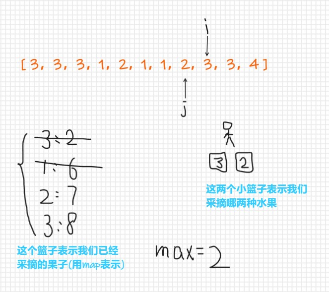
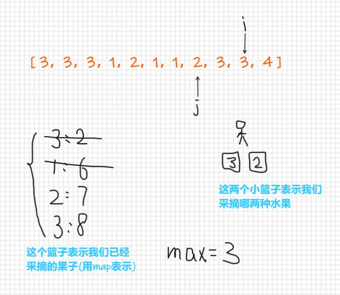
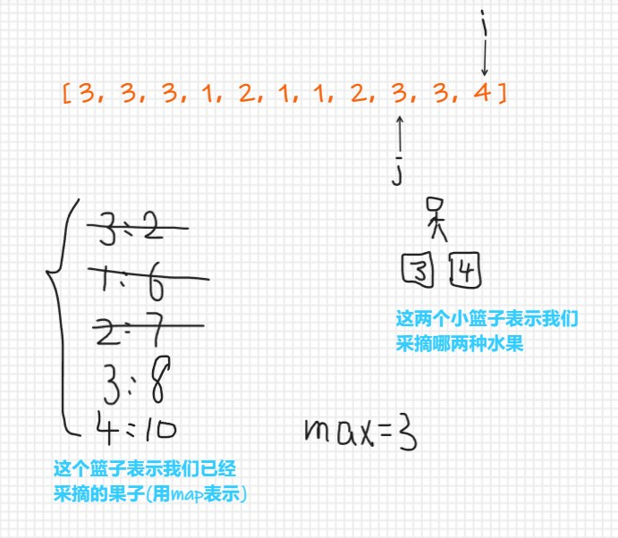

## 904. 水果成篮

[904. 水果成篮](https://leetcode.cn/problems/fruit-into-baskets/)

你正在探访一家农场，农场从左到右种植了一排果树。这些树用一个整数数组 fruits 表示，其中 fruits[i] 是第 i 棵树上的水果 种类 。

你想要尽可能多地收集水果。然而，农场的主人设定了一些严格的规矩，你必须按照要求采摘水果：

你只有 两个 篮子，并且每个篮子只能装 单一类型 的水果。每个篮子能够装的水果总量没有限制。
你可以选择任意一棵树开始采摘，你必须从 每棵 树（包括开始采摘的树）上 恰好摘一个水果 。采摘的水果应当符合篮子中的水果类型。每采摘一次，你将会向右移动到下一棵树，并继续采摘。
一旦你走到某棵树前，但水果不符合篮子的水果类型，那么就必须停止采摘。
给你一个整数数组 fruits ，返回你可以收集的水果的 最大 数目。

 

示例 1：

```
输入：fruits = [1,2,1]
输出：3
解释：可以采摘全部 3 棵树。
```


示例 2：

```
输入：fruits = [0,1,2,2]
输出：3
解释：可以采摘 [1,2,2] 这三棵树。
如果从第一棵树开始采摘，则只能采摘 [0,1] 这两棵树。
```


示例 3：

```
输入：fruits = [1,2,3,2,2]
输出：4
解释：可以采摘 [2,3,2,2] 这四棵树。
如果从第一棵树开始采摘，则只能采摘 [1,2] 这两棵树。
```


示例 4：

```
输入：fruits = [3,3,3,1,2,1,1,2,3,3,4]
输出：5
解释：可以采摘 [1,2,1,1,2] 这五棵树。
```


**题解思路**

首先分析一下题目的意思：

- 你拥有两个篮子，每个篮子可以放一种水果
- 我们需要以某一棵树为起点，**连续**摘下每棵树的果子，要求尽可能摘多的果子，注意：题目要求必须连续采摘
- 当我们遇到第三种水果时，摘果结束
- eg: [0,1,2,2]
  - 一共有三种水果，分别是：0,1,2
  - 当我们从下标为0 的地方开始采摘，那么可以采摘【0,1】，一共可以采摘两个水果
  - 当我们从下标为1 的地方开始采摘，那么可以采摘【1,2,2】，一共可以采摘三个水果


分析思路：

- 用滑动窗口思路解题


- 设立两个指针，i指针表示当前我们采摘到了哪棵树；j指针表示我们的第一种水果的最终的结束位置
- map的key是某种水果，value是这种水果最后的出现位置

- 首次，我们选取了3号水果和1号水果，因为i指针指向的是我们当前遍历到了哪棵树，那么使i指针依次向后移动


- 此时，i指向的是1号水果，j指针指向的是我们的第一种水果，在map中，3号水果的最后出现位置为下标为2的地方，1号水果出现的位置在下标为3的位置，并且记录当前的采摘的最大数量为4

- 那么当i指针继续向下移动时，会遇到第三种水果，即2号水果，那么需要取出一种水果，**在这里我们需要取出出现位置靠前的水果**，3号水果最后出现的位置靠前，那就取出3号水果，因为j指针指向的是我们的第一种水果，那么j指针此时应该向后移动到3号水果最后出现位置的下一个位置(因为在map中我们记录了3号水果最后出现的位置为下标为2的地方，那么j指针现在应该移动到下标为2+1的地方)，

- 然后继续装水果

  

- 此时j指针已经指向了我们存储放第一种水果的起始位置，并且在map中我们也更新了2号水果的最后出现位置为下标为4的地方，并且接下来的水果我们还可以继续采摘，那么就继续向后移动i指针
- 

- 此时，我们已经更新了map中两种水果的最后出现位置，也更新了存储的水果最大数量（计算水果的最大数量可以使用：i - j + 1），接下来当我们继续向后移动指针时，出现了第三种水果，此时需要我们取出一种水果，根据下标，我们要取出的水果是1号水果，并且更新j指针的位置为下标为 6+1 的地方



- 继续向后移动i指针
- 

- 此时将会出现第三种水果，根据下标取出2号水果，并且更新map和max值，移动j指针
- 

- 所以，最后最大的max值应该为5

**完整代码**

```js
var totalFruit = function(fruits) {
    const map = new Map();
    let max = 1;//记录最后采摘果子的最大值，因为题目给定的范围中最少有一棵树，所以设置值为 1
    let j = 0;//我们采摘的第一种果子的起始下标
    for(let i = 0; i < fruits.length; i++){//遍历所有树
        map.set(fruits[i],i);//不断更新果子的最后出现的下标
        if(map.size > 2){//出现第三种果子
            let minIndex = fruits.length - 1;//minIndex记录较小的下标
            for(const [fruit, index] of map){//[fruit, index]是对map的每一项进行解构，直接拿到下标
                if(index < minIndex){
                    minIndex = index;
                }
            }
            map.delete(fruits[minIndex]);//删除某一个果子
            j = minIndex + 1;//更新我们采摘的第一种果子的下标
        }
        max = Math.max(max, i - j + 1);//我们每次都需要更新采摘果子的最大值，不论是否出现第三种果子
    }
    return max;
};
```

