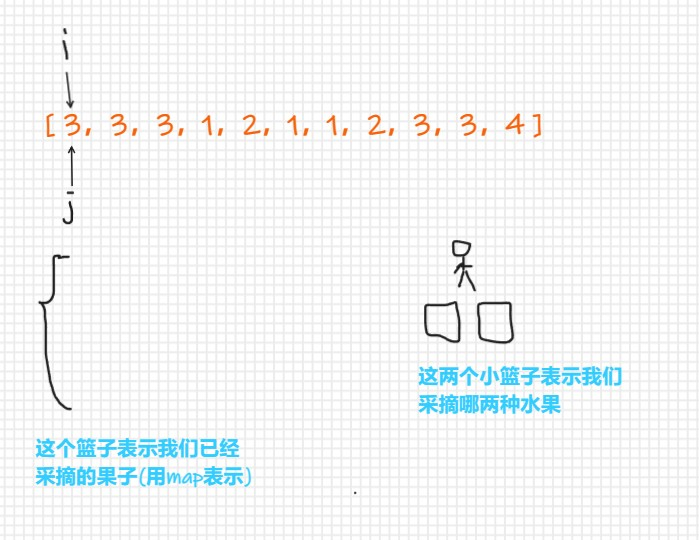
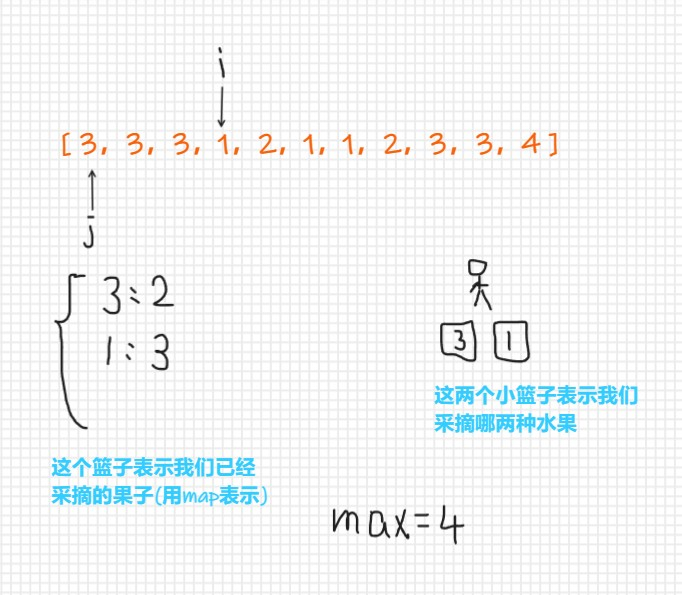
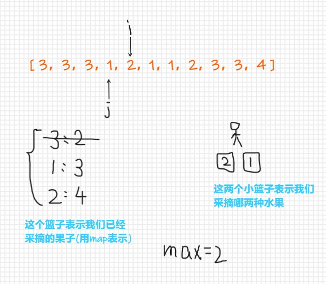
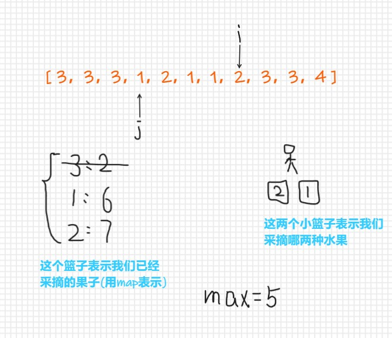
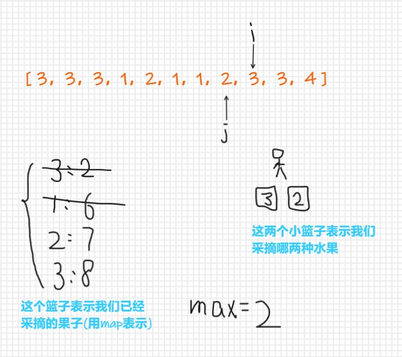
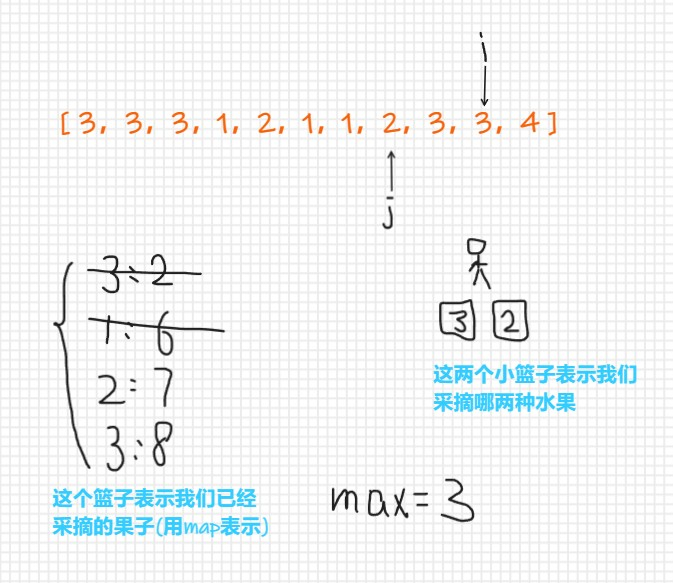
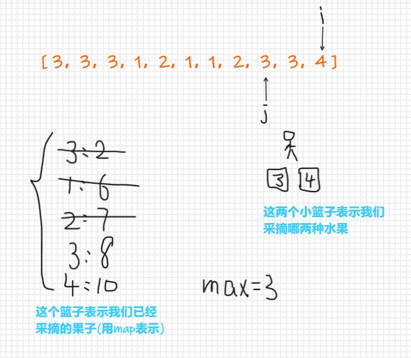

# 【LeetCode】滑动窗口题解汇总

[TOC]


## 写在前面

这里是小飞侠Pan🥳，立志成为一名优秀的前端程序媛！！！

本篇文章同时收录于我的[github](https://github.com/mengqiuleo)前端笔记仓库中，持续更新中，欢迎star~

👉[https://github.com/mengqiuleo/myNote](https://github.com/mengqiuleo/myNote)


## 3. 无重复字符的最长子串

[3. 无重复字符的最长子串](https://leetcode.cn/problems/longest-substring-without-repeating-characters/)

给定一个字符串 s ，请你找出其中不含有重复字符的 最长子串 的长度。

 

示例 1:

```
输入: s = "abcabcbb"
输出: 3 
解释: 因为无重复字符的最长子串是 "abc"，所以其长度为 3。
```


示例 2:

```
输入: s = "bbbbb"
输出: 1
解释: 因为无重复字符的最长子串是 "b"，所以其长度为 1。
```


示例 3:

```
输入: s = "pwwkew"
输出: 3
解释: 因为无重复字符的最长子串是 "wke"，所以其长度为 3。
     请注意，你的答案必须是 子串 的长度，"pwke" 是一个子序列，不是子串。
```

**题解思路**

- set集合中不允许存在重复的元素
- right指针负责向前扩展窗口，left用来缩小窗口
- 当set集合中不存在right指针所指的元素，那就把它加入set集合，并更新maxLength
- 当set集合中存在right指针所指的元素，那就缩小窗口，滑动left指针，然后把right指针的元素加入set

```js
var lengthOfLongestSubstring = function(s) {
    let set = new Set();
    let left = 0, right = 0;
    let maxLength = 0;
    if(s.length === 0){
        return 0;
    }
    while(right < s.length){
        if(!set.has(s[right])){//当前元素不在set中 就加入set 然后更新最大长度，right++继续下一轮循环
            set.add(s[right]);
            maxLength = Math.max(maxLength, set.size);
        }else {
          //set中有重复元素不断让left++ 并删除窗口之外的元素 直到滑动窗口内没有重复的元素
            while(set.has(s[right])){
                set.delete(s[left]);
                left++;
            }
            set.add(s[right]);
        }
        right++;
    }
    return maxLength;
};
```


## 209. 长度最小的子数组

[209. 长度最小的子数组](https://leetcode.cn/problems/minimum-size-subarray-sum/)

给定一个含有 n 个正整数的数组和一个正整数 target 。

找出该数组中满足其和 ≥ target 的长度最小的 连续子数组 [numsl, numsl+1, ..., numsr-1, numsr] ，并返回其长度。如果不存在符合条件的子数组，返回 0 。

 

示例 1：

```
输入：target = 7, nums = [2,3,1,2,4,3]
输出：2
解释：子数组 [4,3] 是该条件下的长度最小的子数组。
```


示例 2：

```
输入：target = 4, nums = [1,4,4]
输出：1
```


示例 3：

```
输入：target = 11, nums = [1,1,1,1,1,1,1,1]
输出：0
```

**题解思路**

- right指针向后遍历数组，
- 每次都将right指针指向的元素加入到sum中，并让right++
- 当sum大于目标值时，left指针向右滑动，并且更新最小长度

```js
var minSubArrayLen = function(target, nums) {
    let len = nums.length;
    let left = right = sum = 0;//sum记录每次的和
    let res = Infinity;//res记录最小长度
    while(right < len){
        sum += nums[right++];
        while(sum >= target){
            res = Math.min(res, right - left);
            sum -= nums[left++];
        }
    }
    return res === Infinity ? 0 : res;
};
```


## 76. 最小覆盖子串

[76. 最小覆盖子串](https://leetcode.cn/problems/minimum-window-substring/)

给你一个字符串 s 、一个字符串 t 。返回 s 中涵盖 t 所有字符的最小子串。如果 s 中不存在涵盖 t 所有字符的子串，则返回空字符串 "" 。

 

注意：

对于 t 中重复字符，我们寻找的子字符串中该字符数量必须不少于 t 中该字符数量。
如果 s 中存在这样的子串，我们保证它是唯一的答案。


示例 1：

```
输入：s = "ADOBECODEBANC", t = "ABC"
输出："BANC"
```


示例 2：

```
输入：s = "a", t = "a"
输出："a"
```


示例 3:

```
输入: s = "a", t = "aa"
输出: ""
解释: t 中两个字符 'a' 均应包含在 s 的子串中，
因此没有符合条件的子字符串，返回空字符串。
```

**题解思路**

这个思路来自力扣，这里只是搬运，在下方会标明出处，附上原文链接

**滑动窗口的思想：**
用i,j表示滑动窗口的左边界和右边界，通过改变i,j来扩展和收缩滑动窗口，可以想象成一个窗口在字符串上游走，当这个窗口包含的元素满足条件，即包含字符串T的所有元素，记录下这个滑动窗口的长度j-i+1，这些长度中的最小值就是要求的结果。

**步骤一**
不断增加j使滑动窗口增大，直到窗口包含了T的所有元素

**步骤二**
不断增加i使滑动窗口缩小，因为是要求最小字串，所以将不必要的元素排除在外，使长度减小，直到碰到一个必须包含的元素，这个时候不能再扔了，再扔就不满足条件了，记录此时滑动窗口的长度，并保存最小值

**步骤三**
让i再增加一个位置，这个时候滑动窗口肯定不满足条件了，那么继续从步骤一开始执行，寻找新的满足条件的滑动窗口，如此反复，直到j超出了字符串S范围。

**面临的问题：**
**如何判断滑动窗口包含了T的所有元素？**
我们用一个字典need来表示当前滑动窗口中需要的各元素的数量，一开始滑动窗口为空，用T中各元素来初始化这个need，当滑动窗口扩展或者收缩的时候，去维护这个need字典，例如当滑动窗口包含某个元素，我们就让need中这个元素的数量减1，代表所需元素减少了1个；当滑动窗口移除某个元素，就让need中这个元素的数量加1。
记住一点：need始终记录着当前滑动窗口下，我们还需要的元素数量，我们在改变i,j时，需同步维护need。
值得注意的是，只要某个元素包含在滑动窗口中，我们就会在need中存储这个元素的数量，如果某个元素存储的是负数代表这个元素是多余的。比如当need等于{'A':-2,'C':1}时，表示当前滑动窗口中，我们有2个A是多余的，同时还需要1个C。这么做的目的就是为了步骤二中，排除不必要的元素，数量为负的就是不必要的元素，而数量为0表示刚刚好。
回到问题中来，那么如何判断滑动窗口包含了T的所有元素？结论就是当need中所有元素的数量都小于等于0时，表示当前滑动窗口不再需要任何元素。


**优化**
如果每次判断滑动窗口是否包含了T的所有元素，都去遍历need看是否所有元素数量都小于等于0，这个会耗费O(k)O(k)的时间复杂度，k代表字典长度，最坏情况下，k可能等于len(S)。
其实这个是可以避免的，我们可以维护一个额外的变量**needCnt**来记录**所需元素**的总数量，当我们碰到一个所需元素c，不仅need[c]的数量减少1，同时needCnt也要减少1，这样我们通过needCnt就可以知道是否满足条件，而无需遍历字典了。
前面也提到过，need记录了遍历到的所有元素，而只有need[c]>0大于0时，代表c就是**所需元素**


原文链接： 👉[简简单单，非常容易理解的滑动窗口思想](https://leetcode.cn/problems/minimum-window-substring/solution/tong-su-qie-xiang-xi-de-miao-shu-hua-dong-chuang-k/)

```js
var minWindow = function(s, t) {
  var need = {}, missing = t.length, i, j, I = 0, J = 0, c, l;
  //need用来存需要的所有字符，key是字符，对应的value值是它需要的次数，大于0表示还需要几次，0表示刚好被全部存储，负数表示这个字母多出现了几次
  //missing表示字符串t的长度，当missing减到0时表示字符串t已被全部找到
  //I,J用来记录我们要截取的子串的起始和结束位置
  for (i = 0, l = t.length; i < l; i++) {//拿到需要的need数组
      c = t[i];
      need[c] = need[c] === undefined ? 1 : need[c] + 1;
  }
  for (i = 0, j = 0, l = s.length; j < l; j++) {
      c = s[j];
      if(need[c] > 0){//如果need[c]存在，并且还没有被计算过（只有当大于0的时候才会没被计算过）
        missing --;
      }
      need[c] = need[c] === undefined ? -1 : need[c] - 1;
      if (missing === 0) {
          while(i < j && need[s[i]] < 0) {//如果当前的指针出现的次数是多余的，向右移动i指针
              need[s[i]]++;
              i++;
          }
          //出了while循环后，此时左边的i指针已经指向了字符串t的第一个字母
          if (J === 0 || j - i < J - I) {//更新子串的起始和结束位置，因为下面的substring是左闭右开区间，所以 J = j + 1;
              J = j + 1;
              I = i;
          }
      }
  }
  return s.substring(I, J);//左闭右开区间
};
```


> **「力扣」第 76 题以及同类问题**
>
> - 「力扣」第 76 题：最小覆盖子串（困难）
> - 「力扣」第 438 题：找到字符串中所有字母异位词（中等）
> - 「力扣」第 567 题：字符串的排列（中等）
>
> 上述题目中都会使用一个need对象，下面的几道题也是，所以在下面的题目中，并不会再次解释need对象中value值的大于0，等于0，小于0的含义。
>
> 在第76题的题解中已经详细介绍了need对象中value的含义


## 438. 找到字符串中所有字母异位词

[438. 找到字符串中所有字母异位词](https://leetcode.cn/problems/find-all-anagrams-in-a-string/)

给定两个字符串 s 和 p，找到 s 中所有 p 的 异位词 的子串，返回这些子串的起始索引。不考虑答案输出的顺序。

异位词 指由相同字母重排列形成的字符串（包括相同的字符串）。

 

示例 1:

```
输入: s = "cbaebabacd", p = "abc"
输出: [0,6]
解释:
起始索引等于 0 的子串是 "cba", 它是 "abc" 的异位词。
起始索引等于 6 的子串是 "bac", 它是 "abc" 的异位词。
```


 示例 2:

```
输入: s = "abab", p = "ab"
输出: [0,1,2]
解释:
起始索引等于 0 的子串是 "ab", 它是 "ab" 的异位词。
起始索引等于 1 的子串是 "ba", 它是 "ab" 的异位词。
起始索引等于 2 的子串是 "ab", 它是 "ab" 的异位词。
```

**题解思路**

- 我们用两个对象（need和win）来存储字符串的信息，key是字符，value是对应的次数
- 注意，win中只会存放need中所需要的字符，不会存储多余的字符
- 为了判断我们的win和need是否相同，使用val变量来记录目前win中已经满足条件的字母。当val和need的key的数量相同时，表示win此时已经满足条件，将其实下标加入答案数组
- 首先需要遍历字符串p，并填充need对象
- 然后使用right指针遍历字符串s
- 当某个字符是need需要的，将它加入win，并且更新val
- 当滑动窗口过大时，首先判断是否满足异位词，并加入答案数组。然后缩小窗口，并减少对应的win中的值和val

```js
var findAnagrams = function(s, p) {
    let need = {}, win = {};//need是需要的字符串，win是滑动窗口中的字符串
    for(let a of p){//拿到需要的need数组
        need[a] = (need[a] || 0) + 1;
    }
    let left = 0, right = 0;
    let val = 0, res = [];//val用来记录当前已经完成了的need中的字符数量
    while(right < s.length){
        let c = s[right];
        right++;
        if(need[c]){//如果当前字符需要，并且也出现在滑动窗口中了
            win[c] = (win[c] || 0) + 1;
            if(win[c] == need[c]){//如果窗口中的字符以及长度符合need中的要求
                val++;//记录当前已经满足了多少字符
            }
        }
        while(right - left >= p.length){ //如果目前窗口的长度大于字符串p的长度
            if(val === Object.keys(need).length){//如果所需要的字符全部满足
                res.push(left);//将左起点加入答案数组中
            }
            let d = s[left];//缩小窗口
            left++;
            if(need[d]){//对应的减少记录值
                if(win[d] == need[d]){
                    val--;
                }
                win[d]--;
            }
        }
    }
    return res;
};
```


## 567. 字符串的排列

[567. 字符串的排列](https://leetcode.cn/problems/permutation-in-string/)

给你两个字符串 s1 和 s2 ，写一个函数来判断 s2 是否包含 s1 的排列。如果是，返回 true ；否则，返回 false 。

换句话说，s1 的排列之一是 s2 的 子串 。

 

示例 1：

```
输入：s1 = "ab" s2 = "eidbaooo"
输出：true
解释：s2 包含 s1 的排列之一 ("ba").
```


示例 2：

```
输入：s1= "ab" s2 = "eidboaoo"
输出：false
```

**题解思路**

- 还是首先使用一个need数组记录目标字符串的信息
- 然后遍历字符串s2，在遍历中更新need的值
- 缩小窗口，并且排除不必要的字符

```js
var checkInclusion = function(s1, s2) {
    if(s2.length < s1.length){
        return false;
    }
    let need = {};
    for(let c of s1){
        need[c] = (need[c] || 0) + 1;
    }
    let left = 0, right = 0;
    while(right < s2.length){
        let c = s2[right];
        right++;
        need[c] === undefined ? need[c] = -1 : need[c]--;
        while(left < right && need[c] < 0){
            let d = s2[left];
            left++;
            need[d]++;
        }  
      //再退出while循环后，left指针已经指向了目标字符串的起始位置(因为退出循环的条件是need[c]===0，而等于0恰好表示这个字符刚好被找到)
        if(right - left == s1.length){
            return true;
        }
    }
    return false;
};
```


## 904. 水果成篮

[904. 水果成篮](https://leetcode.cn/problems/fruit-into-baskets/)

你正在探访一家农场，农场从左到右种植了一排果树。这些树用一个整数数组 fruits 表示，其中 fruits[i] 是第 i 棵树上的水果 种类 。

你想要尽可能多地收集水果。然而，农场的主人设定了一些严格的规矩，你必须按照要求采摘水果：

你只有 两个 篮子，并且每个篮子只能装 单一类型 的水果。每个篮子能够装的水果总量没有限制。
你可以选择任意一棵树开始采摘，你必须从 每棵 树（包括开始采摘的树）上 恰好摘一个水果 。采摘的水果应当符合篮子中的水果类型。每采摘一次，你将会向右移动到下一棵树，并继续采摘。
一旦你走到某棵树前，但水果不符合篮子的水果类型，那么就必须停止采摘。
给你一个整数数组 fruits ，返回你可以收集的水果的 最大 数目。

 

示例 1：

```
输入：fruits = [1,2,1]
输出：3
解释：可以采摘全部 3 棵树。
```


示例 2：

```
输入：fruits = [0,1,2,2]
输出：3
解释：可以采摘 [1,2,2] 这三棵树。
如果从第一棵树开始采摘，则只能采摘 [0,1] 这两棵树。
```


示例 3：

```
输入：fruits = [1,2,3,2,2]
输出：4
解释：可以采摘 [2,3,2,2] 这四棵树。
如果从第一棵树开始采摘，则只能采摘 [1,2] 这两棵树。
```


示例 4：

```
输入：fruits = [3,3,3,1,2,1,1,2,3,3,4]
输出：5
解释：可以采摘 [1,2,1,1,2] 这五棵树。
```


**题解思路**

首先分析一下题目的意思：

- 你拥有两个篮子，每个篮子可以放一种水果
- 我们需要以某一棵树为起点，**连续**摘下每棵树的果子，要求尽可能摘多的果子，注意：题目要求必须连续采摘
- 当我们遇到第三种水果时，摘果结束
- eg: [0,1,2,2]
  - 一共有三种水果，分别是：0,1,2
  - 当我们从下标为0 的地方开始采摘，那么可以采摘【0,1】，一共可以采摘两个水果
  - 当我们从下标为1 的地方开始采摘，那么可以采摘【1,2,2】，一共可以采摘三个水果


分析思路：

- 用滑动窗口思路解题



- 设立两个指针，i指针表示当前我们采摘到了哪棵树；j指针表示我们的第一种水果的最终的结束位置
- map的key是某种水果，value是这种水果最后的出现位置

- 首次，我们选取了3号水果和1号水果，因为i指针指向的是我们当前遍历到了哪棵树，那么使i指针依次向后移动



- 此时，i指向的是1号水果，j指针指向的是我们的第一种水果，在map中，3号水果的最后出现位置为下标为2的地方，1号水果出现的位置在下标为3的位置，并且记录当前的采摘的最大数量为4

- 那么当i指针继续向下移动时，会遇到第三种水果，即2号水果，那么需要取出一种水果，**在这里我们需要取出出现位置靠前的水果**，3号水果最后出现的位置靠前，那就取出3号水果，因为j指针指向的是我们的第一种水果，那么j指针此时应该向后移动到3号水果最后出现位置的下一个位置(因为在map中我们记录了3号水果最后出现的位置为下标为2的地方，那么j指针现在应该移动到下标为2+1的地方)，

- 然后继续装水果

  

- 此时j指针已经指向了我们存储放第一种水果的起始位置，并且在map中我们也更新了2号水果的最后出现位置为下标为4的地方，并且接下来的水果我们还可以继续采摘，那么就继续向后移动i指针

- 

- 此时，我们已经更新了map中两种水果的最后出现位置，也更新了存储的水果最大数量（计算水果的最大数量可以使用：i - j + 1），接下来当我们继续向后移动指针时，出现了第三种水果，此时需要我们取出一种水果，根据下标，我们要取出的水果是1号水果，并且更新j指针的位置为下标为 6+1 的地方



- 继续向后移动i指针
- 

- 此时将会出现第三种水果，根据下标取出2号水果，并且更新map和max值，移动j指针
- 

- 所以，最后最大的max值应该为5

**完整代码**

```js
var totalFruit = function(fruits) {
    const map = new Map();
    let max = 1;//记录最后采摘果子的最大值，因为题目给定的范围中最少有一棵树，所以设置值为 1
    let j = 0;//我们采摘的第一种果子的起始下标
    for(let i = 0; i < fruits.length; i++){//遍历所有树
        map.set(fruits[i],i);//不断更新果子的最后出现的下标
        if(map.size > 2){//出现第三种果子
            let minIndex = fruits.length - 1;//minIndex记录较小的下标
            for(const [fruit, index] of map){//[fruit, index]是对map的每一项进行解构，直接拿到下标
                if(index < minIndex){
                    minIndex = index;
                }
            }
            map.delete(fruits[minIndex]);//删除某一个果子
            j = minIndex + 1;//更新我们采摘的第一种果子的下标
        }
        max = Math.max(max, i - j + 1);//我们每次都需要更新采摘果子的最大值，不论是否出现第三种果子
    }
    return max;
};
```


## 713. 乘积小于 K 的子数组

[713. 乘积小于 K 的子数组](https://leetcode.cn/problems/subarray-product-less-than-k/)

给你一个整数数组 nums 和一个整数 k ，请你返回子数组内所有元素的乘积严格小于 k 的连续子数组的数目。


示例 1：

```
输入：nums = [10,5,2,6], k = 100
输出：8
解释：8 个乘积小于 100 的子数组分别为：[10]、[5]、[2],、[6]、[10,5]、[5,2]、[2,6]、[5,2,6]。
需要注意的是 [10,5,2] 并不是乘积小于 100 的子数组。
```


示例 2：

```
输入：nums = [1,2,3], k = 0
输出：0
```

**题解思路**

> 我们枚举子数组的右端点 j，并且左端点从 i = 0 开始，用 prod 记录子数组 [i,j] 的元素乘积。每枚举一个右端点 j，如果当前子数组元素乘积 prod 大于等于 k，那么我们右移左端点 i 直到满足当前子数组元素乘积小于 k 或者 i > j，那么元素乘积小于 k 的子数组数目为 j - i + 1。返回所有数目之和。
>

首先定义两个指针 i 和 j，后续遍历数组与记录用，

- 左右指针起始均在位置 0 ；用右指针遍历数组，每次循环中右指针右移一次；

- 移动过程中纪录从左指针到右指针路上的连续数的乘积为 prod；

- 如果乘积大于 k 了，则左指针右移，注意此处用的是 while 来使左指针右移，因为实际情况可能是：右指针最后右移一次指向了一个比较大的数使得 prod 不小于目标值，此时左指针需要右移多次才能使得 prod 刚小于 k；

- 最后用 ret 记录 prod 小于 k 时的数组组合；

```js
var numSubarrayProductLessThanK = function(nums, k) {
    let n = nums.length, ret = 0;//ret记录最后一共的种类
    let prod = 1, i = 0;//prod记录每次计算出来的乘积
    for(let j = 0; j < n; j++){
        prod *= nums[j];
        while(i <= j && prod >= k){
            prod /= nums[i];
            i++;
        }
        ret += j - i + 1;
    }
    return ret;
};
```

**疑惑点**

1. 为什么枚举子数组的右端点 j，而不是枚举子数组的左端点 ？

   如果一个子串的乘积小于k，那么他的每个子集都小于k，而一个长度为n的数组，他的所有连续子串数量是1+2+...n，但是会和前面的重复。 比如例子中[10, 5, 2, 6]，第一个满足条件的子串是[10]，第二个满足的是[10, 5]，但是第二个数组的子集[10]和前面的已经重复了，因此我们只需要**计算包含最右边的数字的子串数量，就不会重复了**，也就是在计算[10, 5]这个数组的子串是，只加入[5]和[10, 5]，而不加入[10]，这部分的子串数量刚好是r - l + 1


2. 为什么以 右端点j 为结尾的子数组的数量是 `ret += j - i + 1`

   - j-i+1是以右端点元素为末尾元素的子数组的个数(区间多长，含末尾元素的子数组就有多少个)，所有元素做队尾的子数组数之和就是符合条件子数组的个数。比如例子[10,5,2,6]以10做队尾的子数组[10],以5做队尾的子数组[10,5],[5]，以2作队尾 [5,2],[2],以此类推。

   - 对于一个区间，如果固定右端点，那么左边有多少个元素，就能对应的生成多少个子数组，再加上自身