# 【LeetCode】链表题解汇总

[TOC]


## 写在前面

这里是小飞侠Pan🥳，立志成为一名优秀的前端程序媛！！！

本篇文章同时收录于我的[github](https://github.com/mengqiuleo)前端笔记仓库中，持续更新中，欢迎star~

👉[https://github.com/mengqiuleo/myNote](https://github.com/mengqiuleo/myNote)


## 2. 两数相加

[2. 两数相加](https://leetcode.cn/problems/add-two-numbers/)

给你两个 非空 的链表，表示两个非负的整数。它们每位数字都是按照 逆序 的方式存储的，并且每个节点只能存储 一位 数字。

请你将两个数相加，并以相同形式返回一个表示和的链表。

你可以假设除了数字 0 之外，这两个数都不会以 0 开头。

**示例 1：**

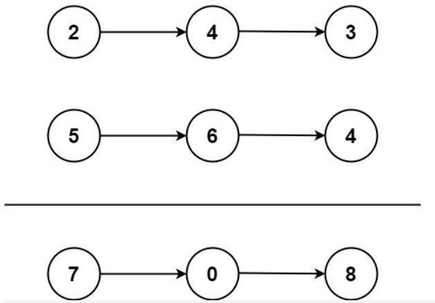

```
输入：l1 = [2,4,3], l2 = [5,6,4]
输出：[7,0,8]
解释：342 + 465 = 807.
```


示例 2：

```
输入：l1 = [0], l2 = [0]
输出：[0]
```


示例 3：

```
输入：l1 = [9,9,9,9,9,9,9], l2 = [9,9,9,9]
输出：[8,9,9,9,0,0,0,1]
```

**题解思路**

- 题目给定的数字右边是高位，链表以低位开头
- 我们在纸上演算时，是从低位开始，也正好符合链表的开头是低位
- 所以，首先我们需要一个curry变量存储进位
- 如果当前位置不存在，用0补充
- 我们用一个新链表存储计算出的结果

```js
var addTwoNumbers = function(l1, l2) {
    let curry = 0;//存储进位
    let pre = cur = new ListNode(0);
    while(curry || l1 || l2){
        let val1 = l1 !== null ? l1.val : 0;
        let val2 = l2 !== null ? l2.val : 0;
        let sum = val1 + val2 + curry;

        curry = sum >= 10 ? 1 : 0;

        cur.next = new ListNode(sum % 10);
        cur = cur.next;

        if(l1) l1 = l1.next;
        if(l2) l2 = l2.next;
    }
    return pre.next;
};
```


## 19. 删除链表的倒数第 N 个结点

[19. 删除链表的倒数第 N 个结点](https://leetcode.cn/problems/remove-nth-node-from-end-of-list/)

给你一个链表，删除链表的倒数第 `n` 个结点，并且返回链表的头结点。

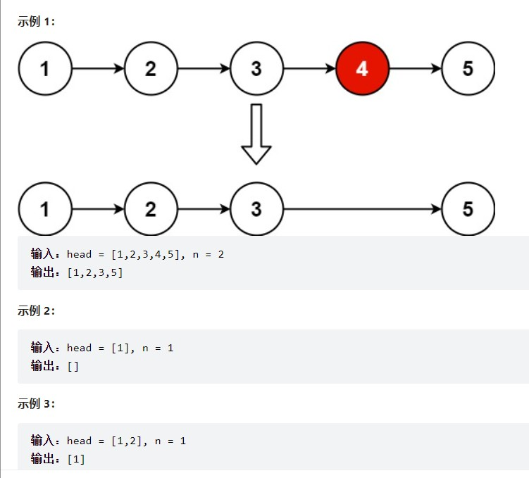

**题解思路**

假设设定了双指针 p 和 q 的话，当 q 指向末尾的 NULL，p 与 q 之间相隔的元素个数为 n 时，那么删除掉 p 的下一个指针就完成了要求。

- 设置虚拟节点 dummyHead 指向 head
- 设定双指针 p 和 q，初始都指向虚拟节点 dummyHead
- 移动 q，直到 p 与 q 之间相隔的元素个数为 n
- 同时移动 p 与 q，直到 q 指向的为 NULL
- 将 p 的下一个节点指向下下个节点

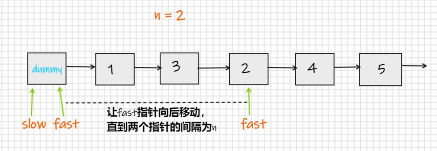

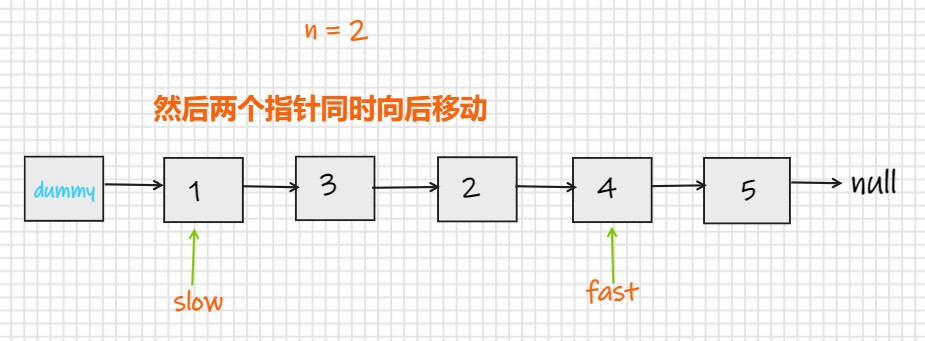

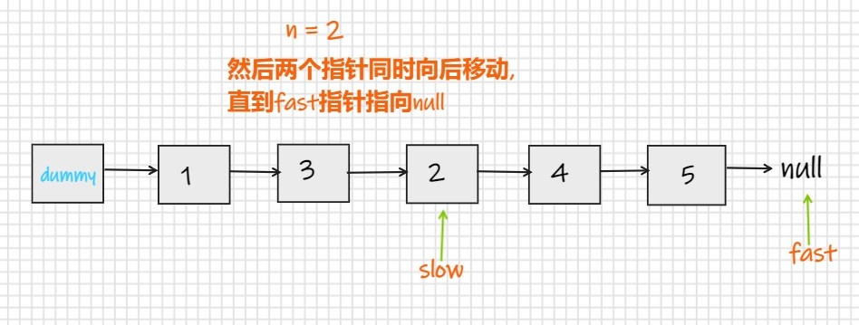

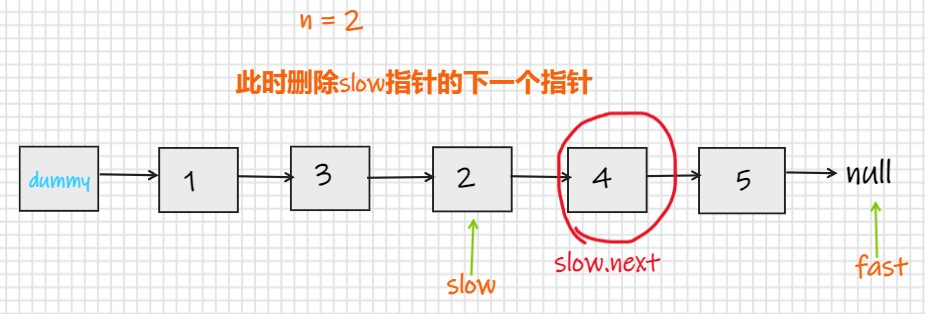

```js
var removeNthFromEnd = function(head, n) {
    let ret = new ListNode(0,head);
    let slow = fast = ret;
    while(n--) fast = fast.next;
    while(fast.next !== null){
        fast = fast.next;
        slow = slow.next;
    }
    slow.next = slow.next.next;
    return ret.next;
};
```


## 21. 合并两个有序链表

[21. 合并两个有序链表](https://leetcode.cn/problems/merge-two-sorted-lists/)

将两个升序链表合并为一个新的 **升序** 链表并返回。新链表是通过拼接给定的两个链表的所有节点组成的。 

**示例 1：**

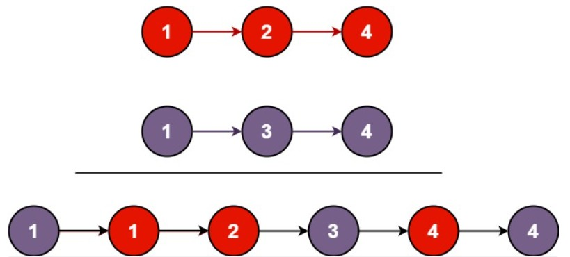

```
输入：l1 = [1,2,4], l2 = [1,3,4]
输出：[1,1,2,3,4,4]
```


示例 2：

```
输入：l1 = [], l2 = []
输出：[]
```


示例 3：

```
输入：l1 = [], l2 = [0]
输出：[0]
```

**题解思路**

- 我们自定义一个节点用来存储新生成的链表
- 当两个链表都未遍历完时，将较小值加在新生成的链表后面
- 最后将剩余的链表接在后面

```js
var mergeTwoLists = function(list1, list2) {
    let dummy = new ListNode(-1), p = dummy;
    while(list1 !== null && list2 !== null){
        if(list1.val > list2.val){
            p.next = list2;
            list2 = list2.next;
        } else {
            p.next = list1;
            list1 = list1.next;
        }
        p = p.next;
    }
    if(list1 !== null){
        p.next = list1;
    }
    if(list2 !== null){
        p.next = list2;
    }
    return dummy.next;
};
```


## 23. 合并K个升序链表

[23. 合并K个升序链表](https://leetcode.cn/problems/merge-k-sorted-lists/)

给你一个链表数组，每个链表都已经按升序排列。

请你将所有链表合并到一个升序链表中，返回合并后的链表。

 

示例 1：

```
输入：lists = [[1,4,5],[1,3,4],[2,6]]
输出：[1,1,2,3,4,4,5,6]
解释：链表数组如下：
[
  1->4->5,
  1->3->4,
  2->6
]
将它们合并到一个有序链表中得到。
1->1->2->3->4->4->5->6
```


示例 2：

```
输入：lists = []
输出：[]
```


示例 3：

```
输入：lists = [[]]
输出：[]
```

**题解思路**

这里使用归并排序

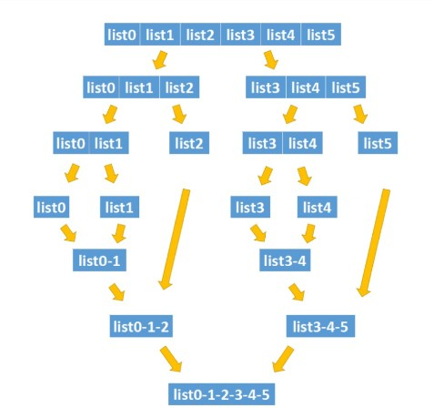

```js
var mergeKLists = function(lists) {
    if(!lists.length) return null;
    return mergeLists(lists, 0, lists.length - 1);
};

function mergeLists(lists, start, end){
    //如果 start === end 说明分治的分到头了，只剩一个元素了，直接返回
    if(start === end){
        return lists[start];
    }
  //在这里进行：分，使用递归将链表逐步分，直到只剩一个元素
    const mid = start + ((end - start) >> 1);
    const leftList = mergeLists(lists, start, mid);
    const rightList = mergeLists(lists, mid + 1, end);
  //调用merge函数：进行合
    return merge(leftList, rightList);
}

//合并链表
function merge(head1, head2){
    let newHead = new ListNode(0), p = newHead;
    while(head1 && head2){
        if(head1.val <= head2.val){
            p.next = head1;
            head1 = head1.next;
        } else {
            p.next = head2;
            head2 = head2.next;
        }
        p = p.next;
    }
    p.next = head1 ? head1 : head2;
    return newHead.next;
}
```


## 24. 两两交换链表中的节点

[24. 两两交换链表中的节点](https://leetcode.cn/problems/swap-nodes-in-pairs/)

给你一个链表，两两交换其中相邻的节点，并返回交换后链表的头节点。你必须在不修改节点内部的值的情况下完成本题（即，只能进行节点交换）。

 **示例 1：**

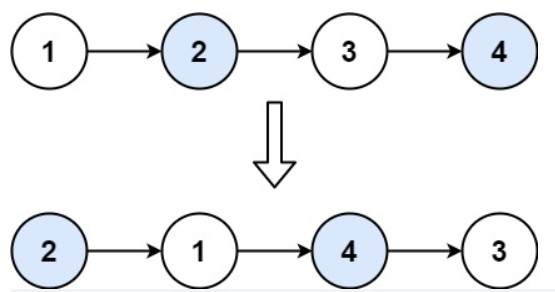

```
输入：head = [1,2,3,4]
输出：[2,1,4,3]
```


示例 2：

```
输入：head = []
输出：[]
```


示例 3：

```
输入：head = [1]
输出：[1]
```

**题解思路**


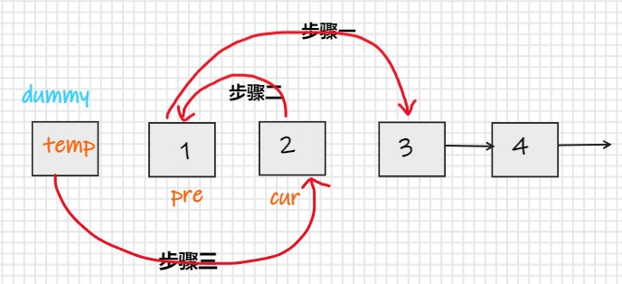

- 我们首先创建一个虚拟头结点ret,并且这个虚拟头结点指向head
- cur代表的是要进行节点交换的第二个节点，pre是进行交换的第一个节点

```js
var swapPairs = function(head) {
    let dummy = new ListNode(0,head), temp = dummy;
    while(temp.next && temp.next.next){
        let cur = temp.next.next, pre = temp.next;
        pre.next = cur.next;
        cur.next = pre;
        temp.next = cur;
        temp = pre;
    }
    return dummy.next;
};
```


## 25. K 个一组翻转链表

[25. K 个一组翻转链表](https://leetcode.cn/problems/reverse-nodes-in-k-group/)

给你链表的头节点 head ，每 k 个节点一组进行翻转，请你返回修改后的链表。

k 是一个正整数，它的值小于或等于链表的长度。如果节点总数不是 k 的整数倍，那么请将最后剩余的节点保持原有顺序。

你不能只是单纯的改变节点内部的值，而是需要实际进行节点交换。

 **示例 1：**

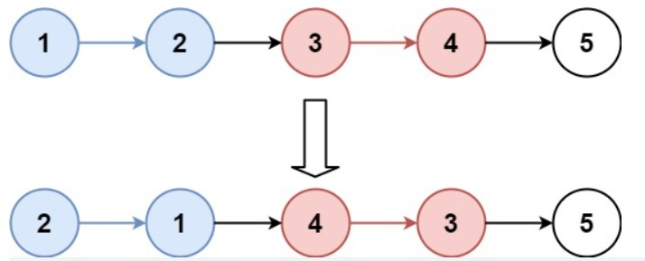

```
输入：head = [1,2,3,4,5], k = 2
输出：[2,1,4,3,5]
```

**示例 2：**

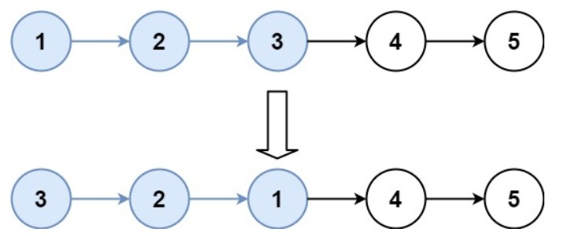

```
输入：head = [1,2,3,4,5], k = 3
输出：[3,2,1,4,5]
```

**题解思路**

用栈，我们把 k 个数压入栈中，然后弹出来的顺序就是翻转的！

这里要注意几个问题：

第一，剩下的链表个数够不够 k 个（因为不够 k 个不用翻转）；

第二，已经翻转的部分要与剩下链表连接起来。

- 我们还是建立一个虚拟头结点dummy,并且还有一个pre指针首先指向dummy
- 然后pre指针会不断在尾部加入链表节点，然后向后移动
- tmp和head节点都会首先表示为要加入栈中的k个节点的开头
- tmp会不断向后移动，在每次移动中拿到对应的值加入栈中
- 并且在每轮循环最后，都要将head重新标记为下一轮k个元素的开头。
- 将head进行标记，可以保证tmp正确遍历每一轮的k个元素

```js
var reverseKGroup = function(head, k) {
    let stack = [];
    let dummy = new ListNode(-1, head);
    let pre = dummy;
    while(true){
        let count = 0;
        let tmp = head;
        while(tmp && count < k){
            stack.push(tmp);
            tmp = tmp.next;
            count++;
        }
        if(count != k){//如果剩下的不够 K 个
            pre.next = head;//将剩下的元素加在链表的最后
            break;
        }
        while(stack.length > 0){
            pre.next = stack.pop();
            pre = pre.next;
        }
        head = tmp;
    }
    return dummy.next;
};
```


## 61. 旋转链表

[61. 旋转链表](https://leetcode.cn/problems/rotate-list/)

给你一个链表的头节点 `head` ，旋转链表，将链表每个节点向右移动 `k` 个位置。

**示例 1：**

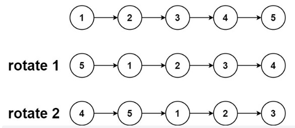

```
输入：head = [1,2,3,4,5], k = 2
输出：[4,5,1,2,3]
```

**示例 2：**

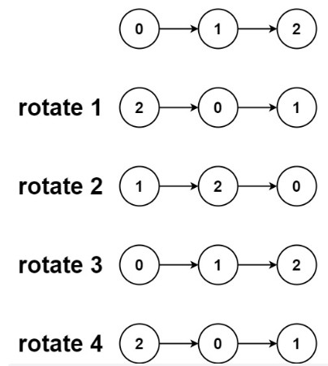

```
输入：head = [0,1,2], k = 4
输出：[2,0,1]
```

**题解思路**

- 第一遍循环获取链表的长度
- 长度对k进行取余(长5，移6，实际移1)
- 初始化两个指针， 余数作为初始时两个指针的间隔
- 两指针同时向后移动，当右指针到达末尾停止
- 此时左指针是尾节点，下一节点是头节点
- 右指针的下一节点指向原来的头结点

```js
var rotateRight = function(head, k) {
    let dummy = new ListNode(-1, head), pre = dummy;
    let len = 0, mod, R = head, L = head;
  //先进行一轮循环，求出链表的长度
    while(pre.next){
        len++;
        pre = pre.next;
    }
    if(len === 0) return dummy.next;
    mod = k % len;//拿到真正应该移动的长度
    while(mod--){
        R = R.next;
    }
    while(R.next){
        R = R.next;
        L = L.next;
    }
    R.next = dummy.next;
    dummy.next = L.next;
    L.next = null;
    return dummy.next;
};
```


## 82. 删除排序链表中的重复元素 II

[82. 删除排序链表中的重复元素 II](https://leetcode.cn/problems/remove-duplicates-from-sorted-list-ii/)

给定一个已排序的链表的头 `head` ， 删除原始链表中所有重复数字的节点，只留下不同的数字 。返回 已排序的链表 。

**示例 1：**

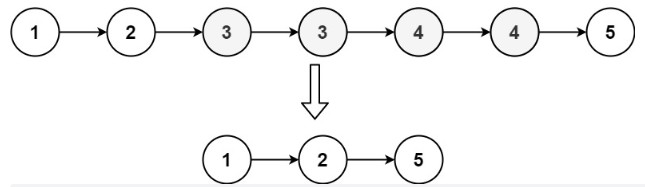

```
输入：head = [1,2,3,3,4,4,5]
输出：[1,2,5]
```

**示例 2：**

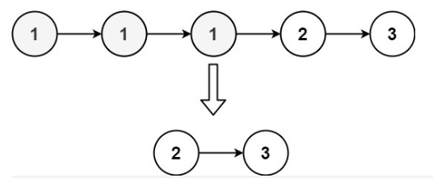

```
输入：head = [1,1,1,2,3]
输出：[2,3]
```

**题解思路**

- 因为可能删除头结点，所以需要一个虚拟头结点dummy
- 从dummy节点开始遍历
- 如果当前节点cur的下一个节点和下下个节点的值相同，那就进行循环，将cur节点的next节点设置为cur.next.next

```js
var deleteDuplicates = function(head) {
    let dummy = new ListNode(0, head);
    let cur = dummy;
    while(cur.next && cur.next.next){
        if(cur.next.val === cur.next.next.val){//相邻节点的值相同
            let val = cur.next.val;//先将值保存
            //删除所有值相同的节点
            while(cur.next && cur.next.val === val){
                cur.next = cur.next.next;
            }
        } else { //值不同直接向后遍历就好
            cur = cur.next;
        }
    }    
    return dummy.next;
};
```


## 83. 删除排序链表中的重复元素

[83. 删除排序链表中的重复元素](https://leetcode.cn/problems/remove-duplicates-from-sorted-list/)

给定一个已排序的链表的头 `head` ， 删除所有重复的元素，使每个元素只出现一次 。返回 已排序的链表 。

 **示例 1：**

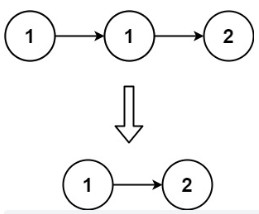

```
输入：head = [1,1,2]
输出：[1,2]
```

**示例 2：**

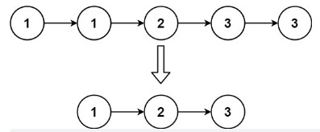

```
输入：head = [1,1,2,3,3]
输出：[1,2,3]
```

**题解思路**

- 这个题和上个体的区别是：这个题并不是将所有的重复值删除，而是要保留一个
- 所以，我们此时不需要虚拟头结点，因为头结点head并不会被删除
- 如果下一个节点的值和当前节点的值相同，那就把当前节点的next节点设置为下下个节点

```js
var deleteDuplicates = function(head) {
    let tmpHead = head;
    while(tmpHead !== null){
        let next = tmpHead.next;
        if(next !== null && next.val === tmpHead.val){
            tmpHead.next = next.next;
        } else {
            tmpHead = tmpHead.next;
        }
    }
    return head;
};
```


## 86. 分隔链表

[86. 分隔链表](https://leetcode.cn/problems/partition-list/)

给你一个链表的头节点 head 和一个特定值 x ，请你对链表进行分隔，使得所有 小于 x 的节点都出现在 大于或等于 x 的节点之前。

你应当 保留 两个分区中每个节点的初始相对位置。

**示例 1：**

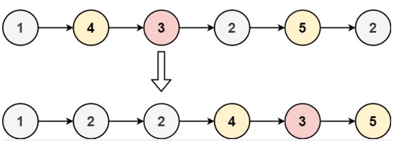

```
输入：head = [1,4,3,2,5,2], x = 3
输出：[1,2,2,4,3,5]
```

**示例 2：**

```
输入：head = [2,1], x = 2
输出：[1,2]
```

**题解思路**

- 我们使用两个链表，一个small链表存放比目标值小的数，另一个是large链表
- 然后循环head头结点
- 当遍历结束后，在small链表后面加上large链表。并且将large的末尾置0

```js
var partition = function(head, x) {
    let small = dummySmall = new ListNode(-1);
    let large = dummyLarge = new ListNode(-1);
    while(head){
        if(head.val < x){
            small.next = head;
            small = small.next;
        }else{
            large.next = head;
            large = large.next;
        }
        head = head.next;
    }
    small.next = dummyLarge.next;
    large.next = null;
    return dummySmall.next;
};
```


## 92. 反转链表 II

[92. 反转链表 II](https://leetcode.cn/problems/reverse-linked-list-ii/)

给你单链表的头指针 head 和两个整数 left 和 right ，其中 left <= right 。请你反转从位置 left 到位置 right 的链表节点，返回 反转后的链表 。

**示例 1：**

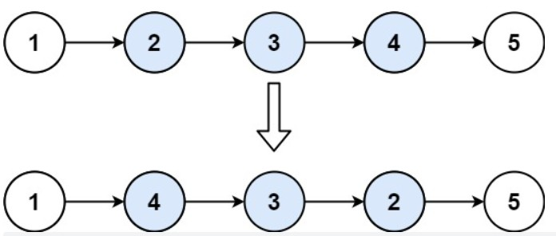

```
输入：head = [1,2,3,4,5], left = 2, right = 4
输出：[1,4,3,2,5]
```


示例 2：

```
输入：head = [5], left = 1, right = 1
输出：[5]
```

**题解思路**

- 我们需要两个指针，一个pre指针要指向翻转区间的前一个节点,另一个cur节点负责翻转区间

- 整体流程如下：图中的g指针就是pre，p指针(即cur指针)负责遍历整个翻转区间

  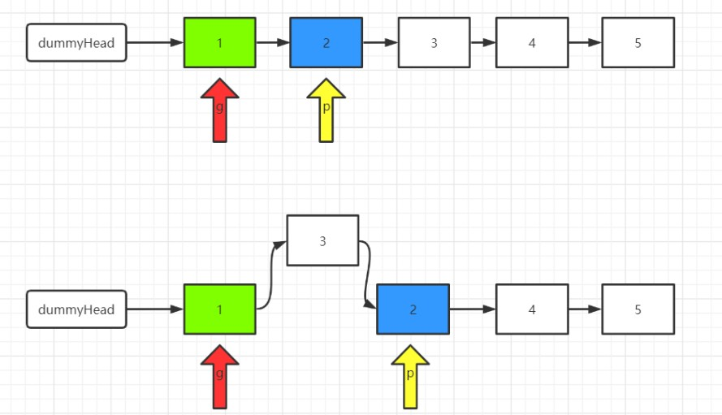

  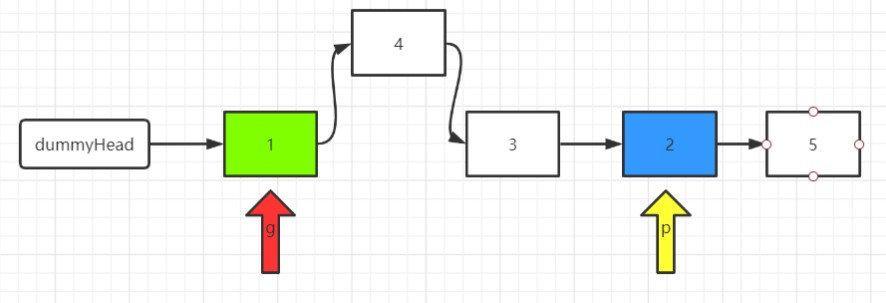

- 上面是整体的流程，下面我们看具体的实现链表移动的操作

  首先进行翻转目标区间内的第一个数

  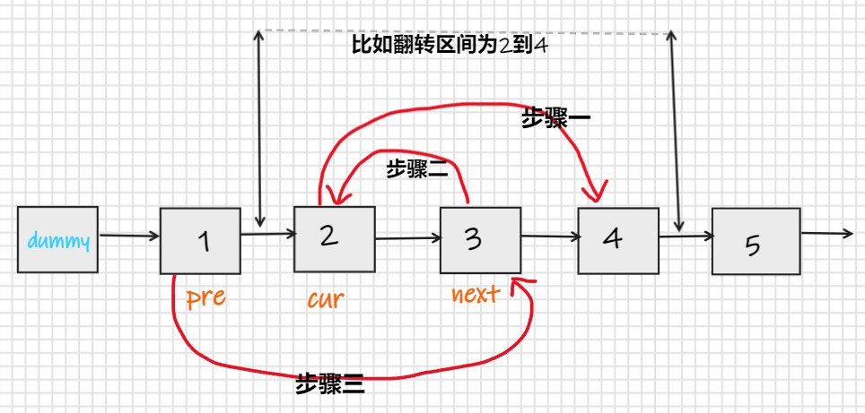

  翻转之后

  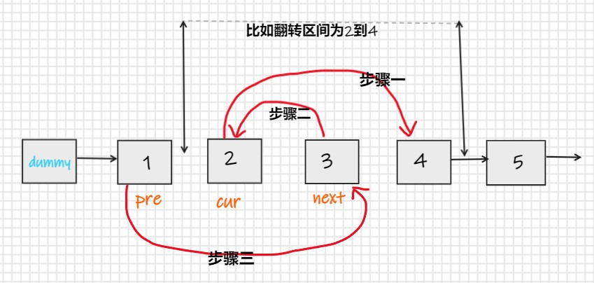

  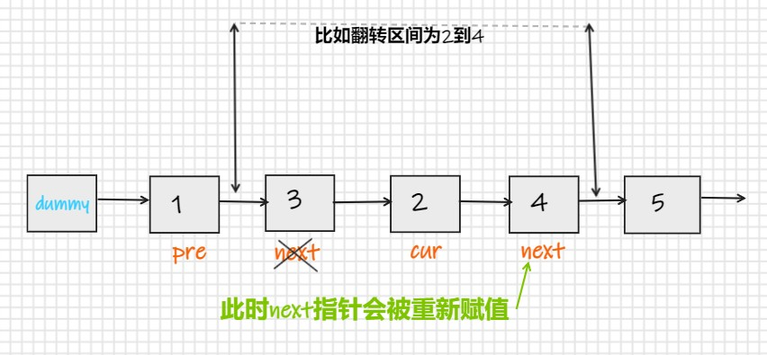

- 下面是第二次翻转

  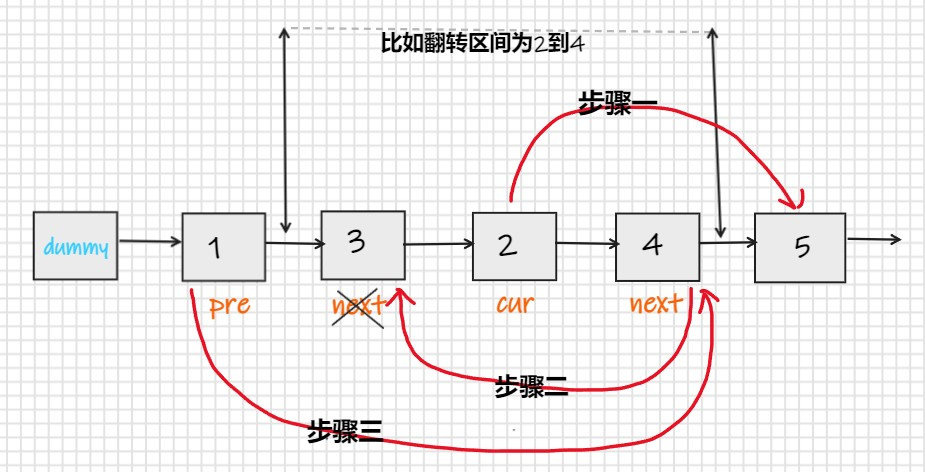

  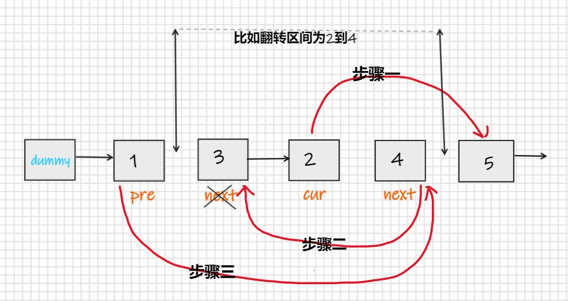

  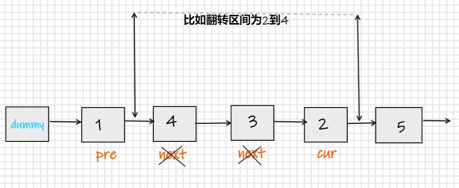

```js
var reverseBetween = function(head, left, right) {
    let dummyNode = new ListNode(-1,head);
    let pre = dummyNode;
    for(let i = 0; i < left - 1; i++){//通过循环，找到要翻转区间的前一个节点
        pre = pre.next;
    }
    let cur = pre.next;//cur节点其实是一个固定值，我们拿到 cur.next 并且将该节点放到pre节点的后面
    for(let i = left; i < right; i++){
        let next = cur.next;
        cur.next = next.next;
        next.next = pre.next;
        pre.next = next;
    }
    return dummyNode.next;
};
```


## 138. 复制带随机指针的链表

[138. 复制带随机指针的链表](https://leetcode.cn/problems/copy-list-with-random-pointer/)

给你一个长度为 n 的链表，每个节点包含一个额外增加的随机指针 random ，该指针可以指向链表中的任何节点或空节点。

构造这个链表的 深拷贝。 深拷贝应该正好由 n 个 全新 节点组成，其中每个新节点的值都设为其对应的原节点的值。新节点的 next 指针和 random 指针也都应指向复制链表中的新节点，并使原链表和复制链表中的这些指针能够表示相同的链表状态。复制链表中的指针都不应指向原链表中的节点 。

例如，如果原链表中有 X 和 Y 两个节点，其中 X.random --> Y 。那么在复制链表中对应的两个节点 x 和 y ，同样有 x.random --> y 。

返回复制链表的头节点。

用一个由 n 个节点组成的链表来表示输入/输出中的链表。每个节点用一个 [val, random_index] 表示：

val：一个表示 Node.val 的整数。
random_index：随机指针指向的节点索引（范围从 0 到 n-1）；如果不指向任何节点，则为  null 。
你的代码 只 接受原链表的头节点 head 作为传入参数。

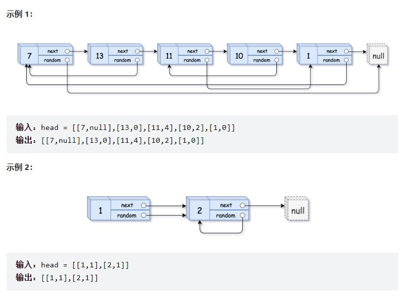

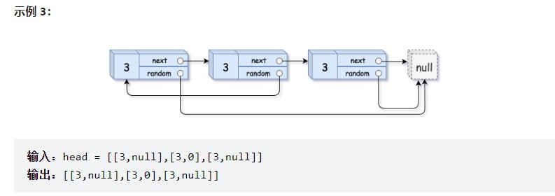

**题解思路**

参考解题视频：[138. 复制带随机指针的链表](https://www.bilibili.com/video/BV1RL411H7RE/?vd_source=cb0f2ca83acbbbf237e17c761cf7bc37)

首先，理解一下题意：

这个题其实就是让我们复制一下链表，然后返回复制的链表，但是有问题的地方是：链表有一个random指针，这个指针的指向是随机的，也就是说，可能某个节点的random指针指向的是后面还没有遍历到的节点

那么我们就可以遍历两次来完成，第一遍只复制当前节点的val值，第二次遍历复制节点的next,random的节点值。

```js
var copyRandomList = function(head) {
    if(!head) return head;

    let cur = head;
    const map = new Map();
    //第一次遍历，生成一个具有val属性的链表
    while(cur){
        map.set(cur, new Node(cur.val));
        cur = cur.next;
    }
    //第二次遍历，根据map映射关系，将random和next指针指向对应的节点或者null
    cur = head;
    while(cur){
        map.get(cur).next = map.get(cur.next) || null;
        map.get(cur).random = map.get(cur.random) || null;
        cur = cur.next;
    }
    return map.get(head);
};
```


## 141. 环形链表

[141. 环形链表](https://leetcode.cn/problems/linked-list-cycle/)

给你一个链表的头节点 head ，判断链表中是否有环。

如果链表中有某个节点，可以通过连续跟踪 next 指针再次到达，则链表中存在环。 为了表示给定链表中的环，评测系统内部使用整数 pos 来表示链表尾连接到链表中的位置（索引从 0 开始）。注意：pos 不作为参数进行传递 。仅仅是为了标识链表的实际情况。

如果链表中存在环 ，则返回 true 。 否则，返回 false 。

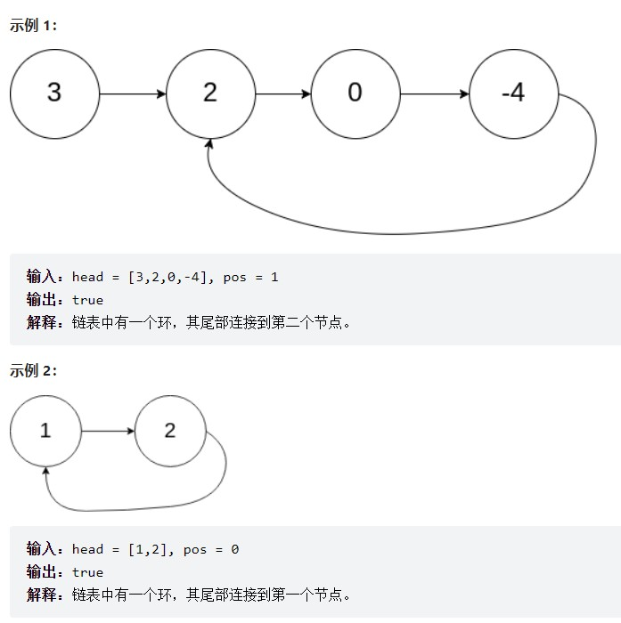

**题解思路**

每次快指针向后移动两个节点，慢指针向后移动一个节点。

如果快指针移动到了链表尾部，就说明链表无环

如果快慢指针相遇了，就说明链表有环

**注意：**若有环，则快慢指针一定会相遇。因为快指针一定比慢指针提前进入到环中，等慢指针也进入环中后，快指针一定会追上慢指针（因为速度是慢指针的两倍），并且一定不会不相遇而直接跳过去（慢指针移动前的旧位置和移动后的新位置共22个节点，快指针一次前进22个节点，必定踩上一个）

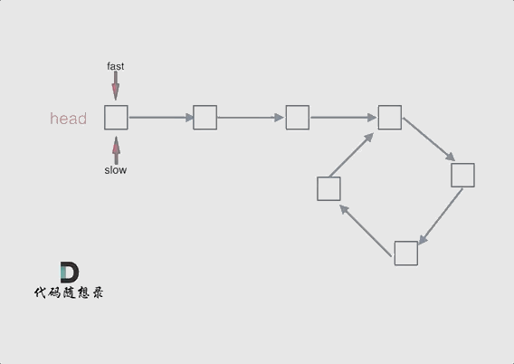

```js
var hasCycle = function(head) {
    if(!head || !head.next) return false;
    let slow = head.next, fast = head.next.next;
    while(fast && fast.next){
        slow = slow.next;
        fast = fast.next.next;
        if(fast === slow){
          // 这里的注释部分：是用来求出环的第一个节点，是为了和下一题的代码保存一致加的
            // slow = head;
            // while(fast !== slow){
            //     fast = fast.next;
            //     slow = slow.next;
            // }
            return true;
        }
    }
    return false; 
};
```


## 142. 环形链表 II

[142. 环形链表 II](https://leetcode.cn/problems/linked-list-cycle-ii/)

给定一个链表的头节点  head ，返回链表开始入环的第一个节点。 如果链表无环，则返回 null。

如果链表中有某个节点，可以通过连续跟踪 next 指针再次到达，则链表中存在环。 为了表示给定链表中的环，评测系统内部使用整数 pos 来表示链表尾连接到链表中的位置（索引从 0 开始）。如果 pos 是 -1，则在该链表中没有环。注意：pos 不作为参数进行传递，仅仅是为了标识链表的实际情况。

不允许修改 链表。

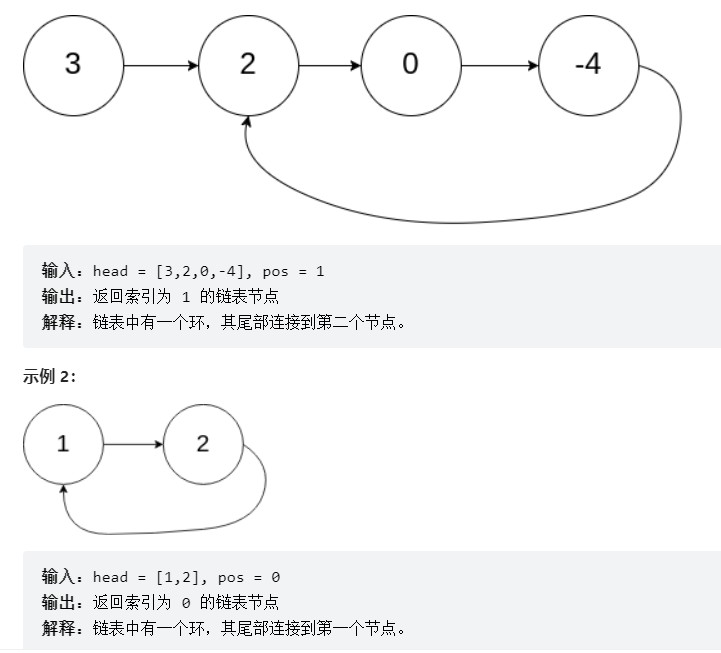

**题解思路**

- 这个题和上一个有相似之处，只不过是这个题要求我们求出环的第一个节点

- **从头结点出发一个指针，从相遇节点 也出发一个指针，这两个指针每次只走一个节点， 那么当这两个指针相遇的时候就是 环形入口的节点**。

- 也就是在相遇节点处，定义一个指针index1，在头结点处定一个指针index2。

  让index1和index2同时移动，每次移动一个节点， 那么他们相遇的地方就是 环形入口的节点。


```js
var detectCycle = function(head) {
    if(!head || !head.next) return null;
    let slow = head.next, fast = head.next.next;
    while(fast && fast.next){
        slow = slow.next;
        fast = fast.next.next;
        if(fast === slow){ // 此时我们已经证明了存在环
            slow = head; //此时定义了两个节点，slow指针位于头结点出发，fast指针位于相遇节点
            while(fast !== slow){ //当这两个节点没有相遇时，让这两个节点每次都向后移动一位
                fast = fast.next;
                slow = slow.next;
            }
            return slow;
        }
    }
    return null;
};
```


## 143. 重排链表

[143. 重排链表](https://leetcode.cn/problems/reorder-list/)

给定一个单链表 L 的头节点 head ，单链表 L 表示为：

L0 → L1 → … → Ln - 1 → Ln
请将其重新排列后变为：

L0 → Ln → L1 → Ln - 1 → L2 → Ln - 2 → …
不能只是单纯的改变节点内部的值，而是需要实际的进行节点交换。

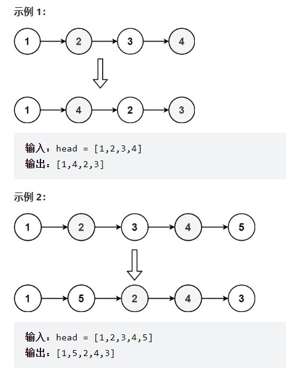

**题解思路**

- 我们先用数组将所有节点存放
- 然后从数组中取出首和尾（ shift 和 pop ）

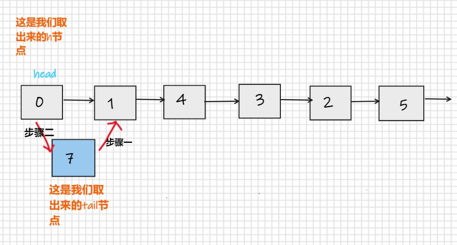

```js
var reorderList = function(head) {
    if(head === null){
        return head;
    }
    let queue = [];
    let p = head
    while(p){
        queue.push(p);
        p = p.next;
    }
    while(queue.length > 2){
        let h = queue.shift();
        let t = queue.pop();
        t.next = h.next;
        h.next = t;
    }
    queue[queue.length - 1].next = null;//尾结点后面置为null
    return head;
};
```


## 147. 对链表进行插入排序

[147. 对链表进行插入排序](https://leetcode.cn/problems/insertion-sort-list/)

给定单个链表的头 head ，使用 插入排序 对链表进行排序，并返回 排序后链表的头 。

插入排序 算法的步骤:

1. 插入排序是迭代的，每次只移动一个元素，直到所有元素可以形成一个有序的输出列表。

2. 每次迭代中，插入排序只从输入数据中移除一个待排序的元素，找到它在序列中适当的位置，并将其插入。

3. 重复直到所有输入数据插入完为止。

下面是插入排序算法的一个图形示例。部分排序的列表(黑色)最初只包含列表中的第一个元素。每次迭代时，从输入数据中删除一个元素(红色)，并就地插入已排序的列表中。

对链表进行插入排序。

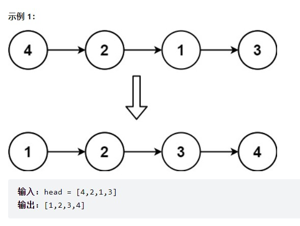

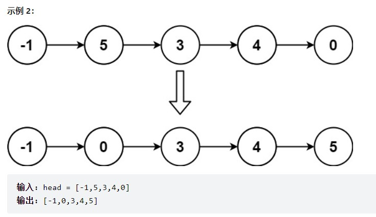

**题解思路**

这个题是链表的插入排序

- 先找到待插入的结点（前一个结点值比当前的大），移除，移除前保存。
- 将该结点插入到合适的位置——从头遍历比较，并插入。

```js
var insertionSortList = function(head) {
    let dummyHead = new ListNode(0,head);
    let cur = head;
    let prev = null;
    let temp = null;
    while(cur && cur.next){
        if(cur.val <= cur.next.val){//如果值就是从小到大
            cur = cur.next;
        } else{
            temp = cur.next;//如果cur.next的值大于前面的，先用temp保存
            cur.next = cur.next.next;//此时将temp移出，同时将链表连到下下个节点
            prev = dummyHead;//从头遍历，找到正确的插入位置
            while(prev.next.val <= temp.val){
                prev = prev.next;
            }
          //此时prev就是temp指针的前一个指针
            temp.next = prev.next;
            prev.next = temp;
        }
    }
    return dummyHead.next;
};
```


## 148. 排序链表

[148. 排序链表](https://leetcode.cn/problems/sort-list/)

给你链表的头结点 `head` ，请将其按 **升序** 排列并返回 **排序后的链表** 。

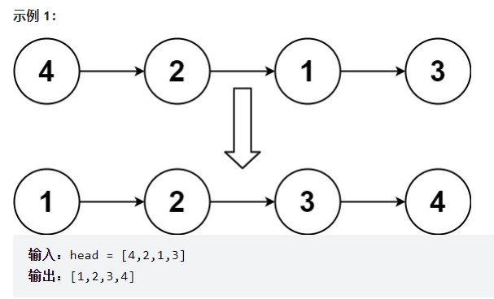

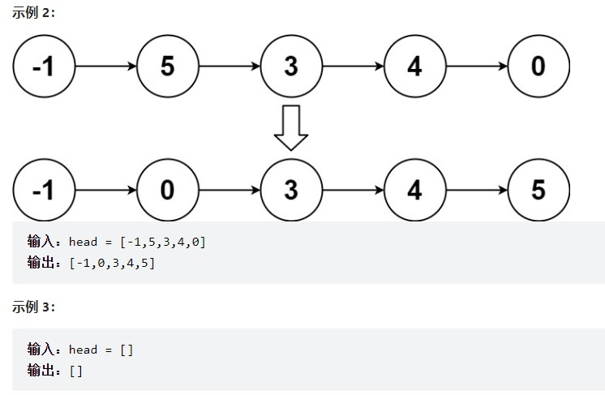

**题解思路**

这里使用归并排序

```js
var sortList = function(head) {
  //对链表进行：合
    let mergeList = (left, right) => {
        let res = new ListNode(0);
        let pre = res;
        while(left && right){
            if(left.val <= right.val){
                pre.next = left;
                left = left.next;
            } else {
                pre.next = right;
                right = right.next;
            }
            pre = pre.next;
        }
        pre.next = left || right;
        return res.next;
    }
    let mergeSort = (node) => {
        if(!node || !node.next) return node;
        let mid = node, fast = node.next;
      //通过while循环，可以找到整个链表的中间的那个指针
        while(fast && fast.next){
            mid = mid.next;
            fast = fast.next.next;
        }
      //这里是对链表进行：分
        let rightList = mid.next;
        mid.next = null;
        let left = node, right = rightList;
        return mergeList(mergeSort(left), mergeSort(right));
    }
    return mergeSort(head);
};
```

使用归并排序解决的题目还有：[23. 合并K个升序链表](https://leetcode.cn/problems/merge-k-sorted-lists/)


## 160. 相交链表

[160. 相交链表](https://leetcode.cn/problems/intersection-of-two-linked-lists/)

给你两个单链表的头节点 headA 和 headB ，请你找出并返回两个单链表相交的起始节点。如果两个链表不存在相交节点，返回 null 。

图示两个链表在节点 c1 开始相交：

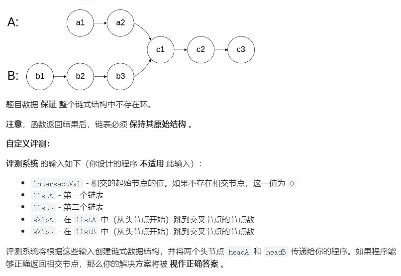

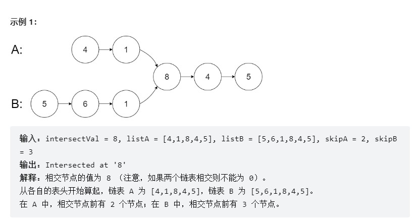

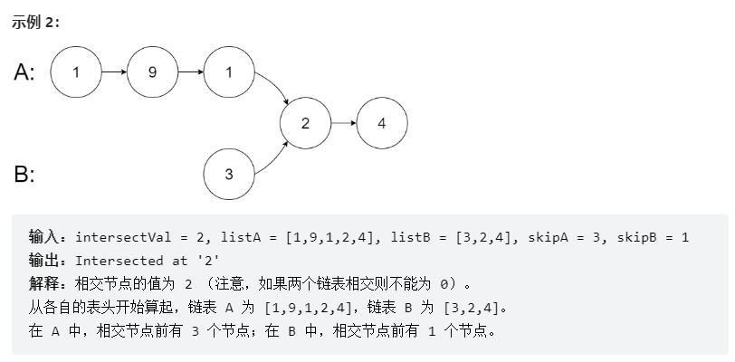

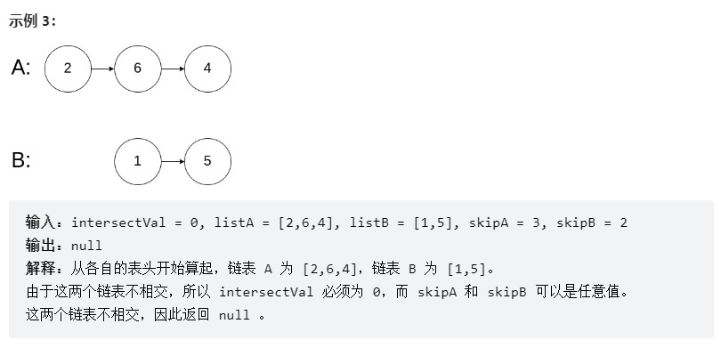

**题解思路**

- curA指向链表A的头结点，curB指向链表B的头结点
- 当画图时，让链表A和链表B的末尾对齐
- 求出两个链表的长度，并求出两个链表长度的差值，然后让curA移动到与curB相等的位置
- 此时我们就可以比较curA和curB是否相同，如果不相同，同时向后移动curA和curB，如果遇到curA == curB，则找到交点。否则循环退出返回空指针。

参考思路：[160. 相交链表](https://www.programmercarl.com/%E9%9D%A2%E8%AF%95%E9%A2%9802.07.%E9%93%BE%E8%A1%A8%E7%9B%B8%E4%BA%A4.html#%E6%80%9D%E8%B7%AF)

```js
var getListLen = function(head){ // 求链表的长度
    let cur = head, len = 0;
    while(cur){
        len++;
        cur = cur.next;
    }
    return len;
}

var getIntersectionNode = function(headA, headB) {
    let curA = headA, curB = headB;
    let lenA = getListLen(headA), lenB = getListLen(headB);
    if(lenA < lenB){ // 让curA为最长链表的头，lenA为其长度
        [curA, curB] = [curB, curA];
        [lenA, lenB] = [lenB, lenA];
    }
    let i = lenA - lenB; // 求长度差
    while(i-- > 0){
        curA = curA.next;  // 让curA和curB在同一起点上（末尾位置对齐）
    } 
    while(curA && curA !== curB){
        curA = curA.next;
        curB = curB.next;
    }
    return curA;
};
```


## 203. 移除链表元素

[203. 移除链表元素](https://leetcode.cn/problems/remove-linked-list-elements/)

给你一个链表的头节点 `head` 和一个整数 `val` ，请你删除链表中所有满足 `Node.val == val` 的节点，并返回 **新的头节点** 。

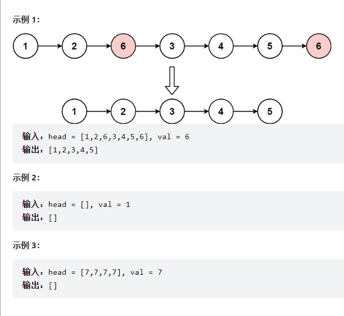

**题解思路**

从头遍历，遇到目标节点，直接删除

```js
var removeElements = function(head, val) {
    let dummyNode = new ListNode(-1); //设置一个虚拟头结点
    dummyNode.next = head;
    let prev = dummyNode; //prev记录当前节点的前一个节点
    while(prev.next){//从head开始遍历
        if(prev.next.val === val){ //如果当前节点的值等于val
            prev.next = prev.next.next;
        }else{
            prev = prev.next; 
        }
    }
    return dummyNode.next;
};
```


## 206. 反转链表

[206. 反转链表](https://leetcode.cn/problems/reverse-linked-list/)

给你单链表的头节点 `head` ，请你反转链表，并返回反转后的链表。

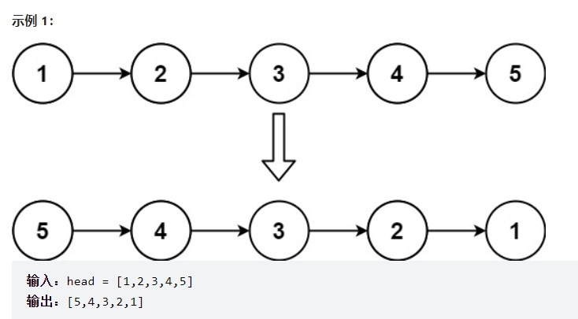

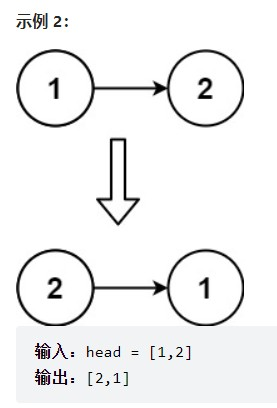

**题解思路**

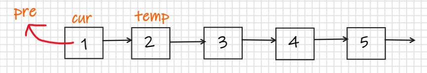

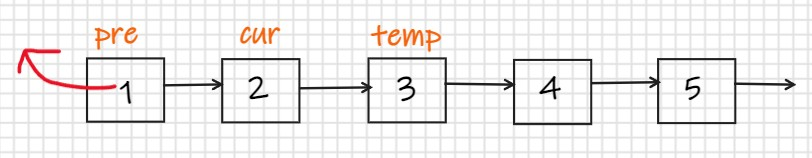

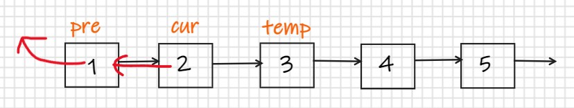

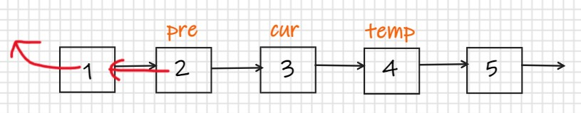

```js
var reverseList = function(head) {
    if(!head || !head.next) return head;
    let temp = null, pre = null, cur = head;
    while(cur){
        temp = cur.next;
        cur.next = pre;
        pre = cur;
        cur = temp;
    }
    return pre;
};
```


## 234. 回文链表

[234. 回文链表](https://leetcode.cn/problems/palindrome-linked-list/)

给你一个单链表的头节点 `head` ，请你判断该链表是否为回文链表。如果是，返回 `true` ；否则，返回 `false` 。

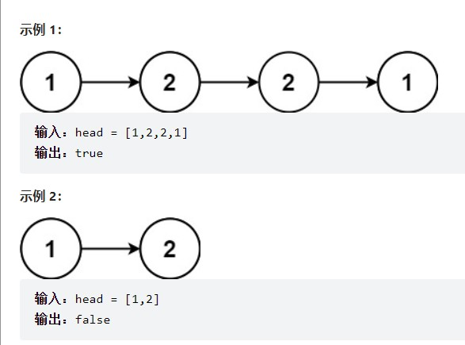

**题解思路**

定义两个指针slow和fast初始分别指向head和head.next。
我们可以思考一下：slow每次向后走一格，fast每次向后走两格，当fast或fast.next到链表末尾时，slow指针正好走到链表的中心位置（**如果是奇数个节点，正好是中心；如果是偶数个节点，则是中心后一个节点**）。
所以，当slow走到中心后，我们只需要，将slow.next也就是中心之后的链表段进行翻转。
再将原来的head和翻转后的slow.next进行一一比对即可。


- 将链表一分为二，然后翻转后半部分的链表
- 因为如果链表长度为奇数，那么后半部分的链表长度比前半部分少一个。
- 所以遍历后半部分的链表：如果元素相同，返回true。
- 对于翻转后半部分的链表：可以单独封装一个函数
- 而翻转链表：相似的力扣题目是：[206. 反转链表](https://leetcode.cn/problems/reverse-linked-list/)

```js
var isPalindrome = function(head) {
    let slow = head, fast = head.next;
  //通过慢指针走一步，快指针走两步，最终可以找到链表的中点
    while(fast && fast.next){
        slow = slow.next;
        fast = fast.next.next;
    }
    let back = reverseList(slow.next);
    while(back){
        if(head.val !== back.val){
            return false;
        }
        head = head.next;
        back = back.next;
    }
    return true;
};

//封装一个翻转链表的函数
function reverseList(head){
    if(!head || !head.next) return head;
    let temp = null, pre = null, cur = head;
    while(cur){
        temp = cur.next;
        cur.next = pre;
        pre = cur;
        cur = temp;
    }
    return pre;
}
```


## 237. 删除链表中的节点

[237. 删除链表中的节点](https://leetcode.cn/problems/delete-node-in-a-linked-list/)

请编写一个函数，用于 删除单链表中某个特定节点 。在设计函数时需要注意，你无法访问链表的头节点 head ，只能直接访问 要被删除的节点 。

题目数据保证需要删除的节点 不是末尾节点 。

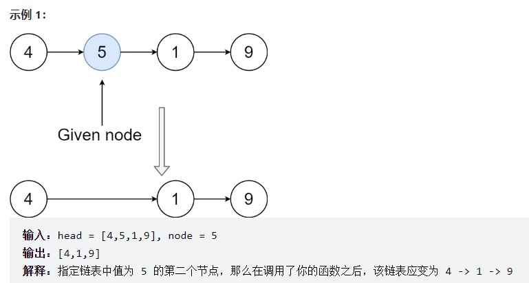

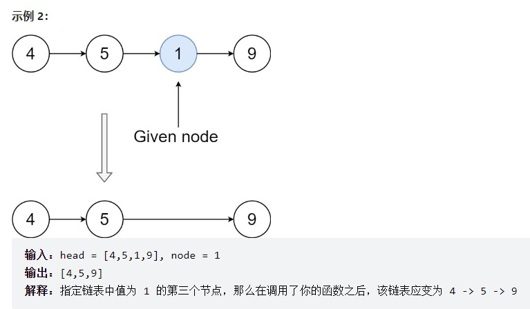

**题解思路**

根据链表的特点，删掉node,就是将node变成下一个节点。

通过值覆盖，next覆盖把被删除的节点改为被删除节点的下一个节点。

```js
var deleteNode = function(node) {
    node.val = node.next.val;
    node.next = node.next.next;
};
```


## 328. 奇偶链表

[328. 奇偶链表](https://leetcode.cn/problems/odd-even-linked-list/)

给定单链表的头节点 head ，将所有索引为奇数的节点和索引为偶数的节点分别组合在一起，然后返回重新排序的列表。

第一个节点的索引被认为是 奇数 ， 第二个节点的索引为 偶数 ，以此类推。

请注意，偶数组和奇数组内部的相对顺序应该与输入时保持一致。

你必须在 O(1) 的额外空间复杂度和 O(n) 的时间复杂度下解决这个问题。

 

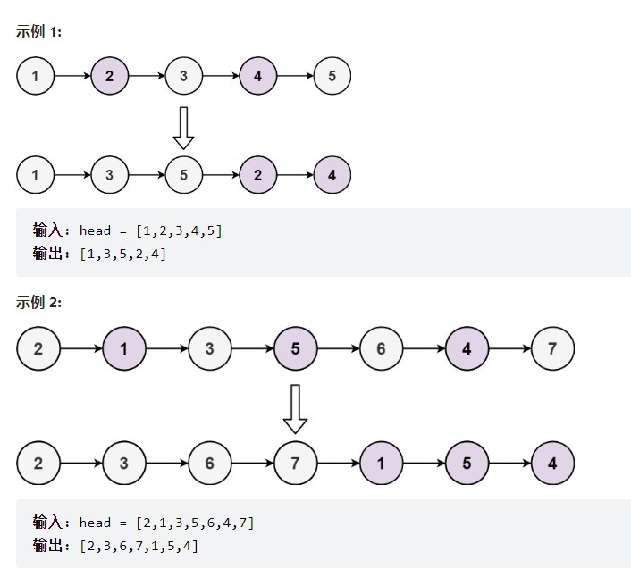

**题解思路**

奇数指向偶数的下一位，偶数指向奇数的下一位，最后把奇数的最后一项指向偶数的第一项

```js
var oddEvenList = function(head) {
    if(head === null || head.next === null) return head;
    let odd = head, even = head.next, evenStart = even;
    while(even && even.next){
        odd.next = even.next;
        odd = odd.next;
        even.next = odd.next;
        even = even.next;
    }
    odd.next = evenStart;
    return head;
};
```


## 445. 两数相加 II

[445. 两数相加 II](https://leetcode.cn/problems/add-two-numbers-ii/)

给你两个 非空 链表来代表两个非负整数。数字最高位位于链表开始位置。它们的每个节点只存储一位数字。将这两数相加会返回一个新的链表。

你可以假设除了数字 0 之外，这两个数字都不会以零开头。

 

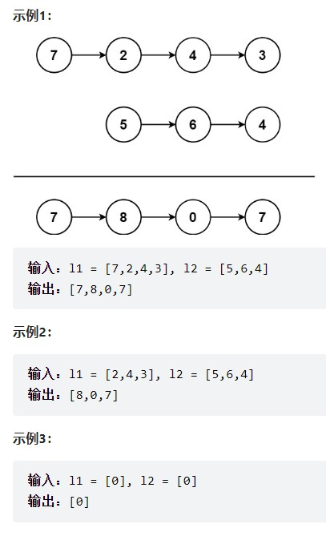

**题解思路**

- 用两个栈存储两个加数
- 再用一个栈存储和
- 设置进位变量curry
- 从两个数组的末尾取出低位的加数，求出和取余并插入到数组的最前面(unshift)
- 最后还要判断最终是否有进位，如果有，还要在数组前面加1
- 然后将和的数组转为链表

```js
var addTwoNumbers = function(l1, l2) {
    let stack1 = [], stack2 = [];
    while(l1 !== null){
        stack1.push(l1.val);
        l1 = l1.next;
    }
    while(l2 !== null){
        stack2.push(l2.val);
        l2 = l2.next;
    }
    let sum = [];
    let curry = 0;
    let len1 = stack1.length - 1, len2 = stack2.length - 1;
    while(len1 >= 0 || len2 >= 0){
        let tmp1 = stack1[len1--] || 0, tmp2 = stack2[len2--] || 0;
        sum.unshift((tmp1 + tmp2 + curry) % 10);
        tmp1 + tmp2 + curry > 9 ? curry = 1 : curry = 0;
    }
    if(curry === 1) sum.unshift(1);
    let dummy = cur = new ListNode(-1);
    let i = 0;
    while(i < sum.length){
        cur.next = new ListNode(sum[i++], null);
        cur = cur.next;
    }
    return dummy.next;
};
```


## 876. 链表的中间结点

[876. 链表的中间结点](https://leetcode.cn/problems/middle-of-the-linked-list/)

给定一个头结点为 `head` 的非空单链表，返回链表的中间结点。

如果有两个中间结点，则返回第二个中间结点。

 示例 1：

```
输入：[1,2,3,4,5]
输出：此列表中的结点 3 (序列化形式：[3,4,5])
返回的结点值为 3 。 (测评系统对该结点序列化表述是 [3,4,5])。
注意，我们返回了一个 ListNode 类型的对象 ans，这样：
ans.val = 3, ans.next.val = 4, ans.next.next.val = 5, 以及 ans.next.next.next = NULL.
```


示例 2：

```
输入：[1,2,3,4,5,6]
输出：此列表中的结点 4 (序列化形式：[4,5,6])
由于该列表有两个中间结点，值分别为 3 和 4，我们返回第二个结点。
```

**题解思路**

使用两个指针变量，刚开始都位于链表的第 1 个结点，一个永远一次只走 1 步，一个永远一次只走 2 步，一个在前，一个在后，同时走。这样当快指针走完的时候，慢指针就来到了链表的中间位置。

当链表长度为奇数时：

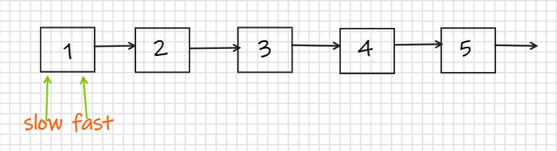


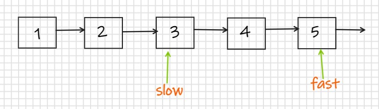

当链表长度为偶数时：

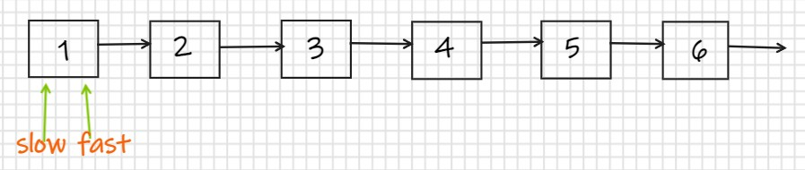

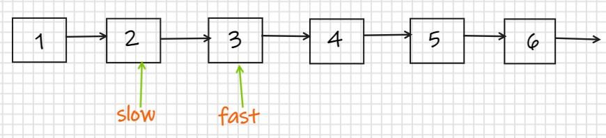

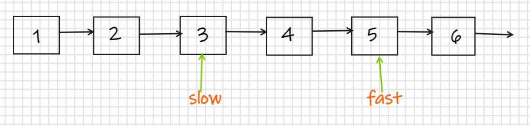

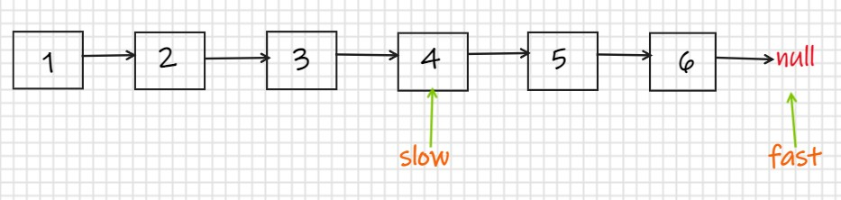

```js
var middleNode = function(head) {
    slow = fast = head;
    while(fast && fast.next){
        slow = slow.next;
        fast = fast.next.next;
    }
    return slow;
};
```

